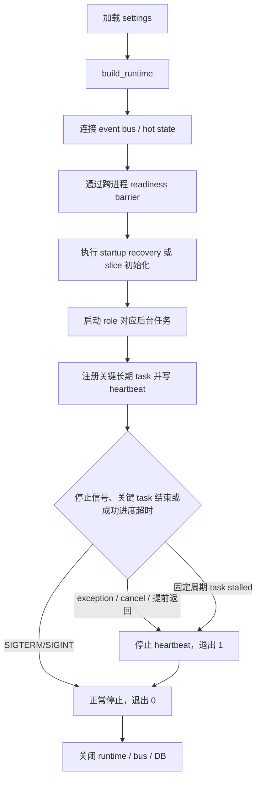
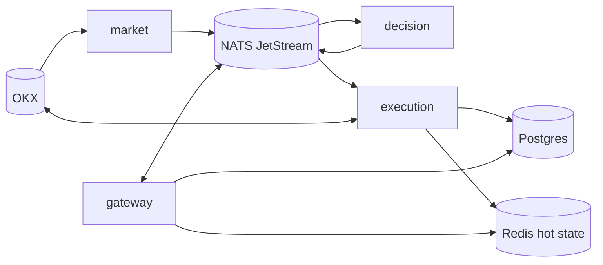
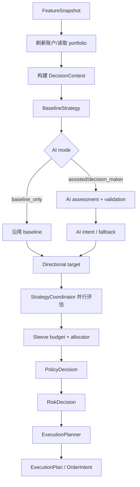
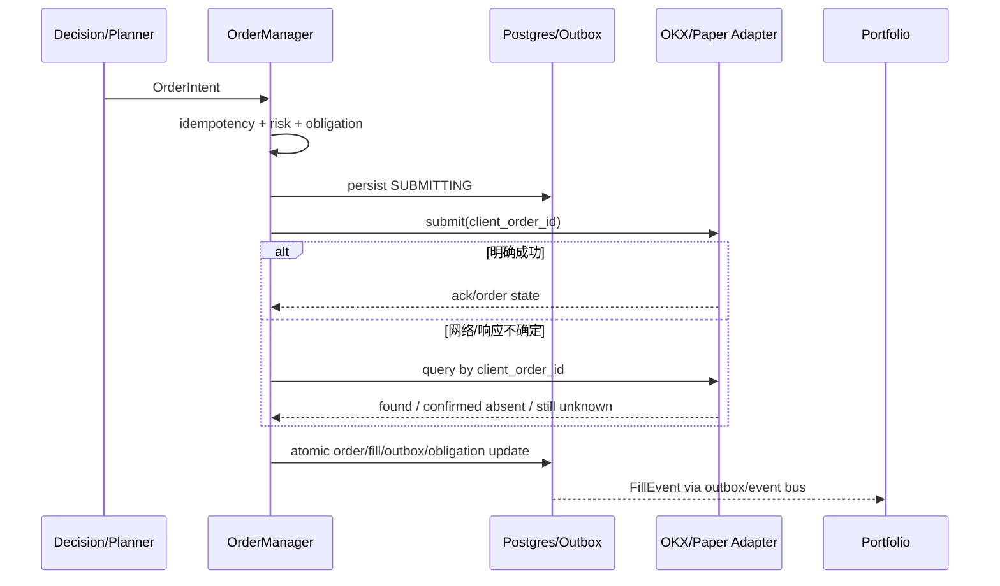

# AATS 当前代码库全景说明与代码审阅手册

> 文档状态：现行代码导航，包含明确标注的历史静态快照
> 文档性质：当前实现说明、代码导航、运行与安全边界、维护手册
> 原始全景审阅基线：Git `be9179ead5be6aba22fbe94e3baf72b9f46eedc3`（`main`，2026-05-19）
> 当前覆盖层最后复核：2026-08-27（静态起始 HEAD `main@9c4112c6d769735f171971c8fa4f2cae5a03a824`；包含尚未部署的 RDP 控制面收口候选，以本文档所在最终 HEAD 为准）
> 核对范围：当前 RDP schema/API/参数控制面、derivatives 模拟拓扑及原始全景导航；原始审阅规模、附录 A/C 和带日期的运行记录保留为历史快照，不证明当前 runtime 或 live 状态
> 适用对象：重新接手项目的维护者、代码审阅者、交易与风控负责人、Operator
> 事实优先级：固定行为以当前可执行代码为准；有效运行值以现场 runtime/数据库为准；自动化测试用于交叉验证；历史设计文档仅作背景

## 0. 先读结论

AATS（AI Participating Autonomous Trading System）不是一个简单的“策略产生信号、适配器发送订单”的程序，而是一个围绕真实资金交易构建的、事件驱动的受治理交易系统。它把行情、特征、规则基线、AI、五类策略、组合分配、政策与风险门、订单状态机、资金占用、账本、对账、恢复、研究治理和 Operator 控制面放在同一条可审计链路中。

当前 derivatives 模拟拓扑，以及 future 衍生品 live 设计拓扑，由以下部分组成；live 当前不可部署：

- 交易主路径：`gateway`、`market`、`decision`、`execution` 四个切片进程；
- 研究治理：`rdp-daemon`；
- 公共旁路采集：`liquidations-daemon`、`microstructure-collector`；当前 derivatives 模拟栈已纳入二者，future live 也声明二者；
- 基础设施：Postgres、Redis、Redis exporter、NATS JetStream、Prometheus、Grafana、Loki、Promtail、Jaeger；
- 外部交易与数据源：OKX 公共行情、私有账户、模拟盘或真实交易接口；
- 人工控制面：FastAPI REST API 与内置中文 Operator UI。

最重要的工程判断如下：

1. **`guarded_live` 是当前最高可用运行模式。** 类型定义仍保留 `autonomous_live`，但运行模式控制器会拒绝它；这不是已开放的无人值守自治交易能力。
2. **“允许计算目标”不等于“允许发单”。** 策略、policy、risk、runtime mode、kill switch、reconciliation、recovery、trial/forward guard、账户状态和 adapter preflight 会逐层收紧权限。
3. **执行状态的第一原则是先持久化、后做不可逆外部写。** 订单提交前先落 `SUBMITTING`，不确定写结果必须按 client order id 向交易所反查，不能盲目重试。
4. **订单真相不是单一 JSON。** `OrderState` 同时存在 Postgres 专用列、JSON payload 与 Redis 热缓存；涉及其字段或语义的修改必须三层同步。
5. **成交是财务投影的核心事实输入。** `FillEvent` 驱动组合、余额、费用、已实现盈亏、lot、ledger、settlement 与 reconciliation；费用在系统内按正成本记录，并从余额/盈亏扣除。
6. **四进程运行依赖 NATS 与 Redis。** exchange-coupled 的四进程模式若仍使用纯内存事件总线或纯内存热状态，启动会失败，而不是带着错误拓扑继续运行。
7. **RDP 的研究结论默认不能直接改实盘。** Research Factory 明确禁止 runtime mutation、active parameter write、runtime config write 和 OKX write；研究产物先形成证据、verdict、recommendation，再进入审批、gate、发布和观察链路。
8. **当前代码与若干旧文档存在漂移。** Phase 3Q 已把失效的 `scripts/run_local.py` 收口为明确迁移失败入口；Phase 3R 又修复 replay short-bias gate，并重写已漂移的参数映射参考；Phase 3S 增加基础 CI/warning gate，Phase 3T 再加入 Python hashed lock 与外部镜像 digest，但远端 required check、integration 和完整供应链扫描仍未启用；当前 RDP ORM 元数据是 102 张表，标准部署另有 8 张 migration-owned 表，现场物理总数为 110；JetStream 主事件流当前代码默认 1 天而部分旧注释仍写 7 天。最新收益复核证明历史、OHLCV/funding 和微观结构三阶段累计 10/10 个唯一候选全部失败，当前项目不能因模拟部署健康而被描述为“接近盈利上线”。具体见第 26 章与[真实收益差距评估](profitability_gap_assessment_2026_08_25.md)。

## 1. 文档范围、方法与可信边界

### 1.1 原始全景审阅覆盖了什么（历史静态快照）

以下数字来自 `be9179e` 原始全景审阅，保留用于说明当时的覆盖规模，不能作为当前计数。当前 RDP 与 API 精确计数见第 19、20、26 章及 [`docs/rdp/module_reference.md`](../rdp/module_reference.md)。原始审阅时仓库约有：

| 范围 | 规模 |
| --- | ---: |
| Git 跟踪文本文件 | 1,952 个 |
| 文本总行数 | 约 503,550 行 |
| Python | 1,061 个文件，约 390,550 行 |
| Markdown | 699 个文件，约 78,344 行 |
| JavaScript | 43 个文件，约 19,545 行 |
| 测试文件 `test_*.py` | 406 个，其中 unit 348、integration 46、scenario 5、smoke 1，另有根级验收测试 |
| 主交易 ORM 表 | 49 张，均在当前 schema（通常是 `public`） |
| RDP ORM 表 | 81 张，分布于 7 个 schema |
| FastAPI 路由 | 193 条（包括 API、UI 静态路由、OpenAPI/Swagger） |

审阅方式不是把历史文档重新拼接，而是从以下实际入口反向建立调用图：

- [apps/api_gateway/main.py](../../apps/api_gateway/main.py)
- [apps/market_gateway/main.py](../../apps/market_gateway/main.py)
- [apps/decision_engine/main.py](../../apps/decision_engine/main.py)
- [apps/execution_engine/main.py](../../apps/execution_engine/main.py)
- [aats/bootstrap/process_lifecycle.py](../../aats/bootstrap/process_lifecycle.py)
- [aats/bootstrap/config.py](../../aats/bootstrap/config.py)
- [scripts/compose_entrypoint.py](../../scripts/compose_entrypoint.py)
- [scripts/rdp_task_daemon.py](../../scripts/rdp_task_daemon.py)

随后沿事件 topic、schema、service、repository、后台任务、API 查询层、UI 数据面、部署文件和测试反向校验。

### 1.2 没有做什么

为避免泄露凭证或改变真实资金系统，本次审阅：

- 没有读取或展示 `.env.wsl2`、OKX key、数据库密码、AI provider token；
- 没有连接当前 live 数据库、Redis、NATS 或 OKX 账户；
- 没有启动、停止或部署容器；
- 没有执行任何下单、撤单、恢复、rebaseline、参数 apply/release 操作；
- 没有把历史运行结果冒充为当前运行状态。

因此，本文准确描述的是**基线提交中的代码行为和受版本控制的配置默认值**。实际运行时还会受到环境变量、数据库中的 active parameter、账户状态、交易所配置和持久化恢复状态影响。

### 1.3 如何阅读“当前值”

本文使用三种表述：

- **代码固定行为**：例如未知 event topic fail-fast、`autonomous_live` 被拒绝；
- **受版本控制的默认值**：例如 `derivatives_live.yaml` 中某开关；它可能被 active parameter 覆盖；
- **运行时事实**：必须通过 Operator API、数据库或监控现场确认。本文不会在没有现场验证时声称它是当前值。

## 2. 项目目标与不可突破的安全原则

项目定位以 [docs/project_positioning.md](../project_positioning.md) 为准：在严格风控、可审计、可恢复、可治理的前提下追求长期、风险调整后、扣除费用后的真实净收益，为 AI 的长期自治积累资本。

由代码体现出的安全原则包括：

- 不确定时 fail closed；
- 外部写结果不确定时先查询事实，禁止猜测成功或直接重复提交；
- 开仓与增仓需要更强证据，减仓与退出在风险场景优先放行；
- 恢复期间可以只减仓、强制平仓或完全停止，不能为了“恢复交易频率”跳过对账；
- 风险、账务、费用、仓位、订单和研究建议均保留审计证据；
- AI provider 失败必须回退基线或降级，不能把解析失败当成有效交易指令；
- 研究层产物不会天然取得生产变更权限；
- live Operator 控制面要求认证和安全 cookie，危险操作保留 actor 与原因。

## 3. 代码库地图

### 3.1 顶层目录

| 目录 | 当前职责 |
| --- | --- |
| `apps/` | 四个主进程的最薄入口；不承载业务逻辑 |
| `aats/bootstrap/` | settings、managed profile、运行时装配、进程生命周期、后台任务、遥测、日志 |
| `aats/events/` | topic 常量与事件契约 |
| `aats/bus/` | InMemory、NATS JetStream、Hybrid 路由 |
| `aats/schemas/` | 跨模块 Pydantic 数据契约 |
| `aats/services/` | 主交易领域服务 |
| `aats/storage/` | ORM、Postgres repository、event store、outbox、execution/ledger/projection 持久化 |
| `aats/api/` | 认证、Operator/RDP REST API、dashboard bundle、内置静态 UI |
| `aats/data_platform/` | RDP 数据采集、标准化、Gold/replay、研究、归因、治理、生产参数工作流 |
| `configs/` | managed profile 策略调参、RDP workflow、研究批次与模板 |
| `migrations/` | 主交易库的增量 SQL；ORM `create_all` 之外的约束与索引 |
| `scripts/` | 启动、部署入口以及大量 RDP/运维 CLI |
| `deploy/wsl2-dev/` | WSL2 Docker Compose、镜像、监控、备份和恢复脚本 |
| `tests/` | unit、integration、scenario、smoke 与根级验收测试 |
| `docs/` | 历史设计、任务、审计和运维资料；阅读时必须核对代码版本 |

### 3.2 `aats/services` 领域边界

| 模块 | 作用 |
| --- | --- |
| `market_gateway` | OKX WebSocket/REST 行情、标准化、缺口与回退 |
| `feature_engine` | 滚动特征、regime、动量、微观结构、资金费、持仓量、多周期组合 |
| `decision_engine` | 触发、队列、上下文、baseline、AI 调用、目标仓位生成、orchestration |
| `strategy_engines` | directional、smart arbitrage、spot grid、DCA、independent、allocator 与 sleeve |
| `governance_engine` | policy、risk、runtime mode、kill switch、live guard、审计 |
| `execution_engine` | planner、OrderManager、paper/OKX adapter、obligation、execution outbox、订单恢复 |
| `execution_control` | gateway 到 execution 的持久化命令处理 |
| `portfolio_service` | fill 投影、余额/仓位/快照、fill outcome、funding、sleeve PnL |
| `ledger` | 复式账、reservation mirror、settlement、lot |
| `reconciliation_service` | 本地与交易所事实对账、分类、修复与报告 |
| `recovery_control` | 启动恢复、stuck submitting、exchange order 预对账 |
| `ai_service` | provider、prompt、schema validation、降级、恢复探测、效果审查 |
| `blocker_control` | 将底层原因合成为 Operator 可理解的根因和操作建议 |
| `operator` | API 查询模型、dashboard 聚合、人工控制动作 |
| `projections` | 事件到只读投影的辅助路径 |

`operator/query_service.py` 是当前最大的聚合查询文件，负责把分散的交易事实、风控事实和历史记录转换为 UI/API 所需的读模型。它不是交易真源；写路径仍由各领域 service 与 repository 负责。

## 4. 配置系统与生效顺序

### 4.1 两种配置路径

`load_settings()` 存在两条路径：

1. **managed profile 路径**：设置了 `AATS_ENV_TEMPLATE_PROFILE`，支持 `spot`、`derivatives`、`spot_live`、`derivatives_live`；
2. **legacy 路径**：未选择 managed profile 时，按基础 YAML、环境 YAML、profile YAML 与环境变量组合。

当前部署入口通过 `AATS_PROFILE` 与 `scripts/compose_entrypoint.py` 推导 managed profile，因此标准 WSL2 部署应按 managed 路径理解。

### 4.2 Managed profile 固定运行时基线

定义位于 [aats/bootstrap/managed_profiles.py](../../aats/bootstrap/managed_profiles.py)：

| Profile | 环境 | OKX | 产品/保证金 | 仓位模式 | Cookie | 主要用途 |
| --- | --- | --- | --- | --- | --- | --- |
| `spot` | dev | simulated | spot / cash | 不适用 | 非 secure | 现货模拟与联调 |
| `spot_live` | prod | real | spot / cash | 不适用 | secure | 受保护现货实盘 |
| `derivatives` | dev | simulated | derivatives / cross | net | 非 secure | 合约模拟与联调 |
| `derivatives_live` | prod | real | derivatives / cross | hedge | secure | 受保护合约实盘 |

四者共同采用：Postgres、OKX market/execution/account backend、account read、exchange portfolio bootstrap、`guarded_live`、live submit enabled、Operator auth enabled。这里的 “live submit enabled” 仅表示 adapter 路线可用；任何其他门禁仍可拒绝提交。

### 4.3 实际优先级

managed profile 的有效构造顺序是：

```text
managed runtime defaults
  -> configs/strategy_profiles/<profile>.yaml
  -> 允许的显式环境变量 override
  -> build_runtime 中加载数据库 active parameters（若启用）
  -> 运行时人工/恢复状态进一步收紧行为
```

注意两点：

- managed profile 的“派生字段”不会被同名环境变量任意改写；代码会记录被忽略的 derived override，防止一个 env 值破坏受管 profile 身份；
- active parameter 在 `build_runtime()` 内、profile 已解析后注入，因此它可以覆盖已解析的策略参数。任何把“环境变量永远是最终最高优先级”写死的旧说明都不适用于该路径。

### 4.4 Active parameter

当前 active parameter 以治理数据库为真源。文件接口保留兼容痕迹，但正常运行不应把本地 JSON 视为 active truth。加载行为为 fail-soft：数据库不可用或组合不完整时记录原因，不把半套研究参数注入交易运行时。

参数映射具有白名单，只允许已知 family 字段；对要求成组出现的研究参数，缺少任何必需项会跳过整组。启用 timeframe 也会被过滤，且加载后再次校验安全 edge 不变量。

### 4.5 重要基础类型

| 概念 | 代码允许值 | 当前语义 |
| --- | --- | --- |
| `mode` | `backtest`、`paper_live`、`guarded_live`、`autonomous_live` | 最后一项类型存在但控制器拒绝 |
| `storage_mode` | `memory`、`postgres` | managed profiles 固定 Postgres |
| `event_bus_backend` | `in_memory`、`hybrid`、`nats` | 四进程 exchange-coupled 要求跨进程 backend |
| `hot_state_backend` | `memory`、`redis` | 四进程 exchange-coupled 要求 Redis |
| `market_data_backend` | `demo`、`okx` | managed profiles 使用 OKX |
| `execution_backend` | `paper`、`okx` | managed profiles 使用 OKX；是否实盘由 simulated/guards 决定 |
| `ai_provider` | `disabled`、`openai`、`deepseek` | provider 不等于 AI 有最终决策权 |
| AI canonical mode | `baseline_only`、`ai_assisted`、`ai_decision_maker` | legacy `ai_advisory`/`ai_blended` 映射到 assisted，`ai_primary` 映射到 decision maker |
| `strategy_family_active` | `directional`、`smart_arbitrage`、`spot_grid`、`dca`、`independent` | 可被自动选择或固定 |
| product | `spot`、`derivatives` | 影响持仓、费用、风险和下单字段 |
| margin | `cash`、`cross`、`isolated` | 必须和 instrument/账户能力一致 |

## 5. 启动入口与进程拓扑

### 5.1 入口保持很薄

三个 worker 入口只把固定 role 交给 `run_process_sync()`：

- market：`PROCESS_ROLE_MARKET`；
- decision：`PROCESS_ROLE_DECISION`；
- execution：`PROCESS_ROLE_EXECUTION`。

gateway 是 FastAPI app，通过 lifespan 负责装配和关闭。monolith 则在一个 runtime 中启用所有 slice。

### 5.2 进程生命周期

worker 的统一生命周期为：



进程会安装信号处理和 heartbeat。2026-08-24 Phase 3D 工作区新增显式
critical task 监督：行情主循环、账户、对账、execution sync/outbox/command、
decision dispatcher 与 guard 长期 task 发生未捕获异常、意外取消或提前返回时，
worker 不再继续只靠独立 heartbeat 伪装健康，而是停止 heartbeat、清理并返回
非零。容器使用 `tini` 作为 PID 1，把 SIGTERM 正确传给 Python，避免只能等待
强杀。Phase 3K 进一步为账户刷新、执行同步、对账、outbox、command flow、
Phase 1 shadow 和 trial guard 七条固定周期关键循环加入成功进度 deadline；
永久 await 或连续无成功周期会分类为 `stalled`，复用非零退出/health `503`
路径。预算为至少 60 秒或三个正常周期，使用进程单调时钟，不持久化。

这仍不等于完整业务健康：public/private WebSocket、decision dispatcher、abort
hook、guard-signal publisher 等事件驱动/service-owned task 需要各自的连接、
freshness 或 queue-lag 契约；整个 event loop 被同步阻塞还需要容器外 supervisor。
真实 Docker restart、依赖断连、告警和误杀边界尚未验证。详见
[`fs_006_critical_task_supervision_sow_2026_08_24.md`](../task/fs_006_critical_task_supervision_sow_2026_08_24.md)
与 [`fs_006_critical_task_progress_watchdog_sow_2026_08_24.md`](../task/fs_006_critical_task_progress_watchdog_sow_2026_08_24.md)。

### 5.3 Gateway lifespan

gateway 启动顺序为：

1. 加载 settings、初始化结构化日志；
2. 识别 gateway 或 monolith role；
3. 只读校验 RDP ORM table/column surface 与 Batch B ledger/checksum；任一差异立即失败；
4. 调用 `build_runtime()`，managed Postgres 在此只读校验 root migration ledger 与财务精度；
5. 发布本 role ready，并等待 peer roles；
6. 启动 runtime background tasks 与 dashboard snapshot plane；
7. 对外提供 UI/API；
8. lifespan 退出时停止 snapshot plane、后台任务和 runtime。

RDP 校验位于任何 readiness 广播、peer wait 和后台 task 之前；原“迁移失败只 warning 后继续 ready”路径已在 Phase 3E 收紧。它仍只是未提交的代码/隔离验证结论，不是生产库已通过声明。

Phase 3J 将第 5 步的 peer barrier 收紧为四主进程 NATS/hybrid 必经失败关闭路径。标准 deploy 在 sync 后生成非秘密 generation，Compose 必填注入；每个 role 只写/读 `aats:runtime:ready:<generation>:<role>` 并校验 payload role/generation。缺失 generation/hot-state、Redis set/get 失败或 60 秒 peer timeout 都在 `start_background_tasks()` 前抛固定错误。退出时 best-effort 删本 role/本代次 key。该 key 是 consumer provisioning 事实，不是持续业务健康 lease。

`/healthz` 不需要认证；lifespan runtime 的关键 task 已结束，或纳管的固定周期
任务成功进度超时时返回 `503`，其余情况下只证明 gateway lifespan 和当前监督面
未发现失败。它不等于完整交易 readiness。完整状态还要看 `/system/health`、
`/system/runtime`、`/system/recovery`、事件驱动 task freshness/queue lag、
blockers、reconciliation 和 submit gate。

### 5.4 Runtime slice

| Slice | monolith | gateway | market | decision | execution |
| --- | :---: | :---: | :---: | :---: | :---: |
| shared | ✓ | ✓ | ✓ | ✓ | ✓ |
| market | ✓ |  | ✓ |  |  |
| decision | ✓ |  |  | ✓ |  |
| execution | ✓ |  |  |  | ✓ |
| portfolio | ✓ |  |  |  | ✓ |
| reconciliation | ✓ |  |  |  | ✓ |
| startup recovery | ✓ |  |  |  | ✓ |
| Operator API/UI | ✓ | ✓ |  |  |  |

shared slice 提供 bus、hot state、kill switch、mode、market/account gateway 基础能力、execution adapter、health、metrics 和 Phase 1 shadow 等共同依赖；具体 worker 只注册本 role 需要的订阅和任务。

Phase 3L 后，Kill Switch 的长期 Redis state 只负责恢复和 generation 权威，不能单独授权增险。Gateway/monolith 在 readiness 后维护同 generation 的短时 permission key（Redis TTL 15 秒、每 5 秒续租），execution 在最终 `place_order` fence 内同时读取长期 state 与 permission，而且没有签发/续租能力。四进程代理 resume 必须由 Gateway 重读 execution 已写的 exact RUNNING generation 并成功激活 permission 后才返回。halt 和 shutdown 优先撤销前一 RUNNING generation；Redis 删除失败仍由 TTL 到期收敛。此协议尚未经过真实 Redis/NATS 四进程单向分区与目标 crash/restart 验证，FS-002 仍为 P0 HARD BLOCKER。

### 5.5 四进程通信



gateway 对 execution-only 人工动作使用 operator command request/response；对 decision-only 的 AI 模式动作使用 AI command request/response。HTTP handler 通过 correlation id 等待对应 worker 响应，而不是在 gateway 内复制一套交易服务。

## 6. Runtime 装配的真实顺序

`build_runtime()` 是理解项目最关键的函数。其主顺序如下：

1. 校验基础 settings 与运行组合；
2. 初始化 telemetry（失败时退化为 no-op，不阻塞交易主逻辑）；
3. 构建 memory/Postgres storage；
4. 解析 provenance 与 managed runtime profile；
5. 注入 active parameter；
6. 再次执行配置、安全与认证校验；
7. 初始化策略 profile 与 Operator 初始状态；
8. 构建 memory/Redis hot store；
9. 构建 shared slice 并启动 event bus；
10. 从持久化/热缓存恢复 kill switch、stream cache、portfolio、obligation、order、fill、account 等状态；
11. 按 role 构建 market、decision、execution、portfolio、reconciliation slice；
12. 聚合事件订阅，构建 audit writer；
13. execution/monolith 执行启动恢复；
14. 创建 `ApplicationRuntime`；
15. gateway 安装跨进程命令 proxy；
16. 由各入口在 readiness 后启动后台循环。

运行时不是“所有服务都有值”的大容器。非本 role 的服务刻意为空；新增调用若跨 slice，必须经事件或命令代理，而不是直接访问一个在该进程不存在的 service。

## 7. 事件总线、投递与状态传播

### 7.1 EventEnvelope

跨模块事件由 `EventEnvelope` 包装，核心信息包括：事件类型、source、topic、key、payload、schema version、时间与 trace context。NATS 消费端按 schema major version 校验；不兼容 envelope 会被终止处理，避免旧进程静默误解新协议。

### 7.2 Hybrid 路由是显式白名单

topic 分三类：

- **critical**：丢失会造成状态不一致、资金风险、决策断链或审计缺口，走 NATS；
- **observer**：只影响本进程可观测性，走内存；当前包括 health snapshot、blocker snapshot、strategy profile evaluation/comparison；
- **persist-only critical**：必须长期审计但没有 live NATS consumer；当前 `AUDIT_RECORDS` 直接进入 Postgres event store，不占 JetStream 热缓冲。

任何新 topic 若没有显式归类，会抛 `UnroutedTopicError`。这是一项重要的防漂移机制。

### 7.3 三条 JetStream stream

以当前代码字段为准：

| Stream | 内容 | retention | 默认 max age | max bytes |
| --- | --- | --- | ---: | ---: |
| `AATS_EVENTS_MARKET` | market/feature 高频快照 | limits | 1 天 | 2 GiB |
| `AATS_EVENTS` | 其他 critical 事件 | interest | 1 天 fallback | 4 GiB |
| `AATS_EVENTS_COMMANDS` | position target、order intent、baseline、sleeve、allocation、bundle、execution plan | limits | 1 天 | 512 MiB |

NATS server file store 上限 8 GiB。三条 stream 声明上限合计 6.5 GiB，留出内部索引、consumer state 与运行余量。

`AATS_EVENTS` 使用 INTEREST，因此“Redis 异常/超时后继续 publisher”的旧 LIMITS 兼容注释已不成立。Phase 3J 单测已证明 strict 路径对 announce/poll/timeout/旧代次失败关闭，但未连接真实 NATS/Redis，也未证明 Compose 并发启动、自动重启和 consumer provisioning 延迟下的消息计数。所以当前状态是 `CODE REMEDIATED / TARGET NATS STARTUP-RESTART VERIFICATION OPEN`，不是 CLOSED。

### 7.4 投递策略

| 事件语义 | DeliverPolicy | 例子 |
| --- | --- | --- |
| snapshot | LAST | market、feature、portfolio、account、kill switch、guard、coordinator snapshot |
| transient request/response | NEW | operator command、AI command |
| 普通不可漏事件 | ALL | order、fill、risk、reconciliation 等 |

consumer 使用 durable、显式 ack、flow control、idle heartbeat、ack wait 和 max delivery。系统追求的是“至少一次投递 + 幂等处理”形成的 exactly-once-effective，而不是假设消息永远只到一次。

### 7.5 `_CollectingBus`

同一 role 内可能有多个 handler 订阅同一 topic。`_CollectingBus` 把它们合并为一个 durable consumer 后在进程内 fan-out，避免同一个 durable name 被重复绑定或不同 handler 竞争同一条消息。

### 7.6 Gateway relay

部分 dashboard 需要展示由 decision/execution 产生、但 gateway 自己不处理的事件。gateway 会注册 no-op relay，使对应 NATS 消息经过 gateway 接收并落 event store，读模型随后从持久化历史查询。这个 relay 的作用是“接收并持久化”，不是执行业务动作。

## 8. 行情与特征链路

### 8.1 行情接入

market slice 的主要外部输入是 OKX 公共 WebSocket，REST 作为初始化、回填和断线回退。核心行为包括：

- 按产品与 symbol 校验订阅；
- 把交易所 payload 标准化为内部 `MarketSnapshot`；
- 对单个 symbol 的 REST refresh 加锁，避免并发重复请求；
- 检测 snapshot 顺序，拒绝旧时间戳覆盖新快照；
- WebSocket 缺口时触发 REST backfill/fallback；
- 记录 exchange timestamp 与本地 receipt timestamp；
- 跨进程 consumer 依据两种时间判断 stale，而不是只看“最近收到过消息”。

市场 gateway 的 REST fallback 有连续失败计数与 circuit-open 语义；持续失败会进入健康/阻断链路，不会把陈旧行情继续包装成“正常”。

### 8.2 FeatureEngine

每个 symbol 使用独立锁串行更新滚动窗口。当前 feature 组合包含：

- momentum；
- trend；
- regime；
- multi-timeframe alignment；
- microstructure；
- basis；
- funding；
- open interest；
- long/short ratio；
- liquidity quality。

当前综合权重为：

| 分量 | 权重 |
| --- | ---: |
| momentum | 0.24 |
| trend | 0.17 |
| regime | 0.12 |
| multi-timeframe | 0.08 |
| microstructure | 0.09 |
| basis | 0.10 |
| funding | 0.07 |
| open interest | 0.07 |
| long/short ratio | 0.06 |

合成信号还要乘 liquidity quality；conviction 综合 alpha、regime、周期对齐和 execution quality。权重总和为 1，但这不代表每个分量在缺失数据时都能提供同等可靠性。

### 8.3 Regime

代码支持 legacy 规则与 ADX 路径。ADX 默认阈值语义是：

- ADX 大于等于趋势阈值（默认 25）：trend/breakout；
- ADX 小于 range 阈值（默认 20）：range；
- 中间区间：uncertain。

启动时可从 OKX candles 尽力 warm up 滚动特征；warmup 失败会留下冷启动/数据不足信号，而不是伪造完整历史。

### 8.4 旁路微观结构采集

衍生品实盘 overlay 还启动两条不进入主交易 event bus 的旁路：

- `liquidations-daemon`：订阅公共 liquidation WebSocket，写 `staging.raw_liquidations`；
- `microstructure-collector`：采集 trades、BBO、books5、OI、funding、mark price，写 bronze/staging，单独在 9465 暴露 metrics。

它们只依赖 RDP 数据库，不读取交易凭证，不向主 NATS 发布交易信号。其数据通过 15 分钟 Silver ETL 后供研究/对照使用。

## 9. 决策周期

### 9.1 TriggerPolicy 与 latest-wins 队列

收到 feature 后并非每条都立即触发一次完整决策。TriggerPolicy 依次判断：

- market 是否存在且未 stale；
- 是否为该 symbol/timeframe 的第一次有效触发；
- 时间戳是否严格向前；
- 每分钟决策上限；
- 15m/1h 最小间隔；
- regime 变化、momentum 变化或价格变化是否足够 material。

触发队列容量为 1，采用 latest-wins。繁忙时新状态替换未处理旧状态，避免在行情已经变化后补算一串过时决策。单次决策周期有超时，失败后有 backoff。

### 9.2 Orchestrator 的顺序

一次有效决策周期大致如下：



实际 orchestrator 还会：

- 发布 decision context、baseline、AI brief/assessment、shadow evaluation；
- 在允许时执行 strategy profile 自动控制；
- 运行非 AI 的 paper trading shadow；
- 将最终 target 与 hedge/independent overlay 合成；
- 把同步数据库与 CPU 工作移到线程，避免阻塞 async event loop；
- 保留 decision id、source、reason codes、fallback 与审计链。

### 9.3 Baseline 与目标仓位

BaselineStrategy 产生 regime、方向、alpha、confidence 与风险上下文。TargetPositionEngine 再根据 AI canonical mode 决定：

- `baseline_only`：AI 不影响最终目标；
- `ai_assisted`：AI 提供建议/解释，基线仍掌握最终交易权；
- `ai_decision_maker`：只有 AI output 合法、非 fallback、非 degraded，且 confidence、uncertainty、directional edge 等通过门槛时才应用；否则回退 baseline。

衍生品 balance-aware sizing 会比较固定默认 qty 与基于可用权益、margin usage、leverage、risk scale、价格得到的 qty，并遵守 leverage/cap 限制。任何“AI 给出数量就直接下单”的理解都是错误的。

## 10. AI 子系统

### 10.1 Provider 与严格输出

支持 `disabled`、OpenAI 与 DeepSeek provider。AI service 负责：

1. 从决策上下文构建结构化 brief/prompt；
2. 调用 provider；
3. 解析 JSON；
4. 按 schema 校验方向、confidence、uncertainty、edge、风险标签与执行建议；
5. 生成 `AIMarketAssessment`；
6. 将 provider/解析/超时问题转换为明确 fallback，而不是半结构化输出。

### 10.2 降级与恢复

失败路径包括 provider 未配置、timeout、调用异常、JSON/schema 不合法、自动降级和效果审查阻断。连续失败达到阈值后进入 degraded；恢复探测按间隔执行，需要成功预算才能恢复。降级状态与事件会持久化/广播，重启后不能无条件忘记。

AI outcome review 还比较费用、churn 与表现窗口。连续坏窗口可以要求人工 review 或自动降级到 baseline。Operator 可以在有权限且满足约束时执行 degrade/restore。

### 10.3 两种 shadow

- **AI shadow**：比较 AI 决策与实际/基线结果，评估 AI 增量价值；
- **paper trading shadow**：以候选策略/参数翻译同一市场状态，模拟未真实执行的结果。

两者都是证据路径，不是绕过 live gate 的旁门。

### 10.4 AI execution suggestion

`ai_execution_suggestion_mode` 支持 disabled、diagnostic_only、shadow_translation、enabled_live。即使是 `enabled_live`，建议也只作为 planner 输入；instrument rule、risk、reduce-only 语义、价格边界、obligation 与 adapter preflight 仍然具有最终约束权。

## 11. 五类策略与组合协调

### 11.1 Coordinator

StrategyCoordinator 同时注册：

1. directional；
2. smart arbitrage；
3. spot grid；
4. DCA；
5. independent。

每个 engine 输出统一的 `StrategyCandidate`，包含 enabled、selectable、execution compatible、route action、目标/增量、score、confidence、urgency、reason/blocking codes 与 metrics。Coordinator 再决定激活、shadow、优先级与是否进入 allocator。

自动选择的当前优先顺序是 smart arbitrage、spot grid、DCA、directional、independent；但是否可选取决于 product、runtime capability、family 开关、状态与阻断，不是简单“前者总赢”。固定 family 模式则优先使用配置指定 family。

### 11.2 Directional

Directional 是永远注册的基础 family，主要由 baseline/AI 目标、成本、regime、最小 edge、confidence、持仓时长、冷却、flat hold、反转和动态 leverage 规则组成。衍生品允许 long/short，并可选 hedge overlay；spot 则受不能裸卖空等产品能力限制。

开仓、scale-in、reversal 的阈值分开配置，short 也有独立门槛。退出会考虑：

- signal/AI 衰减；
- microstructure 与 factor 反转；
- 最短持有；
- fee drag 与 churn；
- transient close retry cooldown；
- 当前风险/恢复是否要求只减仓或立即退出。

### 11.3 Smart Arbitrage

Smart arbitrage 以配置的 spot/derivatives pair 为单位，当前内置配置示例是 `BTC-USDT` 与 `BTC-USDT-SWAP`。其状态机识别：

- flat/inactive；
- opening；
- active hold；
- unwinding；
- partial-fill recovery；
- mixed direction blocked。

正基差 carry 目标是 long spot + short derivative；负基差 reverse carry 目标是 short spot/margin + long derivative。负基差执行可以 disabled/advisory、inventory-backed 或 margin-backed，并需分别满足库存、借币/保证金做空和账户能力。

是否开仓不是只比较 basis：成本模型同时计入 maker/taker fee、spread、slippage、funding、borrow、execution mismatch、transfer 与 time decay。只有 executable edge 为正、预算与 capability 足够时才生成 legs。已有 pair 的退出/恢复优先于新 pair 开仓。

### 11.4 Spot Grid

Spot Grid 只支持 spot runtime。若 breakout guard 开启，只在 range/uncertain regime 考虑执行。算法：

1. 取最近 N 个 snapshot 的均价作为 anchor；
2. 用配置 bps 构建上下 band；
3. 把现价夹到 band 内；
4. 价格越接近下边界，目标库存越接近 ceiling；越接近上边界，越接近 floor；
5. 只调整该 sleeve 的库存，再映射到账户总目标；
6. delta 小于最小 rebalance qty 时 hold；
7. 输出交易成本估计。

它不是挂出一整张长期网格订单簿，而是周期性把库存拉向由 band 位置决定的目标。

### 11.5 DCA

DCA 只支持 spot runtime。核心门包括：

- family enabled；
- 有效现价；
- sleeve 未达到 position cap；
- 距上次真实非零 DCA target 已超过 interval；
- 可选 pullback-only anchor/阈值通过；
- 实时可用 quote balance 大于零；
- 本期 quote budget/price 得到的 tranche 足够大。

DCA 只增加该 sleeve 的现货库存，不把其他策略持仓误算成自己的历史 tranche。

### 11.6 Independent long/short books

Independent family 把 long 与 short 当作两个独立 book，而不是把净头寸当作唯一状态。每条腿独立计算：

- raw/adjusted score；
- expected signal edge、slippage、cost、lifecycle net edge；
- liquidity/depth 与 size impact；
- score stability、confirmation、thesis age；
- execution health；
- entry/scale/de-risk/forced-exit 的执行策略；
- sizing 与 capital multiplier。

book 状态是：`flat -> probing -> building -> holding -> de_risking/forced_exit -> flat`，并允许规则定义的有限回转。guard 是正交状态 `cooldown` 或 `suspended`，guard 生效时禁止进入 probing/building。非法跃迁会留下明确 violation，而不是静默改状态。

book action 包括 inactive、open、hold、scale_in、de_risk、close_failed_thesis、close_stale_thesis、blocked。执行模式可以 passive-first、bounded limit/taker、aggressive bounded taker，以及 post-only timeout fallback。

当前 `derivatives_live.yaml` 的受版本控制基线仍将 independent family、independent overlay 和 live execution 关闭，rollout 为 dry-run；数据库 active parameter 或未来版本可能改变数值，但不应仅凭 UI 某个 score 推断它已经实盘启用。

### 11.7 Sleeve 与 Allocator

策略不会直接争夺账户总仓位。每个 family 先形成 sleeve intent，预算控制器根据 profile、表现、回撤、波动与 reconciliation 状态给出 multiplier；allocator 再执行：

- per-sleeve quote/margin/notional/symbol cap；
- portfolio gross/net cap；
- 预算不足时按权重缩减；
- 同 symbol 冲突检测；
- 可安全净额的 opposing intents netting；
- 受保护退出腿优先；
- multi-leg bundle 的完整性和成本检查；
- 输出 allocation decision、conflict/netting evidence 和 execution bundle。

因此 `PositionTarget` 既是策略结果，也是组合分配后的受约束结果。

## 12. Policy、Risk 与运行时治理

### 12.1 PolicyEngine

Policy 决定“该动作在当前制度下是否允许”，主要检查：

- symbol/product/margin/short/leverage 能力；
- runtime mode；
- kill switch；
- health blockers；
- 是否尝试不支持的 autonomous mode；
- execution allowed、submission allowed 与 dry-run 的区别。

Policy 可以允许生成执行计划但不允许真实提交，也可以将动作限制为 dry-run。

### 12.2 RiskEngine

Risk 同时审查 target 级与每条 leg：

- qty、per-symbol notional、leverage；
- 当前与 projected gross/net/long/short exposure；
- open order 与 pending obligation 暴露；
- available balance/equity/margin；
- daily realized loss、费用和流动性；
- liquidation buffer；
- trial/forward guard；
- reconciliation、recovery 与 runtime posture；
- adaptive risk/aggressiveness multiplier。

返回不仅是 approve/reject，还可包含 cap、only-reduce、flatten、halt 与原因。execution slice 在四进程模式下会保留本地 RiskEngine 做最终执行侧检查，防止 decision 到 execution 之间状态变化造成过期许可。

### 12.3 Kill switch 与 GuardSignal

Kill switch 通过 Redis 保存当前状态并用 NATS 同步，重启/跨进程后仍保持。execution 产生的 guard signal 发送给 decision；如果 guard 过期，decision fail closed，而不是假设“一切正常”。

### 12.4 多层 live guard

真实提交前还叠加：

- derivatives live guard；
- guarded-live preflight；
- forward trial guard；
- recovery posture；
- reconciliation halt/only-reduce；
- drift score 与 Phase 1 shadow；
- Stage 9 abort hook；
- exchange/account/system status preflight。

BlockerControl 将这些信号归并为：根因、影响范围、是 execution blocker 还是 submit-only blocker、是否可自动恢复、建议人工动作。UI 的“不能交易”结论来自此聚合，不应通过查看单个 boolean 自行推翻。

## 13. Execution Planner

Planner 把最终 target 或显式 strategy legs 转换为 `ExecutionPlan` 与 `OrderIntent`。关键步骤包括：

- 计算 current -> target 的 delta；
- 识别 open、increase、reduce、close、reversal；
- 衍生品 hedge mode 下保留 `posSide`，不能只按净仓推断；
- 归一化 instrument qty、lot size、tick size、min size、notional；
- 对 multi-leg 保留 parent/bundle/sleeve/family 身份；
- 应用 execution style、limit offset、post-only、IOC/market、超时 fallback；
- 合并 AI execution suggestion，但由本地约束裁剪；
- 设置显式 reduce-only/close-only/leg action/position intent。

“有效 reduce/close 语义”由多个字段共同推导。OrderState 必须记录最终有效值，不能只保留策略最初提出的 flag，否则恢复和对账无法判断这笔订单是否可能增加风险。

## 14. OrderManager 与订单状态机

### 14.1 状态集合

当前订单状态为：

```text
CREATED
SUBMITTING
SUBMITTED
PARTIALLY_FILLED
FILLED
CANCEL_PENDING
CANCELED
REJECTED
FAILED
BLOCKED
DRY_RUN
EXPIRED
```

状态机限制合法迁移，区分 open/terminal，并防止较晚到达的旧消息把订单从更高状态回退。但即使状态不能回退，较新的累计成交、费用与时间戳仍可合并；累计成交达到请求量时会规范化为 FILLED。

### 14.2 提交流程



关键规则：

1. 用 idempotency key、client order id、semantic duplicate 和 risk-increase convergence 防重复；
2. 对可能增加风险的同义 intent，不因 ID 不同就重复执行；
3. 提交前先落 `SUBMITTING`；
4. 外部写不确定时反查，禁止直接重试；
5. stuck submission 必须经恢复/人工 resolve；
6. 提交状态、fill、outbox 与 obligation 在 repository 支持时原子提交；
7. 错误形成 execution error summary，进入风险与 Operator 读模型。

### 14.3 Post-only timeout fallback

对 `post_only_with_timeout_fallback`：

1. 生成不跨价的 post-only intent；
2. 提交并等待配置时间；
3. 若全部成交则结束；
4. 若仍有剩余，发起 safe cancel；
5. cancel 不确定或失败时禁止 fallback，避免双重成交；
6. cancel 确认后只对 remaining qty 构建 bounded-taker fallback；
7. parent/child 和 fill aggregation 保持关联。

### 14.4 串行退出

风险降低型多腿退出可以按顺序拆分，前一腿的确认成交/取消状态影响下一腿可发送数量。parent exit 记录 child refs、known fill、working/unknown quantity、remaining dispatchable/unresolved quantity。Operator UI 有独立的退出任务工作台处理长历史、safe cancel、limit lookup retry 和 refresh。

### 14.5 Obligation

下单前 obligation 预留可能消耗的货币/名义暴露，避免并发订单各自看到同一份可用余额。提交、成交、取消、拒绝、失败分别消费或释放 obligation。Postgres 路径使用唯一约束/锁和原子更新，Redis 缓存用于跨进程快速读取但不是唯一财务真源。

## 15. OKX 与 Paper Adapter

### 15.1 OKX adapter

adapter 在发单前验证：

- instrument 是否存在且规则已加载；
- account config 与 position mode 是否匹配；
- system status；
- max size、可用余额、margin/notional；
- limit/market/post-only 字段；
- slippage 与价格边界；
- open orders 与可能的冲突；
- `tdMode`、`posSide`、`reduceOnly` 与数量换算。

提交和撤单都采用“未知写保护”：网络超时不等于失败，先按 client order id 查询交易所。只有确认不存在或得到明确结果后才能决定下一步。

### 15.2 Paper adapter

Paper adapter 用最近行情在内存中模拟成交：

- market/可成交 limit 生成 fill；
- 超过 slippage 约束可拒绝；
- 不穿价的 limit 到期可变为 EXPIRED；
- 仍使用真实的 OrderState/FillEvent 契约，使下游 portfolio/reconciliation 流程尽量一致。

它用于行为演练，不证明真实交易所延迟、部分成交、手续费等级和流动性表现。

## 16. Portfolio、费用、Ledger 与财务正确性

### 16.1 PortfolioState

Portfolio 使用 `Decimal`，position key 至少区分 symbol、product、margin mode、position mode 与 `posSide`。在 hedge mode 下 long/short 必须独立存在，不能用一个净数量覆盖。

`FillEvent` 按 fill id 幂等应用。应用逻辑为：

- 同方向加仓：按数量加权更新 average entry price；
- 部分减仓：保留原 average entry price；
- 完全平仓：quantity 归零；
- 穿越零点反转：已关闭部分计算 realized PnL，新方向剩余部分以该 fill price 作为新 entry；
- spot：更新 base/quote balance；
- derivatives：平仓差价进入 realized trading PnL；
- fee currency balance 扣减 fee；
- `realized_pnl_delta = trading_pnl - quote-denominated fee delta`；
- 费用字段记录正成本，不能用负 fee 与负余额变化混淆。

### 16.2 PortfolioService 事务边界

处理 fill 时：

1. 获取 portfolio lock；
2. 保存处理前 checkpoint；
3. 计算 balance delta、position、fee、outcome；
4. 通过 portfolio outbox 能力原子写 snapshot/outcome/event；
5. 发布 portfolio snapshot；
6. 失败时回滚内存 checkpoint，并发布 processing failure。

### 16.3 Funding 与 sleeve PnL

funding fee 独立同步并按唯一业务标识幂等落库。sleeve PnL 把 realized PnL、fee、funding 与 inventory move 分开记录，使 allocator 和策略表现评估不会把资金费/调仓成本误当成 alpha。

### 16.4 Ledger

账本包含：

- accounts；
- journals；
- entries；
- reservations；
- settlements；
- position lots；
- lot events。

每个 journal 的复式 entry 必须平衡。reservation mirror 将 execution obligation 投影到账本，settlement 把 fill outcome 变成财务记账。lot book 为 realized PnL 与生命周期归因提供可重建基础。

### 16.5 Convergence 与 Phase 1 shadow

当前存在从 legacy execution/portfolio 写路径向专用 execution truth 与 ledger convergence 迁移的开关：

- `financial_convergence_mode_enabled=false` 时，主运行仍使用兼容 repository 路径；专用表/ledger 可作为 shadow 和查询真相的一部分；
- 开启时 `ConvergedPostgresExecutionRepository` 承担 execution write/read convergence；
- Phase 1 shadow 把旧/新投影并行比较，drift 可进入 blocker/abort hook；
- 不能只切一个读路径而不切原子写、恢复与 reconciliation，否则会产生双真源。

## 17. Reconciliation 与 Startup Recovery

### 17.1 Reconciliation 比较什么

Reconciliation 对读：

- 本地 order state 与交易所订单；
- 本地 fill 与交易所 fill/bill；
- portfolio position/balance 与 account snapshot；
- execution 专用表、legacy state 与 ledger；
- lot book 与 fill outcomes；
- projection replay offset/watermark；
- obligation/reservation 是否悬空。

finding 有 severity、类别、是否可自动修复、是否要求 review、是否需要 halt/only-reduce。报告本身落库并进入 dashboard。

### 17.2 启动恢复顺序

execution/monolith 启动恢复的核心顺序是：

1. 刷新交易所账户/订单事实；
2. 校验 derivatives position mode；
3. 仅在本地完全没有 scoped snapshot 时允许从交易所导入 baseline，避免覆盖已有账本；
4. 同步 bills、fills、funding；
5. 预先查询 stuck `SUBMITTING`；
6. 恢复 order/fill/obligation/outbox；
7. 对缺失 fill outcome 做确定性补偿；
8. rebuild lot book/ledger projection；
9. 执行 reconciliation；
10. 发布或 hydrate portfolio snapshot；
11. 计算 recovery posture 与是否可恢复提交。

### 17.3 不自动重放 orphan intent

恢复器可以识别“有 intent、没有可靠提交结果”的 orphan，但不会简单自动重试。原因是从原决策到恢复时市场、仓位、余额和风险可能已经变化；自动重放会把历史意图当成当前授权。正确路径是查询交易所、收敛未知订单、重新对账，然后由当前决策产生新 intent。

### 17.4 自动清除范围很窄

恢复逻辑可以在获得新的、干净的 reconciliation 后清除特定的 stale-reconciliation halt；它不会无条件清除人工 kill switch、AI review、未知写、position mode mismatch 或其他根因。`resume` 与 `rebaseline` 是受认证、受审计的不同动作。

## 18. 持久化架构

### 18.1 主交易库：49 张表

按职责分组如下：

| 分组 | 表 |
| --- | --- |
| 事件/审计 | `event_store`、`event_store_archive`、`decision_audit_records`、`external_event_inbox` |
| 订单/成交 | `order_states`、`fill_events`、`fill_outcomes`、`funding_fee_records`、`order_obligations` |
| execution truth | `execution_orders`、`execution_fills`、`execution_order_state_history`、`execution_commands`、`exchange_ack_watermarks` |
| outbox/command | `outbox_events`、`command_outbox` |
| portfolio/reconciliation | `portfolio_snapshots`、`reconciliation_reports`、`reconciliation_findings`、`reconciliation_state_snapshots`、`projection_replay_offsets` |
| ledger/lot | `ledger_accounts`、`ledger_journals`、`ledger_entries`、`reservations`、`settlements`、`position_lots`、`lot_events` |
| strategy sleeve/allocator | `strategy_sleeves`、`strategy_sleeve_intents`、`sleeve_budget_profiles`、`sleeve_budget_assignments`、`sleeve_pnl_records`、allocator 三类 evidence、allocation decision、execution bundle |
| strategy profile | revision、activation、history、evaluation、recommendation、rejection |
| exit execution | `exit_execution_intents`、`exit_execution_child_refs` |
| baseline/auth/schema | `baseline_generations`、`operator_users`、`schema_migrations` |

完整表名见附录 B。

### 18.2 Schema 创建与增量迁移

Postgres runtime 按两种明确模式工作：

1. 显式 migration job：ORM `Base.metadata.create_all()` 后，用 transaction advisory lock 串行执行 `migrations/*.sql`，在 `schema_migrations` 记录 version + SHA-256 checksum；
2. managed 应用启动：`database_auto_create_schema=false`，只读比较当前 checkout 的完整 migration 文件集与 ledger，missing/unknown/checksum mismatch 都拒绝启动；
3. 两种模式都校验关键财务列为 `NUMERIC(36,18)`；
4. 每个 process role 获取作用域化 session advisory lock，防止同一 role 重复运行。

当前增量 SQL 是：baseline guard、obligation active currency index、execution truth dedicated columns、live read indexes、decision audit recent indexes。

### 18.3 数据库连接

Phase 3U 后，主库 SQLAlchemy engine 不再对所有进程统一使用 15+45。它从
`aats/storage/connection_budget.py` 按角色解析：gateway 12+20、market 4+4、decision
5+5、execution 8+8、monolith 12+20；仍使用 30 秒 pool timeout、pre-ping，并注入 60 秒
`idle_in_transaction_session_timeout` 作为极端慢查询/线程拥塞的安全网。该超时不是修复
应用层长事务的替代品。

完整四进程声明 topology（包括当前 RDP、两个 collector、live query/facts/session、
governance、orderbook 和四个 startup transient）ceiling 为 150。Compose 声明
`max_connections=200`、superuser reserved=3，因此普通容量 197、名义余量 47。静态 AST
verifier 归类当前 13 个 `create_engine` 调用，并在新增未审 engine、裸 pool 值或 Compose/CI
漂移时失败。

上述是配置 ceiling，不是生产并发测量。治理 transient engine、并行 `NullPool` CLI、
迁移/恢复/admin、仓库外进程、慢查询/连接泄漏/重连峰值和 64MB `work_mem` 联合内存仍未
闭环；FS-008 状态是“声明拓扑已预算，目标负载与瞬时路径开放”，不是 CLOSED。

RDP 使用独立 engine cache，pool size 5、overflow 10。Phase 3E 后，`apply_rdp_migrations()` 是显式写入入口：先建 ORM baseline，再在 session advisory lock 内执行 13 个 canonical Batch B stage。每个 stage 以原 SQL 的 SHA-256 记录到 `governance.rdp_schema_migrations`，外层 `BEGIN/COMMIT` 由 runner 移除，DDL 与 ledger 行在同一 transaction 提交。已记录 stage 不同 checksum、前置缺失、非 suffix rollback 均失败关闭。`validate_rdp_schema()` 是运行进程唯一允许的只读入口。Batch A 历史 hardening 代码仍存在，未在 Phase 3E 中伪装成已统一/已演练的生产 manifest。

### 18.4 OrderState 三层一致性

任何 OrderState 字段或语义修改必须同时检查：

1. Postgres `order_states` 专用列；
2. `payload` JSON 的序列化/反序列化；
3. Redis order state cache；
4. legacy 与 converged repository；
5. startup recovery 与 reconciliation；
6. API/UI 读模型与测试。

JSON 查询使用 SQLAlchemy 2.0 `.as_string()`，不得恢复已弃用的 `.astext`。

## 19. API、认证与 Operator UI

### 19.1 API 总览

当前 FastAPI registry 有 200 个 method/path operation、196 个唯一 URL path。业务 API 主要分为：

| 前缀 | 数量 | 作用 |
| --- | ---: | --- |
| `/system` | 27 | health、mode、runtime、blocker、recovery、guard、人工动作 |
| `/rdp` | 57 | 研究治理、参数、recommendation、release、workbench、task；对应 56 个唯一 URL path |
| `/reports` | 17 | 执行质量、盈利、归因、trial、forward validation |
| `/auth` | 9 | 登录、session、provider、用户管理 |
| `/strategy-profiles` | 8 | profile 列表、激活、自动控制、历史与优化 |
| `/orders` | 8 | 查询、撤单、stuck resolve |
| `/ai` | 10 | runtime、assessment、shadow、performance、模式选择 |
| 其他 | 64 | decision、risk、policy、portfolio、account、fills、reconciliation、replay、UI 等 |

完整业务路由清单见附录 A。

### 19.2 权限模型

Operator 角色：viewer、operator、admin。

- read endpoint：有效 session；本地兼容模式可用 API key；
- write endpoint：operator 或 admin；
- admin endpoint：admin；
- 未认证危险写只在明确的 local/memory 不安全兼容组合下可能允许，managed live 不允许；
- write API key 兼容也被限制在 local/memory 场景。

`routes.py` 以 `require_read_access` 作为 router 基础依赖，具体 mutation 再提升到 write/admin。RDP read/write 也分别使用相同权限依赖；参数 apply/rollback 还需要短时 apply token 绑定动作与 actor。

### 19.3 Session 与密码

session token 是 base64 编码 JSON + HMAC-SHA256 签名，包含 subject、role、issued/expiry 与 session version。修改密码、角色或禁用账户可以通过增加 session version 使旧会话失效。

密码使用 PBKDF2-HMAC-SHA256、随机 salt、390,000 次迭代。登录有失败计数与锁定。用户管理防止删除/禁用最后一个 admin，也防止不安全的自我降权路径。

Phase 3I 将 `POST /auth/login` 的同步 repository、PBKDF2、账户失败/成功状态和
Operator audit 完整移入 `asyncio.to_thread` worker。每 FastAPI app/每 event loop
用 semaphore 限制并发，默认 4；capacity 最多等待 1 秒，超时在创建 worker 前以
固定 503 失败。请求取消不提前释放 capacity，已开始的 worker 结束后才由 callback
归还，避免底层 thread 继续运行时新增无界 worker。

登录前还执行每进程 60 秒滑动窗口：global 60、ASGI socket client 20、规范化
identity 10；不信任 `X-Forwarded-For`。不存在/禁用用户和损坏 hash 走 390,000 次
dummy PBKDF2，hash iteration 上限为 1,000,000；username/password 上限分别为
128/1024，密码以 `SecretStr` 承载。该限流不跨进程，目标 proxy/Redis 集中限流、
真实 DB、慢连接和生产等价 p95/p99/event-loop lag 尚未验证，所以 FS-019 为
`CODE REMEDIATED / DISTRIBUTED RATE-LIMIT & LOAD VERIFICATION OPEN`。

### 19.4 Gateway middleware

- API 请求创建 telemetry root span，但跳过 health、metrics、favicon 等噪声路径；
- 成功 mutation 后使 dashboard cache/snapshot 失效；
- governance DB unavailable 映射 503；
- governance constraint violation 映射 422；
- 未处理异常进入统一错误与结构化日志。

Phase 3H 新增最外层 user middleware `GatewayBrowserSecurityMiddleware`：

- Host 按小写、合法端口、`localhost` 尾点和 IPv6 括号规范化，当前只允许
  `127.0.0.1`、`localhost`、`::1` 与测试主机；空值、all-interface、userinfo、
  path/query/fragment、非法端口和外部域名在路由前返回 400；
- 普通 HTML/JSON、认证/HTTPException 和 Host 400 响应统一覆盖严格 CSP、
  `X-Frame-Options: DENY`、`nosniff`、`no-referrer`、Permissions Policy、COOP/CORP；
- CSP 与当前无 inline script/style、全同源 UI 匹配，不允许 `unsafe-inline`或
  `unsafe-eval`；新增资源来源前必须同步修改契约和测试；
- HSTS 只依据 ASGI `scheme=https` 输出，不盲信客户端
  `X-Forwarded-Proto`；HTTP 会主动移除下游弱 HSTS。

该结论只有代码审阅和 ASGI/TestClient 证据。框架最外层未捕获 500、真实 TLS
terminator/proxy 是否删除或重复 header、CSP 在目标浏览器的实际兼容性均未验证，
因此 FS-020 为 `CODE & ASGI REMEDIATED / TARGET TLS-BROWSER VERIFICATION OPEN`。

### 19.5 Dashboard 数据面

UI 不是 React/Vue 构建物，而是静态 HTML、CSS 与原生 ES modules。主要页面：

| 页面 | 路径 | 关注点 |
| --- | --- | --- |
| 主页 | `/ui` | 系统状态、执行路径、主要问题 |
| 交易总览 | `/ui/overview` | 仓位、最新决策/订单/成交、时间线 |
| 策略判断 | `/ui/strategy` | family、门禁、成本、no-trade 解释 |
| 委托与成交 | `/ui/execution` | order/fill/error/lifecycle |
| 风险与恢复 | `/ui/risk` | blockers、reconciliation、recovery、trial guard |
| 退出任务 | `/ui/exit-execution` | parent exit 历史与恢复动作 |
| 回放与复盘 | `/ui/replay` | replay validation 与腿级异常 |
| AI 分析 | `/ui/ai-analysis` | AI runtime、shadow、效果和降级 |
| AI 配置 | `/ui/ai-config` | AI 模式、策略 profile 自动/手动控制 |
| RDP 治理 | `/ui/rdp` | evidence、recommendation、release、observation、tuning |
| 账户与权限 | `/ui/settings` | Operator 用户与角色 |

### 19.6 Dashboard refresh

UI 不逐个串行请求所有 endpoint，而调用 `/dashboard/bundle`。每个 view 定义 panel specs，并分为：

- primary bundle：首屏关键数据；
- deferred bundle：较慢的历史/报告数据，后台补齐；
- targeted refresh：动作后只刷新受影响 panels。

自动刷新间隔和 view freshness 都是 30 秒。refresh 使用 generation、AbortController、latest-wins、pending panel ownership，防止切页/多次刷新时旧响应覆盖新状态。首屏超过 5 秒/15 秒会给分级提示；已有数据的后台超时不持续弹 banner，下一周期重试。

protected view 若识别到认证错误会转登录页。按钮权限与 action contract 在客户端提示，但真正授权仍在后端。

## 20. RDP：研究数据与参数治理平台

### 20.1 边界

RDP 与主交易库分离，负责：

- 历史/滚动数据采集；
- staging -> bronze -> silver -> gold；
- replay 与参数扫描；
- 策略归因与 execution realism；
- evidence/recommendation；
- pre-apply gate、发布、观察、回滚建议；
- Research Factory；
- active parameter 真源。

它不是主交易订单执行器。RDP 生成的研究候选不能直接调用 OKX。

### 20.2 七个 schema、102 张 ORM 表（标准部署物理总数 110）

| Schema | 数量 | 作用 |
| --- | ---: | --- |
| `staging` | 13 | 原始/临时采集，保留上游形态 |
| `bronze` | 21 | 标准化原始行情与微观结构 |
| `silver` | 16 | 清洗、对齐、聚合的分析数据 |
| `gold` | 9 | replay-ready bar 与历史 replay 绑定 |
| `meta` | 14 | ingest、manifest、quality、archive、campaign 与 source metadata |
| `research` | 3 | experiments、summary、scan run |
| `governance` | 26 | parameter、recommendation、release、observation、task、holdout、activation、runtime status 与效果动作证明 |

附录 C 保留原始 81 表历史快照；当前精确分布以 ORM metadata 与 [`docs/rdp/module_reference.md`](../rdp/module_reference.md) 为准，避免维护第二份易漂移的完整表清单。

### 20.3 数据链

```mermaid
flowchart LR
    A[OKX ZIP / REST / WS] --> B[staging]
    B --> C[bronze]
    C --> D[silver]
    D --> E[gold replay bars]
    E --> F[replay / scan / experiment]
    F --> G[attribution + execution realism]
    G --> H[evidence + recommendation]
    H --> I[pre-apply gate]
    I --> J[operator approval]
    J --> K[release/apply]
    K --> L[observation]
    L --> M[keep / rollback recommendation]
```



采集和 ETL 使用 checkpoint、manifest、quality report 与幂等 UPSERT。Gold bar 是 replay 与 Research Factory 的主要受控输入，不应直接用未校验 staging 生成生产建议。

> 2026-08-24 未提交整改工作区补充（FS-003）：Gold `ts` 是 bar start，完整
> OHLCV 只能在 `ts + timeframe` 后用于决策。当前 backtest harness 固定使用
> `next_bar_event_v2`：IOC/bounded-limit 最早按下一根可用 bar 的 open 事件
> 解析，post-only 只在下一根完整 bar close 后使用其 volume；末端无下一事件
> 的订单过期，未闭合/重复/倒序/重叠 bar 失败关闭。CLI 额外生成
> `execution_timeline.json`，逐笔保存 observation/decision/submit/fill 时间。
> 旧 same-bar 模型的绩效产物全部失效，必须重跑；该模型仍不是订单簿、排队与
> 真实延迟证明。设计与验收边界见
> [`fs_003_backtest_causal_timing_sow_2026_08_24.md`](../task/fs_003_backtest_causal_timing_sow_2026_08_24.md)。

> 2026-08-24 未提交整改工作区补充（FS-014 / Phase 3N）：当前 fill model
> 固定为 `ohlcv_participation_cap_v2`。IOC、post-only、bounded-limit 都要求
> 正 volume 并受默认 1% participation cap，允许 partial fill；IOC/bounded
> 在 next-open 只使用产生订单的已闭合 observation bar volume，不能读取下一 bar
> 的未来完整 volume。bounded 按保守 taker fee + fixed slippage；cost diagnostic
> 分开记录 fee/slippage。scorecard meta 明示 OHLCV 粒度和无 L2 depth、spread/
> queue、impact/latency 校准。该模型不能外推 live 容量/收益，FS-014 仍为
> `PARTIALLY REMEDIATED / OHLCV CONTAINED / L2 CALIBRATION OPEN`。见
> [`fs_014_ohlcv_fill_realism_containment_sow_2026_08_24.md`](../task/fs_014_ohlcv_fill_realism_containment_sow_2026_08_24.md)
> 与 [`34-fs-014-ohlcv-fill-realism-containment.md`](../../audit/full_system_2026_08_24/34-fs-014-ohlcv-fill-realism-containment.md)。

> 当前覆盖层补充：上述 `ohlcv_participation_cap_v2` 是 2026-08-24 的历史记录，已被
> `ohlcv_participation_cap_contract_v3` 取代。v3 增加显式 InstrumentContract、SPOT
> 买入手续费资产、量价精度与 observation-volume 因果边界；它仍不等于 L2 depth、queue、
> impact、真实延迟或 live 容量证明。

> 2026-08-25 未提交整改工作区补充（FS-017/018 / Phase 3O）：Dashboard 详情
> 抽屉已由视觉-only `<aside>` 改为原生 modal `<dialog>`，所有异步详情入口显式
> 传递原触发按钮；打开聚焦关闭按钮，Escape/backdrop/按钮统一清理并尽可能返回
> 焦点。`prefers-reduced-motion: reduce` 停止 CSS animation/transition/smooth scroll、
> 已知 hover 位移和 JavaScript 显式 smooth scroll。该结论只由静态/单元/语法测试
> 支持；目标浏览器、键盘、读屏、axe、缩放和动效观察仍 OPEN。见
> [`fs_017_fs_018_dashboard_accessibility_sow_2026_08_25.md`](../task/fs_017_fs_018_dashboard_accessibility_sow_2026_08_25.md)
> 与 [`35-fs-017-fs-018-dashboard-accessibility.md`](../../audit/full_system_2026_08_24/35-fs-017-fs-018-dashboard-accessibility.md)。

> 2026-08-25 未提交整改工作区补充（FS-010 / Phase 3P）：四个 managed
> strategy YAML 中没有 Settings 字段或行为消费者的伪 auto-rollback key 已删除；
> managed loader 现在要求 YAML 为 mapping，并对 runtime defaults 与 YAML 全部 key
> 使用 `AATSSettings.model_fields` 失败关闭校验。配置 reference 与 generator 输出一致，
> generator 不再覆盖人工治理的 `configs/README.md`。目标进程启动、仓库外 overlay、
> generator clean-run 与独立复核仍 OPEN。见
> [`fs_010_managed_profile_unknown_key_fail_closed_sow_2026_08_25.md`](../task/fs_010_managed_profile_unknown_key_fail_closed_sow_2026_08_25.md)
> 与 [`36-fs-010-managed-profile-unknown-key-fail-closed.md`](../../audit/full_system_2026_08_24/36-fs-010-managed-profile-unknown-key-fail-closed.md)。

### 20.4 Task queue

gateway 通过 `governance.rdp_task_queue` 给 daemon 发任务。其并发语义：

- workflow 白名单；
- `(workflow) WHERE status IN ('pending','running')` partial unique index；
- `INSERT ... ON CONFLICT DO NOTHING RETURNING` 原子消除 scheduler/operator 竞态；
- daemon 用 `FOR UPDATE SKIP LOCKED` 领取最早且 `earliest_start_at <= now()` 的任务；
- 重试任务可延迟 15 分钟；
- daemon 重启时遗留 running 统一改 failed，特殊 exit code `-3`；
- stdout tail/error/exit code 落库；
- workflow 失败产生结构化日志和受限重试。

### 20.5 当前 10 个 workflow

| Workflow | 当前调度 | 核心任务 |
| --- | --- | --- |
| `candles_rolling_15m` | 每 15 分钟 | 15m candle REST 增量采集 |
| `microstructure_silver_15m` | 每 15 分钟 | Bronze/staging 聚合为 5 类 15m Silver 指标 |
| `okx_rest_history_rolling_1h` | 每小时第 20 分钟 | OI、mark、long/short 最近窗口补采 |
| `observation_cycle` | 每小时第 30 分钟 | 推进 observing release |
| `reliability_cycle` | 每小时第 15 分钟 | reliability 与 current alerts |
| `data_maintenance` | 每日 04:00 UTC | 全量 timeframe/funding、Gold、gap、artifact index、retention |
| `governance_cycle` | 每日 07:00 UTC | quality、artifact validation、round refresh、candidate import |
| `research_cycle` | 周日 08:00 UTC | data refresh + 90 天 replay-only full pipeline |
| `decision_cycle` | disabled | decision/reliability/observation/tuning 的旧周任务组合 |
| `release_cycle` | disabled，且冻结 | 自动扫描批准 recommendation 并 release/apply |

启动后的 scheduler bootstrap 顺序是 `data_maintenance -> research_cycle`；其他 workflow 的当前 slot 会被初始化，避免冷启动从 epoch 补跑。之后如 daemon 停机，scheduler 可按 slot 顺序补登记漏掉的周期。

### 20.6 Golden-path freeze

`release_cycle` 虽然仍在白名单、配置和 daemon 代码中，但：

- schedule disabled；
- `ENQUEUE_BLOCKED_WORKFLOWS` 明确包含它；
- daemon 执行前再次拒绝；
- 自动 retry 也跳过。

这是“保留实现、冻结自动路径”，不是删除功能。Operator API 仍有显式 approve、gate、release、apply、rollback 路径。所有写路径受权限/状态机约束；前向路径受 Step2 integrity、精确 promotion qualification 与 pre-apply gate。直接 `POST /rdp/parameters/apply` 已在所有环境退役，固定以 `release_required` 无写入失败。当前两条人工前向入口 `/releases/create` 与 `approve-and-release` 在 `skip_apply=false` 时都要求 action-bound apply token；Operator rollback 要求 rollback token。observation cycle 的内部风险收敛不伪造 Operator token，只能依靠 canonical DB 状态、精确历史/active 校验和 application insert-once action proof 完成。

### 20.7 Research Factory

Research Factory 的 typed spec 对以下内容做严格验证：

- train/valid/test/replay 时间段与无泄漏顺序；Phase 3V real-data v2 还要求 train/valid
  各自评估且双门通过，test 仅用于 dataset quality/source integrity 与内容 seal，不得用于
  factor/label/绩效 metrics/selection gate；
- processor 白名单；
- feature expression 与路径安全；
- label 的 fee/slippage/funding 语义；
- metrics 缺失必须有理由；
- artifact 必须位于 `artifacts/research`；
- workflow 仅允许 candidate gate/review、validate、record、static scan、draft recommendation；
- output/action 中禁止 active parameter、apply、live order、OKX write、production config 等词义。

完整研究治理工作流为：真实 Gold experiment -> candidate/evidence -> observation -> observation gate -> pre-apply evidence package -> reference integrity -> review pending -> research memory -> workflow summary/verdict board。

Candidate verdict 只有三种：

- `reject`；
- `keep_observing`；
- `positive_executable_edge`。

最后一种也只表示“证据通过且扣成本 edge 为正，进入 pre-apply review”，不表示已批准生产变更。verdict 对象把 runtime mutation、active parameter、runtime config 与 OKX write 权限固定为 false。

Phase 3V 的 `development_evidence.json` 把 train stability、valid selection 与
`test=sealed_not_evaluated` 写入同一 lineage。candidate/recommendation 的指标仍只是 valid
development evidence；当前没有最终 OOS runner、一次性 holdout access ledger、purged
walk-forward、多重检验或历史 v1 artifact 污染审计，因此不能把 ready-for-review 当作
test PASS 或生产授权。

### 20.8 Active parameter 发布

RDP governance 表保存 parameter set、recommendation、pre-apply gate、release、apply history、observation 与 rollback recommendation。主交易启动时只读取已成为 active truth 且符合映射/完整性/安全不变量的参数。研究数据库不可用时，不应根据 artifact 文件猜测一个“最近参数”注入实盘。

## 21. WSL2 部署与基础设施

### 21.1 唯一标准入口

代码已经提交时：

```bash
bash scripts/deploy.sh --profile derivatives --skip-commit
```

不要手工拼 `docker compose`，不要使用 rsync。标准脚本同时处理 profile overlay、WSL Git 同步、环境文件位置、live TLS、基础设施、镜像、应用、健康检查和版本报告。手工绕过会跳过这些一致性检查。

### 21.2 deploy.sh 八步

1. 检查/提交精确暂存的代码；不会自动 `git add -A`；
2. 通过仓库同步脚本把已提交 Git HEAD 同步到 WSL2；
3. 在停止旧应用前构建新镜像；
4. 停止旧应用；
5. 清理 dangling image；
6. 幂等校正 WSL2 `vm.overcommit_memory=1`，再启动基础设施并同步 Postgres 密码；
7. 用新镜像运行一次性 root + RDP schema migration/validation job；非零时不启动应用；
8. 启动应用并做健康检查。

没有默认 profile；必须显式选择。Phase 3F/3G 当前只允许 `spot` 与 `derivatives`，三个 live profile 在任何副作用前以 NO-GO 非零退出，`--yes` 不能绕过；本地 `start_api.py` 也拒绝 live 与非 loopback host。

非 live 使用 HTTP。live TLS 生成逻辑仍保留为 future path，但当前 gate 在生成证书前即拒绝。Gateway 容器内监听 `0.0.0.0`，宿主映射固定 `127.0.0.1`；模拟部署 evidence 会读取实际 Docker published binding，任一非 loopback HostIp 即失败。证据包还含 WSL commit、image ID、profile、schema job 和 required container 状态，并明确 `production_ready=false`；报告会比较 Windows HEAD 与 WSL deployed HEAD，若不一致明确报警。

该代码收口不证明现有容器已经按新 mapping 重建，也不证明 Windows/WSL 防火墙、VPN/NAT、证书、Host/auth/cookie/限流已经通过目标网络验证。远程访问必须通过另行批准的 proxy/VPN/mTLS 设计，不能把 Compose 改回 all-interface。

### 21.3 标准应用容器

| 容器 | 命令 | 内存上限 | 健康依据 |
| --- | --- | ---: | --- |
| `aats-gateway` | compose entrypoint + uvicorn | 3072 MiB | `/healthz` |
| `aats-market` | `python -m apps.market_gateway.main` | 1536 MiB | process heartbeat/readiness |
| `aats-decision` | `python -m apps.decision_engine.main` | 1536 MiB | process heartbeat/readiness |
| `aats-execution` | `python -m apps.execution_engine.main` | 3072 MiB | process heartbeat/readiness |
| `aats-rdp-daemon` | task daemon + scheduler | 1536 MiB | daemon heartbeat |
| `aats-liquidations-daemon` | liquidation WS collector | 512 MiB | `/tmp` heartbeat |
| `aats-microstructure-collector` | microstructure WS collector | 512 MiB | `/tmp` heartbeat |

当前 `spot` 模拟 profile 要求 gateway、market、decision、execution、RDP daemon；`derivatives` 模拟 profile 另要求两个公共 collector，共 7 个应用容器。future `derivatives-live` 与 monolith list 也要求 collector。静态清单和 heartbeat 均不能替代频道/Silver freshness 与 eligibility。

### 21.4 基础设施容器

| 服务 | 镜像/版本 | 端口（仅 127.0.0.1 暴露） | 内存上限 |
| --- | --- | --- | ---: |
| Postgres | 16-alpine | 5432 | 2560 MiB |
| Redis | 7-alpine | 6379 | 512 MiB |
| Redis exporter | 1.58 alpine | 9121 | 64 MiB |
| NATS | 2.10 alpine | 4222 / 8222 | 1024 MiB |
| Loki | 3.0.0 | 3100 | 512 MiB |
| Jaeger all-in-one | 1.57 | 16686 / 4317 / 4318 | 1536 MiB |
| Prometheus | 2.51.0 | 9090 | 256 MiB |
| Grafana | 12.4.3 | 3000 | 512 MiB |
| Promtail | 3.0.0 | 无 host port | 256 MiB |

Postgres 设 max connections 200、shared buffers 768 MiB，并记录 500ms 以上 SQL；健康探针同时指定 `POSTGRES_USER` 与 `POSTGRES_DB`，避免把“用户名同名但不存在的库”误写成周期性 FATAL。Redis AOF everysec、maxmemory 384 MiB、allkeys-lru；标准部署会以 WSL root 幂等设置 `vm.overcommit_memory=1`，否则失败关闭，防止 fork/BGSAVE 因宿主 overcommit 配置失败。Redis 仍是热状态，不是不可替代的永久账本。

### 21.5 镜像

Dockerfile 使用 Python 3.12 slim 两阶段构建，安装项目的 nats、redis、otel extras。runtime：

- 使用非 root UID/GID 1000；
- 安装 `tini`、curl、CA；
- 预创建 artifact/runtime 目录并赋权；
- 设置 malloc trim/mmap/arena 参数控制容器峰值内存；
- 复制 `aats`、`apps`、`configs`、`migrations`、`scripts`；
- 默认命令是 gateway，其余 service override command。

### 21.6 可观测性

Prometheus 通过 profile-aware file discovery 抓取主进程 9464、可选 microstructure collector 9465、Redis exporter 9121，并自采集 9090：`spot` 模拟盘只配置四个 sliced 主进程；`derivatives` 模拟盘还挂载 microstructure target；future derivatives live 同样包含 collector。自采集把 `prometheus_sd_discovered_targets` 写入 TSDB，可选服务告警据此判断当前 profile 是否实际发现目标；这既不会把未部署服务伪装成 DOWN target，也不会因已移除 target 的 `up` 时序在 lookback 窗口内残留而误报。

Grafana 当前 provision 的主要告警包括：

- Kill Switch Triggered；
- Reconciliation Mismatch；
- Process Crash；
- Decision Cycle Stall；
- High Error Rate；
- Microstructure WS Stale/Reconnect；
- Silver ETL Slow；
- Fee Drift；
- Cost Margin Tight；
- metrics endpoint dead-man；
- AI decision maker 24h 无订单；
- close-only race condition；
- OKX rate limit persistent；
- Candles 15m rolling stale。

OTel trace context 随 EventEnvelope 跨进程传播；Jaeger 接收 OTLP。Promtail 收集容器/应用日志到 Loki。telemetry 配置失败会退化 no-op，但 metrics dead-man 应提示这种“业务可能活着、可观测性已死”的情况。

当前 Stage 9 通知策略是 **UI-only**：告警状态继续在 Grafana UI 中计算和保留，默认 policy 通过全天 mute timing 抑制 notifier，不配置外部 SMTP/Slack/Telegram。不能再用“不可投递 email 地址 + 未配置 SMTP”冒充 log-only，否则每次告警都会生成通知失败 ERROR。Microstructure WS Stale 会先验证当前 Prometheus profile 是否配置 collector；derivatives 模拟已配置，spot 未配置。Decision Cycle Stall 在 Kill Switch/recovery 失败关闭期间仍可处于 active，它表示决策周期确实停止，不等同于进程 crash。

### 21.7 备份与恢复

备份脚本用 `pg_dump -F c` 写 `.partial`，成功后原子改名，并按默认 14 天保留。恢复脚本使用 `pg_restore --clean --if-exists`，会删除并重建数据库对象，默认要求输入 `yes`；`--yes` 是危险的非交互跳过确认。

当前通用脚本默认数据库名来自 `POSTGRES_DB`。项目实盘数据库可能按 profile 使用不同库名，因此执行备份/恢复前必须明确目标 DB，并分别验证主交易库与 `aats_research` 是否都在备份范围。不要把一份默认 `aats` dump 当成完整灾备。

## 22. 测试体系

### 22.1 分层

| 层级 | 文件数 | 关注点 |
| --- | ---: | --- |
| unit | 348 | settings、bus、策略、risk、execution、ledger、API、RDP、UI helper |
| integration | 46 | Postgres/NATS/Redis、四进程、browser/auth/RDP、repository convergence |
| scenario | 5 | independent probing/building/holding/de-risk/forced exit/suspension |
| smoke | 1 Python + 1 shell | 四进程 pipeline、RDP legacy script 禁用 |
| 根级验收 | 6 | 历史 taskbook/review/research 验收 |

`tests/conftest.py` 在 collection 时调用 Postgres test bootstrap。优先级为显式 `AATS_DATABASE_URL`、`AATS_TEST_DATABASE_URL`、`.env.test.postgres`，再到指定 profile。数据库测试通过临时 schema 隔离并在结束时 drop。

### 22.2 变更后的标准验证

代码变更遵循仓库手册：

```powershell
.venv\Scripts\python.exe -m ruff check aats/ --fix
.venv\Scripts\python.exe -m pytest tests/unit/ -x -q
```

再在 WSL2 运行受影响的最窄 integration test。真实交易相关改动还应增加：

- adapter payload contract；
- unknown-write/retry；
- OrderState 三层 round-trip；
- obligation concurrency；
- fee sign/precision；
- hedge `posSide`；
- recovery/reconciliation；
- NATS at-least-once idempotency；
- UI/API 权限与中文文案。

本文档本身不改变 Python 行为，因此不应为“验证 Markdown”运行带 `--fix` 的 Ruff 去改写无关代码。

### 22.3 高风险回归清单

| 变更类型 | 至少验证 |
| --- | --- |
| OrderState | ORM 列 + payload + Redis；迁移；旧 payload；状态跃迁；API |
| Fill/fee | rebate/fee 符号；不同 fee currency；partial/reversal；Decimal |
| Hedge mode | long/short 分腿；`posSide`；close-only；净额展示 |
| Event topic | 显式路由；stream 归属；deliver policy；durable；schema major |
| Risk | pending order/obligation 暴露；only-reduce；flatten/halt；执行侧复检 |
| Active parameter | mapping 完整性；安全不变量；DB unavailable；provenance |
| Recovery | unknown submission；orphan intent；lot rebuild；clean recon 才恢复 |
| Operator action | role；actor；audit；跨进程 proxy；cache invalidation |
| RDP release | Step2 integrity；精确 promotion qualification；gate；两条 release 入口的 apply token；退役 direct apply 无写入；状态机；observation；rollback evidence 与 action proof |

## 23. 重新接手项目的推荐阅读顺序

### 第一天：建立正确心智模型

1. 本文第 0～7 章；
2. [CLAUDE.md](../../CLAUDE.md)；
3. [aats/bootstrap/config.py](../../aats/bootstrap/config.py) 中 `build_runtime` 与 slice 构建；
4. [aats/events/topics.py](../../aats/events/topics.py)；
5. [aats/bus/nats_bus.py](../../aats/bus/nats_bus.py) 的 routing/stream/delivery；
6. Operator UI 只读查看 runtime、recovery、blockers、reconciliation。

### 第二天：交易主链

1. market gateway 与 feature engine；
2. decision orchestrator、baseline、target position；
3. strategy coordinator 与 allocator；
4. policy/risk/runtime mode；
5. planner、OrderManager、OKX adapter；
6. portfolio、ledger、reconciliation、startup recovery。

### 第三天：研究与运维

1. RDP schemas 与 `rdp_models.py`；
2. workflow scheduler/task daemon；
3. Research Factory 与 production workflow；
4. compose overlay、deploy script、监控告警；
5. 选一条历史 decision，从 audit -> target -> plan -> order -> fill -> portfolio -> reconciliation 走完整链。

## 24. 安全的日常操作检查

### 24.1 启动前

- 确认 Git HEAD 与预计部署版本；
- 确认选择的 managed profile；
- 确认 live/simulated、product、margin、position mode；
- 确认 Postgres、Redis、NATS 可达；
- 确认 Operator auth/TLS；
- 确认 kill switch、recovery、reconciliation、active parameter provenance；
- 确认 execution dry-run 与 live submit 的组合；
- 确认 OKX account position mode 与本地配置一致。

### 24.2 启动后

- `/healthz` 只看存活；继续检查 `/system/health`、runtime、recovery、blockers；
- 确认四个 role ready 与 heartbeat；
- 确认 NATS stream/consumer 无 drift；
- 确认 Redis hot state 已 hydrate；
- 确认 startup recovery 完成且没有 unknown submission；
- 确认 reconciliation 是新鲜且可接受；
- 确认 market/feature/decision cycle 时间戳向前；
- 确认两个旁路 collector 与 Silver/candle freshness；
- 确认 active parameter set id/source，不只看最终数值。

### 24.3 出现异常时

先回答四个问题：

1. 当前是**没有产生交易意图**，还是**意图被 policy/risk 阻断**，还是**计划已产生但提交门关闭**？
2. 事实来自当前 runtime、持久化读模型还是旧 dashboard cache？
3. 问题是否可能涉及未知外部写？如果是，先查交易所，禁止重试；
4. 恢复动作会减少风险还是扩大风险？不确定时 halt/only-reduce。

## 25. 维护者变更指南

### 25.1 新增策略 family

至少需要：

- 新 engine 与统一 `StrategyCandidate`；
- registry/coordinator 注册；
- family enable/shadow/live flags；
- sleeve identity/inventory/budget；
- allocator conflict/netting 语义；
- planner leg translation；
- policy/risk 能力；
- provenance/active parameter 映射；
- API/UI 解释与中文文案；
- unit + scenario + integration。

### 25.2 新增 event topic

至少需要：

- `topics.py` 常量；
- critical/observer/persist-only 分类；
- 若 critical，选择 stream 与 deliver policy；
- publisher/consumer schema；
- durable name 和 consumer role；
- idempotency；
- gateway relay/stream cache 是否需要；
- topic route completeness 测试；
- NATS 容量影响。

### 25.3 修改财务字段

先写清单位、符号、精度、币种、何时确认，再修改：schema -> ORM/migration -> repository -> service -> ledger -> reconciliation -> report/UI。不得用 float 代替核心金额 `Decimal`。

### 25.4 修改配置字段

检查：

- `AATSSettings` 类型/默认/validator；
- env alias；
- managed derived key 是否应禁止 override；
- 四个 strategy YAML；
- active parameter mapping/provenance；
- API summary/UI；
- 文档与 tests。

### 25.5 修改 API

不要静默改变公共 response。新增 mutation 必须明确 read/write/admin、actor、audit、跨进程 ownership、幂等、cache invalidation 和错误码。gateway 不拥有的 service 通过 command proxy，不要在 gateway 偷建 execution/decision slice。

## 26. 当前代码审阅结论与文档漂移

以下不是对历史作者的评价，而是重新接手时必须知道的“当前代码事实”。

### 26.1 `scripts/run_local.py` 是迁移失败入口

Phase 3Q 后脚本保留旧参数识别，但不加载 dotenv、不导入 decision runtime、不创建
event loop；它固定向 stderr 输出当前 API/UI 与 integration 迁移指引并返回 exit `2`。
当前 `apps.decision_engine.main.main()` 保持无参数同步 process entry。旧入口不是可运行
paper loop；仓库外期待 JSON summary/exit 0 的调用方仍需迁移。

### 26.2 “四进程”不等于部署只有四个应用容器

四进程只描述主交易 slice。derivatives 模拟 overlay 当前还定义 RDP daemon、liquidation collector 与 microstructure collector，监控、资源规划和故障域应按 7 个应用容器理解。future live 也声明同样角色但当前不可部署。

### 26.3 公共 collector 已进入 derivatives 模拟 required list，现场 freshness 仍须验证

本次收益可信度整改把 liquidation 与 microstructure collector 加入 `derivatives` 模拟 required
list、部署证据和 Prometheus target，不再是旧的“五个模拟应用容器”清单。代码清单与单元
测试仍不能证明目标 Compose 已重建、heartbeat 新鲜或四类 Silver 数据 eligible；必须按现行
运行手册现场验证。future live 继续在任何副作用前硬禁用。

### 26.4 RDP 迁移不再属于应用启动

Phase 3E 工作区已把 root/RDP schema 所有权收口到部署期显式 job，并为 RDP Batch B 增加完整 ledger/checksum/order/rollback-suffix contract。Gateway 在任何 ready/background side effect 前只读校验，daemon 和研究 runner 也不再以 `--ensure-schema` 隐式做 DDL。这关闭了原“Gateway 吞迁移异常仍 ready”路径，但克隆库 manifest、部分失败重试和 app+schema rollback 仍未运行，FS-009/G6 保持未放行。

### 26.5 RDP 表数量旧说明已过时

当前 `RdpBase.metadata` 是 102 张表、7 个 schema，分布为 `13/21/16/9/14/3/26`；标准部署另有 Batch B SQL 所有的 7 张治理表与 1 张迁移账本，因此现场物理总数是 110。旧 README/设计中出现的 48/78/81/84/98/101 等数量只能代表历史阶段。

### 26.6 JetStream 旧注释漂移（已在 2026-08-22 文档修复中更正）

早期设计说明曾保留 “AATS_EVENTS 7 day/两条 stream” 文本，但当前 `DEFAULT_AATS_EVENTS_SPEC.max_age_seconds` 是 86,400 秒，且 retention 是 interest。本次已把 `nats_bus.py` 的模块注释修正为当前三 stream；历史 Stage runbook 仍只作历史证据。运维容量、保留与恢复评估必须读实际 `StreamSpec`。

### 26.7 NATS server 容量注释漏算 command stream（已更正）

`nats-server.conf` 过去只写 market 2 GiB + main 4 GiB；本次已补入 command stream 512 MiB。当前注释与测试都以三条 stream 的 6.5 GiB 声明总量和 8 GiB server 上限为准。

### 26.8 RDP active parameter 的文件 fallback 说明需谨慎

当前主交易 active parameter 加载是数据库真源；Research Factory artifact、历史 active JSON 或 scheduler 状态文件不能自动替代 active DB truth。部分 RDP 运行状态仍设计了 DB 失败时的文件降级，但那不等价于实盘参数允许文件接管。

### 26.9 `autonomous_live` 只是保留类型

settings 类型与部分 schema 包含它，但 runtime mode controller 明确不支持。对外文档不应将其列成可选上线模式。

### 26.10 当前受版本控制的 derivatives-live 基线并不代表最终 live 参数

该 YAML 启用 active parameters，因此运行时数据库可能覆盖策略阈值。审查一笔真实决策必须同时记录：Git revision、managed profile、strategy YAML、active parameter set/revision/provenance、人工 mode/profile override 和恢复状态。

### 26.11 文档与代码中的历史日期注释很多

大量注释以 Stage/Task/日期记录修复背景，适合解释“为什么”，不应替代当前控制流。维护文档时应保留有价值的因果说明，同时将真实默认值、状态机和拓扑从可执行代码自动核对。

### 26.12 Independent replay 的 short-bias gate 已与生产收口

Phase 3R 后，`ReplayParameterOverrides` 以生产同名布尔字段记录
`strategy_short_bias_enabled`。值为 `false` 时，independent replay 在 score history、
dominant-leg 和状态机之前把 short score 钳制为 `0.0`，与生产
`compute_raw_book_score()` 的关闭语义一致。该值是目标 profile 上下文快照，不进入按
family/timeframe 分片的 active-parameter 自动映射；正式实验必须显式保存实际值。

这只关闭 short gate 的行为差异，不使 OHLCV replay 输入、AI assessment、真实盘口或
成交模型与生产完全等价。历史 artifact 尚未重跑，不能用新代码追认旧结论。

### 26.13 基础 CI 已落地，但尚不是完整发布门

Phase 3S 新增 `.github/workflows/quality.yml`，以只读权限在 Python 3.12 执行全仓
Ruff、完整 unit、strict markers 和新增 warning 阻断；Long/Short poller 测试中错误的
同步方法 `AsyncMock` 已改正。workflow 不读取 secrets、不运行 Docker 或部署。

Phase 3T 已将 CI 安装改为消费 Linux/Python 3.12 hashed lock，因此“依赖 lock/hash”不再
是当前缺失项；但该文件仍无远端 run/required-check 证据，且不覆盖
PostgreSQL/NATS/Redis integration、Node/browser、Compose/schema runtime、APT、SBOM、
secret/CVE/license/provenance。FS-021 仍只能标为基础门禁部分整改；详见
[`../../audit/full_system_2026_08_24/39-fs-021-ci-quality-gate.md`](../../audit/full_system_2026_08_24/39-fs-021-ci-quality-gate.md)。

### 26.14 依赖和外部镜像已固定，但供应链尚未闭环

Phase 3T 新增 `requirements/`：运行时和 CI 分别有面向 CPython 3.12/Linux x86_64 的
完整版本/hash 锁。Docker 与 CI 都使用 `--require-hashes --only-binary=:all:`，项目源码
只以 `--no-deps --no-build-isolation` 注册。两个 Python stage 和九个外部 Compose
image 均固定 manifest digest；标准库 verifier 与单元测试阻止恢复开放解析或 tag-only
引用。

已验证 46 个 runtime 和 33 个 CI 目标 wheel 的 SHA-256 下载，静态 verifier 确认九个
镜像引用。这不等于 clean Docker build、远端 CI、镜像签名、SBOM 或无漏洞。runtime
APT package 仍按构建时 repository 解析，CVE/license/secret/provenance 和独立复核仍
OPEN，因此 FS-022 只能标为部分整改。详见
[`../../audit/full_system_2026_08_24/40-fs-022-reproducible-dependencies.md`](../../audit/full_system_2026_08_24/40-fs-022-reproducible-dependencies.md)。

### 26.15 数据库连接已有声明预算，但尚未通过目标容量验证

Phase 3U 新增 `aats/storage/connection_budget.py`，主进程按角色使用 32/8/10/16 的
ceiling，并把当前 RDP、两个 collector、live query/facts/session、governance、orderbook
和 startup pool 建模为 14 个 component、合计 150。当前 Compose 普通连接容量 197，
名义余量 47。标准库 AST verifier 归类 13 个 `create_engine` 调用，禁止新增未审 engine、
裸 pool 数字、错误单一真源、短命持久 pool 或 Compose/CI 漂移。

150 不是运行时跨进程硬上限。governance transient、并行 `NullPool` 命令、迁移/恢复/
admin、仓库外进程、慢查询/泄漏/重连和 topology 实例漂移仍可能叠加；pool 缩小还可能
增加等待、timeout 和 Gateway latency。目标全拓扑负载、故障、告警与 64MB `work_mem`
联合内存没有现场证据，因此 FS-008 保持部分整改。详见
[`../../audit/full_system_2026_08_24/41-fs-008-database-connection-budget.md`](../../audit/full_system_2026_08_24/41-fs-008-database-connection-budget.md)。

### 26.16 Research Factory 已补齐资金资格基础设施，但最终 OOS 运行仍开放

Phase 3V 将 real-data runner 固定为 `train_valid_selection_test_holdout_v2`：train 与 valid
分别计算 segment-local label、metrics 和 gate，二者必须同时通过；valid 是 candidate
benchmark。外部 execution summary 也必须声明 valid 并精确覆盖 valid 时间窗，只合并进
valid；覆盖全窗口或 test 会失败关闭。test 仍参与 dataset quality/source integrity gate，
但不进入 factor evaluator、label、绩效 metrics 或 selection gate；它生成绑定完整 prepared
rows 与 dataset fingerprint 的 `rfseg_` SHA-256 seal，并标记
`sealed_not_evaluated`/`metrics_exposed=false`。

新 candidate/recommendation 必须闭合 development evidence ref、segment roles、protocol
和 holdout seal。本次又实现历史 artifact 资金资格审计、确定性 v2 计划/批处理、purged
walk-forward、block bootstrap、Holm、deflated Sharpe、先占唯一键再读取的一次性 holdout
ledger、L2 event replay 与 paper lifecycle calibration。当前历史候选已全部登记为不可作为
资金证据，但尚未得到候选专用的最终 OOS 结果，也没有 worker 参数 readback 或真实故障矩阵，
因此仍不能放行生产。详见
[`../../audit/full_system_2026_08_24/42-fs-004-research-selection-holdout.md`](../../audit/full_system_2026_08_24/42-fs-004-research-selection-holdout.md)。

### 26.17 全量候选复审已收口新增缺陷，目标运行验证仍开放

Phase 3W 对 Phase 3A–3V 的叠加候选重新进行入口到执行/部署的全量复审，新增收口如下：

- 登录 timeout/window、Kill Switch authority/permission 时间与 FillSimulator 参数都拒绝
  `NaN`/无穷；非有限市场输入不再产生成交证据；
- `scripts/start_api.py` 显式固定 `monolith`，使“本地单进程”与实际 slice 一致；
- Quality workflow 的 SQLite allowlist 改用命令行 `-W` 的字面前缀语义；所有内存 SQLite
  测试 engine 由 cleanup/finalizer 确定性释放；
- 当前 Compose 文件不再提供手工 `up/down/down -v` 指令；模拟盘只走标准部署脚本，live
  override 明确不是当前可执行 runbook。

全仓 Ruff、依赖锁、连接预算、生成器和严格 unit 已通过；完整结果为
`4423 passed, 30 skipped, 94 subtests passed`。这仍是 Windows 静态/隔离证据，不证明 WSL2
四进程、NATS/Redis、恢复、模拟交易所或持续日志健康。详见
[`../../audit/full_system_2026_08_24/43-phase3w-post-audit-full-change-review.md`](../../audit/full_system_2026_08_24/43-phase3w-post-audit-full-change-review.md)。

### 26.18 收益证据 campaign 与执行漏斗证据已落地，当前候选明确失败

提交 `d026bc19455f2e6a21e0695b5e98294d930db9dc` 将每次 development 实验的 train/valid
净收益序列与 metrics 绑定，并以完整计划族自动执行重复假设识别、block bootstrap、Holm、
deflated Sharpe 和 purged walk-forward。2026-08-25 WSL2 实际 campaign 计入 10 个计划；
3 个具备 return series 的代表候选全部为负收益、统计通过数为 0，holdout 未读取。

提交 `0762a4aeed87075b9001717383b9565416c7271b` 又修复方向 intent 的 allocator 预算金额与
qty 分裂，以及衍生品 margin/notional 量纲错误。当前 derivatives 模拟栈已按标准入口部署；
首批 25 个 target 均为 flat/0，risk 均批准，但没有 plan/order/fill。因此代码修复与部署为
PASS，自然非零信号运行验收仍为 UNKNOWN，真实收益仍为 NO-GO。量化差距、后续阶段与硬门见
[`profitability_gap_assessment_2026_08_25.md`](profitability_gap_assessment_2026_08_25.md)。

提交 `6749ea8a515fc84f8ab8b38de5790c8f5c0fc17c` 进一步把上述人工 SQL 观察收口为不可覆盖的
只读漏斗证据：绑定健康 deployment 的 SHA/commit/generation，以 settle delay 后的唯一
decision 为样本，自动识别超 cap、尺度型风险拒绝、阶段断链、拒绝后订单和孤儿成交。当前现场
上一代 artifact 覆盖 8 个自然 flat/0 决策周期，因成熟自然非零目标为 0 正确输出 `UNKNOWN`，并固定
`production_ready=false`、`trading_ready=false`。

提交 `410e3a40c910f07f0722704a25cf14e1fb376c91` 又补齐新经济假设的预注册缺口，并把
funding 成本纳入 plan、experiment 和 hypothesis fingerprint。实际 v3 campaign 在结果前固定
4 个唯一机制，四者 train/valid 净收益和成本后 edge 均未通过，2,000 次 bootstrap 后代表通过
数仍为 0；holdout 保持封存，因此 P2 L2 request 未启动。提交
`66be4f5c4fbb180e2a286ff7b6d3844b3064ea9f` 同时修复运行证据目录导致标准 WSL 同步自阻断的问题。
该部署的最新漏斗 artifact 覆盖后续 5 个自然 flat/0 决策周期，仍正确输出 `UNKNOWN`。

后续自然信号首次走通端到端模拟链，两个 generation 各产生 1 个新风险订单；最强单链为 1 个成熟
非零 target、risk 批准、1 个订单、11 个 partial fill，且所有八个阶段齐全。现场同时发现旧
RiskDecision symbol 只在 event key、启动恢复 fill 污染观察窗和亚微量化尾差三类证据误判；
提交 `2a13eb3ba4d16e0b7391bf874b00d90a227ea726`、
`8ff96eb6530fb2cc5768fcb3398b8212b3b86e06` 已修复。最终状态仍为 `UNKNOWN`（1/100），
不构成候选盈利、paper calibration 或 live 就绪证明。

同一现场时间线还发现，已有空仓完整平仓后约 17 秒又重新开空，违反 derivatives profile 的
300 秒 post-close cooldown。根因不是 target guard 缺失，而是 Fill 热缓存重启时仅信任不完整的
Redis index，Decision Context 无法把平仓 fill 与此前开仓生命周期关联。提交
`ad1c68b24d8865e06ad6f57b71ffe22c24ea7e2e` 已改为启动时用 Postgres truth 重建、失败时回退 PG，
并为当前 flat 的明确 close fill 保留冷静期锚点。最终标准部署的四个主进程均用 Postgres 恢复
15 条 fill；最新自然决策恢复出真实平仓时间，并在约 444 秒后才重新开仓，超过 300 秒门禁。
随后一次自然平仓约 2 秒后的决策上下文明确报告 298.12 秒剩余冷静期、active guard 和零 target。
累计现场样本现为 3 个新风险订单、3 个平仓订单和 28 个 fill；最终 deployment 漏斗窗仍只有
2/100 个成熟可执行 target，状态为 `UNKNOWN`，不构成收益证明。

### 26.19 微观结构研究桥接与跨进程风险观测已完成，经济性继续失败

提交 `fe6efd65fb283b0d52ec340971de290afed3b490` 将订单簿 top-5、主动成交、OI、funding z-score
和 mark-mid basis 作为受白名单约束的 Factor DSL 输入接入 Gold/Silver 查询，并加入字段级、
分段级缺失门、lineage 和 dataset fingerprint。K 线采集器只允许 confirmed bar 推进 checkpoint；
显式权威刷新后，2026-05-16 至 2026-05-28 半开区间的 Silver/Gold 均为 1,152 条 closed bar，
每个所需微观结构字段缺失率为 0.173611%，低于预注册 1% 上限。提交
`012b91c454b88b0d573a2cfcd0de981c77388f73` 进一步归一化 Python 3.12/3.14 的 AST 表示，避免
同一 Factor DSL 因运行时差异被误计为不同 trial。

三种预注册机制在 fee=5bps、slippage=2bps、funding=0.5bps 下，train/valid 净收益和成本后
edge 全部为负，原始 p 值均为 1.0；campaign 的 `representative_pass_count=0`、
`capital_eligible=false`、holdout=`sealed_not_evaluated`。累计三个阶段 10 个唯一候选通过数为 0。
当前主约束已经从“研究工厂读不到微观结构”转为“12 天样本过短、单 bar 换手成本高且没有正的
开发段机制”，不能通过打开 holdout 或改阈值解决。

签名 Operator 现场还暴露两项真实性缺陷：净空仓强平距离曾用 long 方向计算成负值；Gateway 与
Execution 分进程时曾把实际存在的 trial guard 显示成未配置。提交
`2c798eab13dedd6c65287d64ae46499d98492ce2` 已修复方向推断并让 Gateway 订阅 Redis/NATS guard
signal cache。最终模拟 UI 显示 trial guard“监控中”、净空仓强平距离为正；这些修复只提高风险
观测可信度，不改变候选全部失败、参数 readback 未接入和 live NO-GO 的结论。

## 27. 尚未通过本次静态审阅确认的运行事实

以下项目必须现场检查：

- 当前 deployed HEAD；
- 当前 active parameter set 与有效值；
- 当前 OKX simulated/live、账户 position mode、fee tier；
- 当前 kill switch/recovery/reconciliation；
- 当前 NATS stream 配置是否已自动迁移到代码目标；
- 当前 Redis/Postgres 数据完整性；
- 当前 RDP scheduler slot、失败任务、release/observation 状态；
- 当前告警、资源和备份可恢复性；
- 当前 API 端口与 TLS 证书；
- 当前策略 family 是否由人工或自动 profile 控制。

本文没有把这些未知项写成“正常”，这正是 live 系统文档必须保留的边界。

---

## 附录 A：原始全景基线业务 API 路由快照

以下清单来自 `be9179e` 原始全景基线，不含 Swagger/Redoc/OpenAPI 和大部分静态资源细节，不再声称是当前完整 registry。当前精确总量为 200 个 operation、196 个唯一 URL path；RDP 为 57/56。逐条现行契约应以当前 OpenAPI registry、路由代码与 [`docs/rdp/module_reference.md`](../rdp/module_reference.md) 交叉核对。

### A.1 Auth

```text
POST   /auth/login
POST   /auth/logout
GET    /auth/providers
GET    /auth/session
GET    /auth/whoami
GET    /auth/users
POST   /auth/users
PATCH  /auth/users/{username}
DELETE /auth/users/{username}
```

### A.2 System 与人工控制

```text
GET  /healthz
GET  /system/health
GET  /system/mode
POST /system/mode
GET  /system/runtime
GET  /system/metrics
GET  /system/recovery
GET  /system/blockers
GET  /system/blocker-control
GET  /system/blocker-history
POST /system/blocker-actions/{action_id}
GET  /system/drift-report
GET  /system/shadow
GET  /system/shadow/history
GET  /system/trial-guard
GET  /system/guarded-live-preflight
POST /system/halt
POST /system/resume
POST /system/rebaseline
POST /system/scaling-review
POST /system/trial-review/action
POST /system/trial-review/record
POST /system/ai-review/degrade-to-baseline
POST /system/ai-review/restore
GET  /system/exit-execution/action-history
POST /system/exit-execution/refresh
POST /system/exit-execution/retry-limit-lookup
POST /system/exit-execution/safe-cancel
POST /halt
POST /resume
```

`/halt`、`/resume` 与 `/system/...` 的并存是兼容路由，不代表两套独立状态机。

### A.3 Decision、Policy、Risk、Strategy

```text
GET /decision/latest
GET /decision/recent
GET /decision/{decision_id}
GET /policy/latest
GET /policy/recent
GET /risk/latest
GET /risk/recent
GET /risk/margin-buffer
GET /strategy/runtime
GET  /strategy-profiles
GET  /strategy-profiles/summary
GET  /strategy-profiles/activation-history
GET  /strategy-profiles/selection-decisions
GET  /strategy-profiles/optimization/reports
POST /strategy-profiles/pause-auto
POST /strategy-profiles/restore-auto
POST /strategy-profiles/profiles/{profile_id}/activate
```

### A.4 AI

```text
GET  /ai/runtime
GET  /ai/overview
GET  /ai/latest
GET  /ai/recent
GET  /ai/shadow/latest
GET  /ai/shadow/recent
GET  /ai/shadow/evaluations
GET  /ai/performance/overview
GET  /ai/performance/reports
POST /ai/operating-mode/select
GET  /ai-config/summary
```

### A.5 Account、Portfolio、Order、Fill、Execution

```text
GET /account/state
GET /account/open-orders
GET /account/recent-bills
GET /account/recent-fills
GET /account/recent-funding-fees
GET /balances
GET /positions
GET /portfolio
GET /portfolio/latest
GET /portfolio/history

GET  /orders/latest
GET  /orders/recent
GET  /orders/open
GET  /orders/partial
GET  /orders/canceled
GET  /orders/{client_order_id}
POST /orders/{client_order_id}/cancel
POST /orders/{client_order_id}/resolve-stuck-submission

GET /fills/latest
GET /fills/recent
GET /fills/{fill_id}
GET /execution/latest
GET /execution/result/latest
GET /execution/errors
```

### A.6 Reconciliation、Replay、Audit

```text
GET  /reconciliation/latest
GET  /reconciliation/recent
GET  /reconciliation/mismatches
GET  /reconciliation/{reconciliation_id}
POST /reconciliation/validate
GET  /replay/status
GET  /replay/recent-validations
POST /replay/validate/{decision_id}
GET  /audit/latest
GET  /audit/{decision_id}
```

### A.7 Reports

```text
GET /reports/execution-anomalies
GET /reports/execution-attempts
GET /reports/execution-quality
GET /reports/forward-validation
GET /reports/guarded-live-run-packet
GET /reports/position-lifecycle-attribution
GET /reports/position-lifecycle-attribution/{lifecycle_id:path}
GET /reports/position-lifecycle-profitability
GET /reports/profile-control-summary
GET /reports/profitability-overview
GET /reports/scaling-readiness
GET /reports/strategy-attribution
GET /reports/strategy-segments
GET /reports/trial-review-details
GET /reports/trial-review-history
GET /reports/trial-review-packet
GET /reports/trial-review-summary
```

### A.8 Dashboard bundle

```text
GET /dashboard/bundle
```

该 endpoint 根据 `view`、panel 列表、分页和 exit-execution filter 聚合多个后端查询。它是 UI 优化层，不应作为新的交易真源。

### A.9 RDP 只读

```text
GET /rdp/health
GET /rdp/parameters/active
GET /rdp/parameters/apply-history
GET /rdp/attribution/latest
GET /rdp/execution/latest
GET /rdp/decisions/latest
GET /rdp/recommendations/latest
GET /rdp/recommendations/history
GET /rdp/decision-round/latest
GET /rdp/readiness
GET /rdp/releases/latest
GET /rdp/releases/history
GET /rdp/tasks/status
GET /rdp/control-summary
GET /rdp/workbench/overview
GET /rdp/workbench/items
GET /rdp/workbench/items/{combo_key}
GET /rdp/workbench/evidence/{combo_key}
GET /rdp/workbench/alerts
GET /rdp/tuning/overview
GET /rdp/tuning/proposals
GET /rdp/profile-recommendations
GET /rdp/profile-recommendations/{rec_id}
GET /rdp/profile-type-reviews
GET /rdp/sleeve-advice/recent
```

### A.10 RDP 变更

```text
POST /rdp/gates/run
POST /rdp/observations/run
POST /rdp/operator-tokens
POST /rdp/parameters/apply
POST /rdp/parameters/rollback
POST /rdp/recommendations/{recommendation_id}/approve
POST /rdp/recommendations/{recommendation_id}/approve-and-release
POST /rdp/recommendations/{recommendation_id}/reject
POST /rdp/recommendations/{recommendation_id}/supersede
POST /rdp/releases/create
POST /rdp/rollback-recommendation/evaluate
POST /rdp/tasks/trigger
POST /rdp/tuning/proposals/{proposal_id}/approve
POST /rdp/tuning/proposals/{proposal_id}/reject
POST /rdp/profile-recommendations/{rec_id}/approve
POST /rdp/profile-recommendations/{rec_id}/gate
POST /rdp/profile-recommendations/{rec_id}/apply
POST /rdp/profile-recommendations/{rec_id}/release
POST /rdp/profile-recommendations/{rec_id}/reject
POST /rdp/profile-recommendations/{rec_id}/rollback
POST /rdp/profile-type-reviews/{rec_id}/resolve
POST /rdp/sleeve-advice/{rec_id}/approve
POST /rdp/sleeve-advice/{rec_id}/apply
POST /rdp/sleeve-advice/{rec_id}/release
POST /rdp/sleeve-advice/{rec_id}/mark-reviewed
```

> 2026-08-24 Phase 3M 未提交整改工作区补充：
> `POST /rdp/profile-recommendations/{rec_id}/apply` 与 `/rollback` 路由仍注册，
> 但当前代码都只在 token/actor、状态及双人签署校验后以 `501` 无写入失败。
> apply 不检查/打开 live pool，不创建或续跑历史 Saga，也不把 recommendation
> 改成 `applied`；rollback 不把 recommendation 改成 `rolled_back`。approve/release
> 只表示研究治理状态，不能表示有效参数或 worker runtime 已改变。真实
> execution-owned generation、worker ack/readback 与 reverse saga 完成前，这两个
> profile endpoint 均不可用于运行参数操作；详见
> [`fs_001_profile_apply_fail_closed_sow_2026_08_24.md`](../task/fs_001_profile_apply_fail_closed_sow_2026_08_24.md)、
> [`fs_001_profile_rollback_fail_closed_sow_2026_08_24.md`](../task/fs_001_profile_rollback_fail_closed_sow_2026_08_24.md)
> 和 [`33-fs-001-profile-apply-fail-closed.md`](../../audit/full_system_2026_08_24/33-fs-001-profile-apply-fail-closed.md)。

## 附录 B：主交易库 49 张表

```text
allocator_budget_snapshots
allocator_conflict_resolutions
allocator_netting_decisions
baseline_generations
command_outbox
decision_audit_records
event_store
event_store_archive
exchange_ack_watermarks
execution_commands
execution_fills
execution_order_state_history
execution_orders
exit_execution_child_refs
exit_execution_intents
external_event_inbox
fill_events
fill_outcomes
funding_fee_records
ledger_accounts
ledger_entries
ledger_journals
lot_events
operator_users
order_obligations
order_states
outbox_events
portfolio_allocation_decisions
portfolio_snapshots
position_lots
projection_replay_offsets
reconciliation_findings
reconciliation_reports
reconciliation_state_snapshots
reservations
schema_migrations
settlements
sleeve_budget_assignments
sleeve_budget_profiles
sleeve_pnl_records
strategy_execution_bundles
strategy_profile_activation
strategy_profile_activation_history
strategy_profile_evaluations
strategy_profile_recommendations
strategy_profile_rejections
strategy_profile_revisions
strategy_sleeve_intents
strategy_sleeves
```

## 附录 C：RDP 81 表历史快照（原始全景基线）

以下完整清单属于 `be9179e`，不得作为当前 schema 迁移目标。当前 ORM 为 102 张表，分布为 `staging=13 / bronze=21 / silver=16 / gold=9 / meta=14 / research=3 / governance=26`；标准部署物理库另含 8 张 migration-owned 表，总数为 110。现行数量与职责见 [`docs/rdp/module_reference.md`](../rdp/module_reference.md)，部署时仍必须以 ORM metadata、migration ledger 和目标数据库核验。

### C.1 `staging`（11）

```text
market_oi_funding_ticks
market_spot_candles_1m
market_spot_candles_5m
market_spot_candles_15m
market_spot_candles_1h
market_swap_candles_1m
market_swap_candles_5m
market_swap_candles_15m
market_swap_candles_1h
market_swap_funding
raw_liquidations
```

### C.2 `bronze`（17）

```text
market_long_short_ratio_5m
market_long_short_ratio_1h
market_mark_price_candles_1m
market_oi_history_1h
market_orderbook_bbo
market_orderbook_books5
market_orderbook_payloads
market_spot_candles_1m
market_spot_candles_5m
market_spot_candles_15m
market_spot_candles_1h
market_swap_candles_1m
market_swap_candles_5m
market_swap_candles_15m
market_swap_candles_1h
market_swap_funding
market_trades
```

### C.3 `silver`（14）

```text
market_liquidation_metrics_15m
market_oi_funding_metrics_15m
market_orderbook_metrics_15m
market_spot_candles_1m
market_spot_candles_5m
market_spot_candles_15m
market_spot_candles_1h
market_swap_candles_1m
market_swap_candles_5m
market_swap_candles_15m
market_swap_candles_1h
market_swap_funding
market_trade_flow_15m
market_volume_profile_15m
```

### C.4 `gold`（8）

```text
market_spot_replay_bars_1m
market_spot_replay_bars_5m
market_spot_replay_bars_15m
market_spot_replay_bars_1h
market_swap_replay_bars_1m
market_swap_replay_bars_5m
market_swap_replay_bars_15m
market_swap_replay_bars_1h
```

### C.5 `meta`（6）

```text
dataset_manifests
ingest_checkpoints
ingest_run_items
ingest_runs
quality_reports
raw_source_files
```

### C.6 `research`（3）

```text
experiment_summaries
experiments
parameter_scan_runs
```

### C.7 `governance`（22）

```text
active_decisions
active_parameter_sets
decision_evidence_bundles
decision_round_snapshots
observation_results
parameter_apply_history
parameter_releases
parameter_sets
pre_apply_gate_results
rdp_runtime_status
rdp_task_queue
recommendations
release_effectiveness
research_round_snapshots
research_holdout_access_ledger
rollback_recommendations
snapshots
parameter_activation_operations
parameter_runtime_acks
strategy_tuning_proposals
workflow_run_reports
workflow_scheduler_state
```

## 附录 D：事件 Topic 契约

### D.1 行情、账户与特征

```text
market.snapshots
features.snapshots
account.snapshots
account.baselines
```

### D.2 决策、AI 与策略

```text
strategy.decision_context
strategy.baseline_assessment
strategy.ai_assessment
strategy.ai_decision_brief
strategy.ai_degradation
strategy.ai_performance_report
strategy.ai_shadow_decision
strategy.ai_shadow_evaluation
strategy.family_shadow_decision
strategy.family_shadow_evaluation
strategy.position_target
strategy.decision_outcome
strategy.coordinator_snapshots
strategy.sleeve_intents
strategy.portfolio_allocation_decisions
strategy.execution_bundles
strategy.overlay_parent_exposure
strategy.profile_recommendations
strategy.profile_activations
strategy.profile_rejections
strategy.profile_evaluations
strategy.profile_comparison_reports
strategy.profile_selection_decisions
strategy.profile_activation_policies
strategy.profile_optimization_reports
```

### D.3 Policy、Risk 与执行

```text
policy.decisions
risk.decisions
execution.plans
execution.order_intents
execution.order_updates
execution.fill_events
execution.obligation_updates
execution.error_summaries
```

### D.4 Portfolio、Reconciliation、Replay

```text
portfolio.balance_deltas
portfolio.snapshots
reconciliation.reports
reconciliation.validations
replay.validations
```

### D.5 System 与控制面

```text
system.audit_records
system.operator_actions
system.operator_command_requests
system.operator_command_responses
system.ai_command_requests
system.ai_command_responses
system.processing_failures
system.health_snapshots
system.blocker_snapshots
system.kill_switch_state
system.guard_signal_updates
```

## 附录 E：后台任务与所属 Role

| Task | Role | 作用 |
| --- | --- | --- |
| OKX public market WS/REST fallback | market/monolith | 行情持续输入与断线回退 |
| long-short ratio poller | market/monolith | 补充长短比因子 |
| OKX private account WS | execution/monolith | 账户、订单、成交事实 |
| account refresh loop | execution/monolith | 定期账户快照与校验 |
| reconciliation refresh | execution/monolith | 周期对账 |
| execution sync | execution/monolith | 开放订单/状态向交易所收敛 |
| execution outbox flush | execution/monolith | 发送已提交事务事件 |
| execution command flow | execution/monolith | 处理 gateway 人工命令 |
| Phase 1 shadow monitor | execution/monolith | legacy/converged drift |
| trial guard monitor | execution/monolith | forward-trial 动态收紧 |
| strategy profile auto switch | decision/monolith | 自动选择/回滚 profile |
| stream cache flush | market/monolith | Redis/持久化快照刷新 |
| DB housekeeping | execution/monolith | event/archive/outbox 等维护 |
| guard signal publisher | execution/monolith | derivatives/trial/recovery signal |
| abort hook | execution/monolith | 高严重性 drift/风险终止 |
| metrics bridge | 启用 telemetry 的 role | 业务 metrics 到 OTel/Prometheus |
| audit batch writer | 需要 audit 的 role | 批量持久化审计事件 |
| heartbeat | 所有 worker | Docker healthcheck 与优雅关停 |
| dashboard snapshot plane | gateway/monolith | 预计算 bundle 面板快照 |

任务由 `ApplicationRuntime.start_background_tasks()` 按实际 service 是否存在和 role 判定；不是每个进程都运行表中所有 loop。

## 附录 F：状态真源与缓存

| 状态 | 持久真源 | 热状态/传输 | 重要说明 |
| --- | --- | --- | --- |
| 订单 | Postgres order/execution tables | Redis + NATS | 三层字段同步；未知写反查 |
| 成交 | Postgres fill/execution tables | NATS | fill id 幂等 |
| Portfolio | Postgres snapshots/outcomes | Redis + NATS | exchange snapshot 是对账事实，不直接覆盖已有本地账本 |
| Ledger | Postgres ledger/lot tables | 无或只读投影 | 财务真源，复式平衡 |
| Obligation | Postgres | Redis + NATS | 下单前占用；并发安全 |
| Kill switch | Postgres/audit + Redis state | NATS | 跨进程恢复，不能随重启丢失 |
| Guard signal | execution 计算状态 | Redis/NATS | decision 读取 stale 时 fail closed |
| Strategy profile | Postgres revisions/activation | NATS/cache | 自动与人工控制均留历史 |
| Active parameter | RDP governance DB | 启动时注入 settings | artifact 文件不接管实盘真源 |
| Market/feature latest | event/stream cache | Redis/NATS/in-memory | 有 freshness 与 out-of-order 防护 |
| Reconciliation | Postgres reports/findings/state | NATS/dashboard | 直接影响 halt/only-reduce |
| RDP scheduler | governance DB | JSON 文件降级 | DB 可用时 DB 是真源 |

## 附录 G：关键文件导航

### G.1 启动与配置

- [CLAUDE.md](../../CLAUDE.md)
- [aats/bootstrap/settings.py](../../aats/bootstrap/settings.py)
- [aats/bootstrap/managed_profiles.py](../../aats/bootstrap/managed_profiles.py)
- [aats/bootstrap/env_profiles.py](../../aats/bootstrap/env_profiles.py)
- [aats/bootstrap/config.py](../../aats/bootstrap/config.py)
- [aats/bootstrap/process_lifecycle.py](../../aats/bootstrap/process_lifecycle.py)
- [apps/api_gateway/main.py](../../apps/api_gateway/main.py)

### G.2 事件与运行时

- [aats/events/topics.py](../../aats/events/topics.py)
- [aats/bus/base.py](../../aats/bus/base.py)
- [aats/bus/nats_bus.py](../../aats/bus/nats_bus.py)
- [aats/storage/stream_snapshot_cache.py](../../aats/storage/stream_snapshot_cache.py)

### G.3 决策与策略

- [aats/services/decision_engine/orchestrator.py](../../aats/services/decision_engine/orchestrator.py)
- [aats/services/decision_engine/baseline.py](../../aats/services/decision_engine/baseline.py)
- [aats/services/decision_engine/target_position.py](../../aats/services/decision_engine/target_position.py)
- [aats/services/strategy_engines/coordinator.py](../../aats/services/strategy_engines/coordinator.py)
- [aats/services/strategy_engines/allocator.py](../../aats/services/strategy_engines/allocator.py)
- [aats/services/strategy_engines/spot_grid.py](../../aats/services/strategy_engines/spot_grid.py)
- [aats/services/strategy_engines/dca.py](../../aats/services/strategy_engines/dca.py)
- [aats/services/strategy_engines/smart_arbitrage/engine.py](../../aats/services/strategy_engines/smart_arbitrage/engine.py)
- [aats/services/strategy_engines/independent/state_machine.py](../../aats/services/strategy_engines/independent/state_machine.py)

### G.4 风控、执行、财务与恢复

- [aats/services/governance_engine/policy.py](../../aats/services/governance_engine/policy.py)
- [aats/services/governance_engine/risk.py](../../aats/services/governance_engine/risk.py)
- [aats/services/execution_engine/planner.py](../../aats/services/execution_engine/planner.py)
- [aats/services/execution_engine/order_manager.py](../../aats/services/execution_engine/order_manager.py)
- [aats/services/execution_engine/okx_adapter.py](../../aats/services/execution_engine/okx_adapter.py)
- [aats/services/portfolio_service/positions.py](../../aats/services/portfolio_service/positions.py)
- [aats/services/reconciliation_service/repair.py](../../aats/services/reconciliation_service/repair.py)
- [aats/services/recovery_control/startup_recovery.py](../../aats/services/recovery_control/startup_recovery.py)
- [aats/storage/sqlalchemy_models.py](../../aats/storage/sqlalchemy_models.py)
- [aats/storage/session.py](../../aats/storage/session.py)

### G.5 API 与 UI

- [aats/api/routes.py](../../aats/api/routes.py)
- [aats/api/auth.py](../../aats/api/auth.py)
- [aats/api/auth_routes.py](../../aats/api/auth_routes.py)
- [aats/api/rdp_routes.py](../../aats/api/rdp_routes.py)
- [aats/api/static/app.js](../../aats/api/static/app.js)
- [aats/api/static/modules/store.js](../../aats/api/static/modules/store.js)
- [aats/api/static/modules/dashboard-refresh.js](../../aats/api/static/modules/dashboard-refresh.js)

### G.6 RDP

- [aats/data_platform/rdp_models.py](../../aats/data_platform/rdp_models.py)
- [aats/data_platform/db.py](../../aats/data_platform/db.py)
- [aats/data_platform/migrations/_batch_b.py](../../aats/data_platform/migrations/_batch_b.py)
- [aats/data_platform/governance/rdp_task_db.py](../../aats/data_platform/governance/rdp_task_db.py)
- [aats/data_platform/operations/workflow_scheduler.py](../../aats/data_platform/operations/workflow_scheduler.py)
- [aats/data_platform/research_factory/workflow.py](../../aats/data_platform/research_factory/workflow.py)
- [aats/data_platform/research_factory/verdicts.py](../../aats/data_platform/research_factory/verdicts.py)
- [aats/data_platform/production_workflow/release_cycle.py](../../aats/data_platform/production_workflow/release_cycle.py)

### G.7 部署

- [scripts/deploy.sh](../../scripts/deploy.sh)
- [scripts/apply_schema_migrations.py](../../scripts/apply_schema_migrations.py)
- [scripts/compose_entrypoint.py](../../scripts/compose_entrypoint.py)
- [deploy/wsl2-dev/docker-compose.yml](../../deploy/wsl2-dev/docker-compose.yml)
- [deploy/wsl2-dev/docker-compose.aats.yml](../../deploy/wsl2-dev/docker-compose.aats.yml)
- [deploy/wsl2-dev/docker-compose.aats.derivatives-live.yml](../../deploy/wsl2-dev/docker-compose.aats.derivatives-live.yml)
- [deploy/wsl2-dev/Dockerfile](../../deploy/wsl2-dev/Dockerfile)

## 附录 H：术语

| 术语 | 含义 |
| --- | --- |
| baseline | 不依赖外部 AI provider 的规则决策基线 |
| candidate | 某策略 family 对当前状态的候选动作 |
| target | 经 AI/策略/allocator 后的目标仓位 |
| plan | planner 生成的一组执行动作 |
| intent | 可交给 OrderManager 的单笔订单意图 |
| obligation | 下单前为潜在消耗预留的金额/暴露 |
| fill outcome | fill 对 position、balance、PnL、fee 的确定性结果 |
| sleeve | 某策略 family 的逻辑资金与持仓隔离单元 |
| bundle | 需要保留关联和组合语义的一组策略腿 |
| shadow | 记录候选路径但不取得真实执行权的比较机制 |
| only-reduce | 只允许降低风险暴露，不允许新增风险 |
| unknown write | 外部请求结果未知，既不能认为成功也不能认为失败 |
| rebaseline | 受控地重建本地账户/组合基线，不等于普通 resume |
| convergence | legacy 与专用 execution/ledger 真源迁移到统一读写路径 |
| RDP | Research Data Platform，研究数据与参数治理平台 |
| active parameter | 已经治理批准并成为运行时可读取真源的参数集合 |
| pre-apply | 生产应用之前的证据、完整性和安全门 |

## 结语

维护 AATS 时，最危险的误区是把某个局部“允许”理解为系统最终“会下单”，或把某个历史文档的目标状态理解为当前代码已经实现。正确的审阅单位是一整条事实链：

```text
代码版本 + managed profile + active parameter provenance
  + market/account freshness
  + baseline/AI/strategy evidence
  + allocator/policy/risk
  + recovery/reconciliation/kill switch
  + planner/order state/obligation
  + exchange ack/fill
  + portfolio/ledger/reconciliation
```

只有这条链全部可解释、可审计且相互一致，某笔交易和某个运行状态才可以被认为是可信的。
