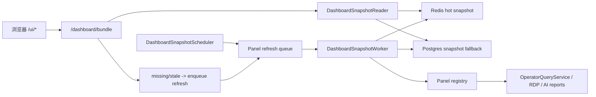

# Dashboard Snapshot Plane 方案书（2026-05-02）

> 项目定位声明：本文件默认服从 AATS 的统一目标：在严格风控、可审计、可恢复、可治理前提下，通过自动化交易追求长期稳定盈利，为 AI 的持续自治与终身发展积累资本。详见 [项目定位声明](../project_positioning.md)。

- 日期：2026-05-02
- 状态：Phase 1/2/3 已实施；持久化 store 和生产关闭 fallback 待后续审批和实施
- 范围：Operator UI、`/dashboard/bundle`、OperatorQueryService 读模型、dashboard 前端刷新模型
- 非范围：交易决策、下单执行、风控判定、恢复动作、RDP 审批语义

## 1. 执行摘要

当前 UI 慢的根因不是前端渲染，也不是单个页面 request plan 写得不够细，而是 `/dashboard/bundle` 仍在用户请求链路中同步执行重型查询。过去几轮优化主要把部分 panel 从 primary 挪到 deferred、给 runtime 做轻量摘要、加短 TTL 缓存和慢日志。这些措施降低了部分首屏阻塞，但没有改变根因：**用户打开页面时仍可能触发 DB/报告/诊断链路现算**。

本方案建议把 dashboard 从“请求时拼装 bundle”重构为“后台持续生产 UI 快照，页面只读快照”。最终目标是：

1. `/dashboard/bundle` 成为纯快照读取接口，生产环境禁止临时重算重 panel。
2. 所有页面 primary bundle P95 小于 1 秒，目标小于 200ms。
3. 重型 panel 超时不再卡页面，只表现为旧快照、stale 标记和局部刷新状态。
4. 慢查询、重报表、诊断包统一由后台 snapshot worker 调度、限流、缓存和审计。

## 2. 现状证据

2026-05-02 用户视角顺序打开所有页面后，gateway `dashboard_bundle_slow` 显示：

| 页面 | observed max bundle | 主要慢点 |
|---|---:|---|
| home | 26.6s | `runtime`、`health`、`metrics`、deferred `latestDecision` |
| overview | 27.8s | `runtime`、`strategyRuntime`、`health` |
| strategy | 17.2s | `health`、`aiRuntime`、`recentDecisions` |
| execution | 67.7s | `runtime`、`latestDecision`、`blockerControl` |
| risk | 75.3s | deferred `guardedLiveRunPacket` |
| exitExecution | 76.1s | `runtime` |
| replay | 24.1s | `health` |
| aiAnalysis | 45.0s | `runtime`、`aiOverview`、`aiLatest`、`profileControlSummary` |
| aiConfig | 47.5s | `runtime`、`aiConfigModel` |
| rdp | browser observed 81.1s | `runtime`、`rdpWorkbenchOverview`、`rdpControl` |
| admin | browser observed 81.9s | `runtime`、`health` |

全局 Top panel：

1. `runtime`: 75.99s
2. `guardedLiveRunPacket`: 75.26s
3. `latestDecision`: 39.62s
4. `strategyRuntime`: 25.20s
5. `health`: 24.79s
6. `aiConfigModel`: 18.65s
7. `metrics`: 17.64s

关键观察：

- 慢点高度集中在共享 core panel 和少数重型报表，而不是所有页面都各自慢。
- deferred 只能保护首屏，不能解决后台长期占用请求/线程/DB 的问题。
- 用户切页后，旧 bundle 的同步查询仍可能继续运行；后续页面会受到排队和资源竞争影响。
- 只调前端 timeout 或继续把 panel 分层，会继续掩盖根因。

## 3. 对上一版方案的审查

上一版方向“后台生产 UI 快照，页面只读快照”是正确的，但还不够完整，需要补齐以下设计约束：

### 3.1 不能只做 bundle 级快照

如果按完整 `view + panel list` 存快照，切页、分页、角色、参数变化会产生大量组合，仍然容易重复计算。应以 **panel key + normalized params + principal scope** 为最小快照单元，再由 bundle 接口只做拼装。

### 3.2 不能保留生产 on-demand fallback

如果 `/dashboard/bundle` 在 snapshot miss 时退回同步现算，峰值慢查询还会回来。生产路径应返回 `status=missing` 或 `stale`，并触发后台刷新。同步 fallback 只能在测试或本地诊断配置中启用，默认关闭。

### 3.3 需要明确 stale 语义

交易系统 UI 不能为了快而展示不明来源的数据。每个 panel 必须返回：

- `snapshot_generated_at`
- `snapshot_age_ms`
- `stale`
- `refreshing`
- `last_success_at`
- `last_error`
- `source`

前端必须把“数据旧但可读”和“正在刷新”分开展示。

### 3.4 需要 panel 级优先级和预算

`runtime`、`health`、`blockerControl` 是所有页面共享的高优先级快照；`guardedLiveRunPacket`、AI history、RDP workbench 是低优先级重型快照。后台调度不能一视同仁，否则重报表会挤压首屏基础状态。

### 3.5 需要防回归测试

这类问题多轮复发，必须用测试禁止 `/dashboard/bundle` 调用重查询函数。否则未来新增 panel 时很容易又把现算逻辑塞回请求链路。

## 4. 最终方案

引入 Dashboard Snapshot Plane，由后台 worker 负责生产 panel 快照，由 `/dashboard/bundle` 负责读取快照并拼装返回。

### 4.1 架构图



### 4.2 核心职责

#### DashboardSnapshotRegistry

声明每个 panel 的刷新策略：

- `panel_key`
- `params_schema`
- `ttl_seconds`
- `stale_after_seconds`
- `hard_expire_seconds`
- `timeout_seconds`
- `priority`
- `max_concurrency`
- `principal_scope`
- `loader`

#### DashboardSnapshotWorker

后台执行 loader，写入 Redis 和 Postgres。每个 panel 独立 singleflight，同一 key 同一时刻只允许一个刷新任务。

#### DashboardSnapshotStore

提供：

- `get_snapshot(key)`
- `put_snapshot(key, payload, metadata)`
- `mark_refreshing(key)`
- `record_error(key, error)`
- `enqueue_refresh(key, reason)`

Redis 作为热路径，Postgres 作为重启后兜底和审计来源。

#### DashboardSnapshotReader

`/dashboard/bundle` 使用 reader 拼装 panel。reader 不调用重型 loader。

返回策略：

- snapshot fresh：返回 data
- snapshot stale：返回旧 data + `stale=true` + enqueue refresh
- snapshot missing：返回 `data=null` + `loading=true` + enqueue refresh
- last refresh failed：返回旧 data + `last_error`；没有旧 data 时返回 panel-level error

### 4.3 Snapshot Key

推荐 key：

```text
dashboard:snapshot:v1:{profile}:{principal_scope}:{panel_key}:{params_hash}
```

`principal_scope`：

- `public_read`: 只读公共运行状态，不含用户权限差异
- `role:{role}`: admin/operator 不同结果
- `identity:{identity}`: 用户私有结果，例如账户权限管理视图

`params_hash` 来自规范化参数，例如分页 limit/offset、过滤条件、view-specific limit。

## 5. Panel 分级

### 5.1 P0 快照，必须优先迁移

目标：所有页面 primary bundle 不再被共享 core panel 卡住。

| panel | TTL | stale-after | timeout | 理由 |
|---|---:|---:|---:|---|
| `runtime` | 3s | 5s | 2s | 当前最大慢点，所有页面共享 |
| `health` | 3s | 5s | 2s | 多页面 15-25s |
| `mode` | 5s | 10s | 1s | 状态轻量但常被慢链路拖住 |
| `systemRecovery` | 5s | 10s | 2s | 顶栏/恢复按钮依赖 |
| `blockerControl` | 3s | 5s | 3s | 风控提示关键 |
| `aiRuntime` | 10s | 20s | 3s | 当前 5-12s |
| `metrics` | 5s | 10s | 3s | 多页面共享 |
| `accountState` | 5s | 10s | 2s | 风险与总览依赖 |

### 5.2 P1 快照，第二批迁移

| panel | TTL | stale-after | timeout | 理由 |
|---|---:|---:|---:|---|
| `latestDecision` | 5s | 15s | 5s | execution 页最高 39.6s |
| `strategyRuntime` | 10s | 30s | 5s | overview 页 25s |
| `executionLatest` | 5s | 15s | 3s | execution 页 8s |
| `portfolio` | 5s | 10s | 2s | 账户展示 |
| `positions` | 5s | 10s | 2s | 风险/总览 |
| `reconciliationLatest` | 10s | 30s | 3s | 风险/回放 |

### 5.3 P2 快照，重型后台报告

| panel | TTL | stale-after | timeout | 理由 |
|---|---:|---:|---:|---|
| `guardedLiveRunPacket` | 30s | 60s | 20s | 风险页 75s，必须脱离请求链路 |
| `guardedLivePreflight` | 10s | 30s | 8s | 风险页 |
| `replayStatus` | 15s | 60s | 8s | replay/risk |
| `profileControlSummary` | 60s | 120s | 20s | AI 分析 deferred 11.8s |
| `aiOverview` / `aiLatest` | 30s | 60s | 10s | AI 首屏 |
| `aiConfigModel` | 60s | 120s | 15s | AI 配置页 |
| `rdpControl` / `rdpWorkbenchOverview` | 30s | 120s | 15s | RDP 首屏 |
| RDP deferred panels | 60s | 180s | 20s | RDP 细节 |

## 6. API 兼容设计

现有 `/dashboard/bundle` 返回结构保持兼容：

```json
{
  "view": "overview",
  "panels": {
    "runtime": {
      "data": {},
      "error": null,
      "meta": {
        "snapshot_generated_at": "...",
        "snapshot_age_ms": 1234,
        "stale": false,
        "refreshing": false,
        "last_success_at": "...",
        "last_error": null,
        "source": "dashboard_snapshot"
      }
    }
  },
  "timing": {
    "total_ms": 42.1,
    "panels": {
      "runtime": {"duration_ms": 1.2}
    },
    "snapshot_read": true
  }
}
```

兼容要求：

- `panels[key].data` 和 `panels[key].error` 保留。
- 新增 `meta` 不破坏旧前端。
- `timing.panels` 仍保留，但含义从 loader 耗时变为 snapshot read 耗时。
- 另增 `snapshot_timing` 记录后台刷新耗时，便于诊断。

## 7. 前端交互设计

页面刷新语义改为：

1. 打开页面：读取已有快照，立即渲染。
2. 若有 stale/missing panel：局部卡片显示“后台刷新中”。
3. 用户点刷新：调用 enqueue refresh，不等待重算完成。
4. 前端轮询或下一轮 auto refresh 读取新快照。

展示规则：

- fresh：正常展示。
- stale with old data：展示旧数据，卡片角落显示“数据 N 秒前，后台刷新中”。
- missing：展示 loading placeholder，不影响其他卡片。
- last error：展示旧数据和“上次刷新失败”，允许人工重试。

禁止：

- 因单个 panel missing 而整页骨架屏。
- 因 deferred panel 失败覆盖已有数据为空状态。
- 点刷新后锁死全局页面直到重型查询完成。

## 8. 一致性和金融正确性

该方案只改变 UI 读模型，不改变交易真实状态。

必须遵守：

1. 快照只用于 operator UI 展示，不能作为交易决策、风控、下单或恢复动作的输入。
2. 人工高风险动作提交前，如果依赖当前状态，action handler 必须重新读 canonical source，而不是信任 UI 快照。
3. 快照 meta 必须暴露 age/stale，避免运营误以为旧数据是实时数据。
4. 恢复、暂停、账户权限等写操作成功后，必须 invalidate 相关快照并 enqueue 高优先刷新。

## 9. 迁移计划

### Phase 0：基线和保护网

- 增加性能回归测试基线。
- 在测试中标记重型 loader，如果 `/dashboard/bundle` 直接调用则失败。
- 明确当前所有 panel 的 registry 草表。

验收：

- 测试能证明当前 bundle 仍调用重查询。
- 无生产行为变化。

### Phase 1：Snapshot Store 和 P0 panel

- 新增 snapshot store、registry、worker skeleton。
- 迁移 P0 panel：`runtime`、`health`、`mode`、`systemRecovery`、`blockerControl`、`aiRuntime`、`metrics`、`accountState`。
- `/dashboard/bundle` 对 P0 panel 只读 snapshot。

验收：

- 所有页面 primary bundle 中 P0 panel snapshot read 总耗时 < 200ms。
- P0 panel miss 不触发同步重算。
- 页面仍能显示旧数据/stale 状态。

### Phase 2：P1 panel 迁移

- 迁移 `latestDecision`、`strategyRuntime`、`executionLatest`、`portfolio`、`positions`、`reconciliationLatest`。
- 删除这些 panel 的 request-time loader 路径。

验收：

- home/overview/execution/risk/replay primary bundle P95 < 1s。
- `latestDecision` 慢查询不再阻塞 execution 页面。

### Phase 3：P2 重型报告迁移

- 迁移 `guardedLiveRunPacket`、AI、RDP、Replay 重型报告。
- 对重型报告设置独立后台并发和超时。

验收：

- risk full settle 不再受 75s run packet 阻塞。
- AI/RDP 页面打开后 1s 内有可读旧快照。
- 重型报告刷新失败不会清空已有卡片。

### Phase 4：生产关闭 on-demand fallback

- 默认配置禁止 `/dashboard/bundle` 同步调用 loader。
- 本地诊断可通过显式配置启用 fallback。

验收：

- 自动测试覆盖 production config 下 bundle 不现算。
- 线上慢日志中不再出现 request-time panel loader 超过 2s。

## 10. 数据存储建议

### 10.1 Redis hot cache

用途：低延迟读取。

Key：

```text
dashboard:snapshot:v1:{profile}:{principal_scope}:{panel_key}:{params_hash}
dashboard:snapshot:refreshing:v1:{profile}:{principal_scope}:{panel_key}:{params_hash}
```

Value：JSON payload + metadata。

### 10.2 Postgres fallback

建议表：

```sql
dashboard_panel_snapshots(
  id bigserial primary key,
  profile text not null,
  principal_scope text not null,
  panel_key text not null,
  params_hash text not null,
  params jsonb not null,
  payload jsonb,
  error_code text,
  error_message text,
  generated_at timestamptz,
  last_success_at timestamptz,
  last_attempt_at timestamptz not null,
  duration_ms numeric,
  stale_after_seconds integer not null,
  hard_expire_seconds integer not null,
  created_at timestamptz not null default now(),
  updated_at timestamptz not null default now(),
  unique(profile, principal_scope, panel_key, params_hash)
);
```

索引：

```sql
create index idx_dashboard_snapshots_panel_updated
  on dashboard_panel_snapshots(profile, panel_key, updated_at desc);
```

注意：如果第一阶段不想上 schema，可先用 Redis-only + in-memory store 完成 P0 行为验证，但最终需要 Postgres 审计和重启兜底。

## 11. 调度和并发

推荐调度策略：

- P0 panel：固定周期 3-5 秒刷新，优先级最高。
- P1 panel：固定周期 5-15 秒刷新，用户打开页面时可 enqueue。
- P2 panel：固定周期 30-120 秒，按需 enqueue，但受并发预算限制。

并发预算：

- P0 worker pool：独立，不能被 P2 抢占。
- P1 worker pool：中等。
- P2 worker pool：低并发，失败指数退避。

取消策略：

- 已启动的同步 DB 查询可能无法硬取消，因此必须在调度层避免重复启动。
- 用户切页不取消 worker；因为 worker 生产的是共享快照。但切页也不能启动重复 worker。

## 12. 日志、指标和告警

新增日志事件：

- `dashboard_snapshot_refresh_start`
- `dashboard_snapshot_refresh_success`
- `dashboard_snapshot_refresh_failed`
- `dashboard_snapshot_read_miss`
- `dashboard_snapshot_stale_served`
- `dashboard_bundle_snapshot_slow`

核心指标：

- `dashboard_bundle_read_ms{view}`
- `dashboard_snapshot_age_ms{panel}`
- `dashboard_snapshot_refresh_duration_ms{panel}`
- `dashboard_snapshot_refresh_errors_total{panel,error}`
- `dashboard_snapshot_stale_served_total{panel}`
- `dashboard_snapshot_miss_total{panel}`
- `dashboard_snapshot_queue_depth{priority}`

告警：

- P0 snapshot age > 15s 持续 3 分钟。
- P0 refresh error 连续 5 次。
- bundle read P95 > 1s。
- P2 队列积压超过阈值但不影响 P0。

## 13. 风险和缓解

| 风险 | 影响 | 缓解 |
|---|---|---|
| UI 展示旧数据 | 运营误判 | meta 暴露 age/stale；写操作前重读 canonical source |
| 快照 worker 本身拖垮 DB | 影响交易服务 | 独立并发预算、超时、退避、P0/P2 隔离 |
| Postgres schema 增加复杂度 | 迁移风险 | Phase 1 可先 Redis-only，Phase 2 再补持久化 |
| on-demand fallback 被保留 | 慢问题复发 | production config 默认禁止，测试强制验证 |
| 多用户权限泄漏 | 安全事故 | key 包含 principal_scope，admin panel 使用 identity/role scope |
| 快照结构和旧 panel 不兼容 | 前端破坏 | 保留 `data/error`，新增 meta |

## 14. 被否决方案

### 14.1 继续拆 primary/deferred

否决原因：只能改变首屏等待位置，不能减少总查询，也不能阻止旧请求继续占用资源。

### 14.2 放宽前端 timeout

否决原因：会把 30s 卡顿变成 90s 卡顿，不解决 DB/报告链路。

### 14.3 只加 bundle TTL cache

否决原因：完整 bundle key 受 view、panel list、分页、角色影响，复用率低；而且 miss 时仍同步现算。

### 14.4 给每个慢 SQL 单独加索引

否决原因：索引优化应做，但当前慢点跨 runtime、health、AI、RDP、诊断报告，不是一个索引能根治。应先改变请求链路模型，再逐个优化 loader。

### 14.5 前端 localStorage 缓存

否决原因：无法保证权限隔离、无法统一审计，也不能减少后端请求计算压力。

## 15. 测试策略

### 15.1 单元测试

- registry key 规范化。
- TTL/stale/hard expire 判定。
- snapshot miss 不调用 loader。
- stale snapshot 返回旧数据并 enqueue refresh。
- role/identity scope 隔离。

### 15.2 集成测试

- `/dashboard/bundle` 在 production snapshot mode 下只读 snapshot。
- P0 snapshot worker 能刷新并写入 store。
- 写操作后 invalidate/enqueue 生效。
- loader error 保留旧快照。

### 15.3 浏览器测试

顺序打开：

- `/ui`
- `/ui/overview`
- `/ui/strategy`
- `/ui/execution`
- `/ui/risk`
- `/ui/exit-execution`
- `/ui/replay`
- `/ui/ai-analysis`
- `/ui/ai-config`
- `/ui/rdp`
- `/ui/settings`

验收：

- primary 已同步 P95 < 1s。
- 任一 P2 panel 慢或失败，不阻塞页面进入可读状态。
- stale/missing 文案正确显示。

### 15.4 回归测试

猴子补丁或 spy 以下函数，若 `/dashboard/bundle` 调用则失败：

- `OperatorQueryService.guarded_live_run_packet`
- `OperatorQueryService.strategy_runtime`
- `OperatorQueryService.latest_decision`
- `OperatorQueryService.ai_overview`
- RDP workbench loaders

## 16. 部署和回滚

部署：

1. Phase 1 先以 shadow mode 启动 worker，只写 snapshot，不服务 UI。
2. 对比 snapshot payload 与现有 loader payload。
3. 切 P0 panel 到 snapshot read。
4. 观察 bundle latency、snapshot age、refresh error。
5. 再逐步切 P1/P2。

回滚：

- 每个 panel 单独 feature flag。
- 出现严重展示错误时，只回滚该 panel 到旧 loader。
- 若 snapshot worker 影响 DB，立即关闭 P2 worker，保留 P0。
- 最终 Phase 4 前，短期可保留 emergency fallback；Phase 4 后只允许本地诊断启用。

## 17. 验收标准

架构验收：

1. `/dashboard/bundle` production path 不直接执行重型 loader。
2. P0/P1/P2 panel 都有 registry 策略。
3. 快照 meta 完整暴露。
4. 权限 scope 明确隔离。

性能验收：

1. 所有页面 primary bundle P95 < 1s。
2. P0 snapshot age P95 < 10s。
3. P2 panel 慢查询不影响 primary bundle。
4. gateway 不再出现 request-time `dashboard_bundle_slow` > 2s。

运营验收：

1. 页面不再长时间停留在整页骨架屏。
2. stale 数据有明确提示。
3. 刷新失败不清空旧数据。
4. 人工写操作仍以 canonical source 为准。

## 18. 推荐实施顺序

推荐先做 Phase 0 + Phase 1，不一次性迁移所有 panel。原因：

- `runtime`、`health`、`aiRuntime`、`blockerControl` 已经覆盖大多数页面卡顿。
- P0 迁移能验证 snapshot plane 的关键合同。
- 先保护首屏，再处理 AI/RDP/风险重报告，风险更低。

第一轮交付边界：

1. 新增 snapshot registry/store/worker 基础设施。
2. 迁移 P0 panel。
3. `/dashboard/bundle` 对 P0 panel 纯读快照。
4. 前端支持 panel meta 的 stale/loading 展示。
5. 增加防回归测试和浏览器性能测试。

如果第一轮验收达不到 primary P95 < 1s，应停止后续迁移，先修 snapshot read path，而不是继续迁移更多 panel。
