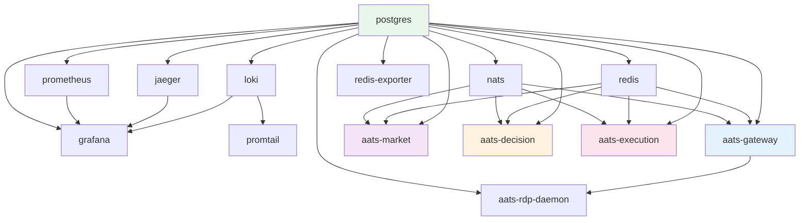

# 01 · 系统拓扑

> **历史快照**：基于 2026-04-21 HEAD `0ef6f1c`；当前拓扑以根目录 `ARCHITECTURE.md`、`DEPLOYMENT.md` 为准。

> **生成于 HEAD=0ef6f1c** · 2026-04-21
> **内容**：AATS 4 进程 + 基础设施容器 + 部署拓扑 + 启动依赖

---

## TL;DR

4 个业务进程（gateway / market / decision / execution）+ 1 个辅助 daemon（rdp-daemon）
+ 9 个基础设施容器（postgres / redis / nats / loki / jaeger / prometheus / grafana / promtail / redis-exporter）。

所有东西跑在 WSL2 Ubuntu 的 docker compose 里，business 进程用 heartbeat 文件做 health check。

---

## 4 个业务进程

### 职责划分（一句话）

| 进程 | 职责 |
|------|------|
| **gateway** | FastAPI HTTP + UI dashboard + 跨进程 operator command proxy |
| **market** | 订阅 OKX 公开 WS，算 feature snapshot，广播到 NATS |
| **decision** | 消费 feature snapshot → baseline 规则 + (optional) AI → PositionTarget |
| **execution** | 消费 PositionTarget → OKX REST 下单 → OKX 私有 WS 收 fill → 更新 state |
| **rdp-daemon** | 轮询 `governance.rdp_task_queue`，运行 research / data-maintenance 长任务 |

### Slice 门禁（`aats/bootstrap/config.py:_slice_active`）

每个进程只启动自己需要的 service，避免重复 work：

| Slice | gateway | market | decision | execution | rdp-daemon |
|-------|---------|--------|----------|-----------|------------|
| shared (logging / DB / bus) | ✓ | ✓ | ✓ | ✓ | ✓ |
| market (WS / feature) | | ✓ | | | |
| decision (orchestrator / AI / risk) | | | ✓ | | |
| execution (OrderManager / OKX adapter) | | | | ✓ | |
| portfolio (snapshot / PnL) | | | | ✓ | |
| reconciliation | | | | ✓ | |
| startup_recovery (once at boot) | | | | ✓ | |

### 单实例守护（advisory lock）

每个进程在启动时获取 PG advisory lock，key = hash(db_url + process_role)。
保证同一 process_role 只有一个进程在跑。本次 autonomous session 的 T+1
（`23c8e7e`）修了"被 60s idle-in-tx safety net 误杀"的 bug。

详见 `scripts/diag/pg_connection_health.sh` 第 3 段（advisory_lock_holders 应为 4）。

---

## 基础设施容器

| 容器 | 用途 | 暴露端口 | 持久化 |
|------|------|----------|--------|
| **aats-postgres** (16-alpine) | 主库：accounts / orders / portfolio / reconciliation | 127.0.0.1:5432 | `postgres_data` volume |
| **aats-redis** (7-alpine, auth) | 跨进程 hot state cache | 127.0.0.1:6379 | `redis_data` volume (AOF) |
| **aats-nats** (2.10-alpine, JetStream) | Event bus：关键 topic 文件持久、observer topic 内存 | 127.0.0.1:4222 / 8222 | `nats_data` |
| **aats-loki** (3.0.0) | 日志聚合 | 127.0.0.1:3100 | `loki_data` |
| **aats-jaeger** (1.57) | 分布式 trace（OTLP gRPC） | 127.0.0.1:16686 / 4317 / 4318 | `jaeger_badger_data` |
| **aats-prometheus** (2.51.0) | metrics 抓取 | 127.0.0.1:9090 | `prometheus_data` |
| **aats-grafana** (12.4.3) | dashboard + 告警 | 127.0.0.1:3000 | `grafana_data` |
| **aats-promtail** (3.0.0) | docker 容器日志 → loki | — | `promtail_positions` |
| **aats-redis-exporter** (1.58.0) | redis metrics → prometheus | 127.0.0.1:9121 | — |

**所有端口都绑 127.0.0.1**（仅 WSL2 本地可达），不暴露到局域网。

---

## 业务进程容器

| 容器 | 端口 | 命令 | Health check |
|------|------|------|--------------|
| **aats-gateway** | 127.0.0.1:8011 (衍生品实盘) | uvicorn apps.api_gateway.main:app | `curl /healthz` |
| **aats-market** | — | python -m apps.market_gateway.main | 心跳文件 /tmp/aats_market_heartbeat < 30s |
| **aats-decision** | — | python -m apps.decision_engine.main | 心跳文件同上 |
| **aats-execution** | — | python -m apps.execution_engine.main | 心跳文件同上 |
| **aats-rdp-daemon** | — | python scripts/rdp_task_daemon.py | python 进程存活 |

**⚠️ 心跳文件 health check 的盲点**（[LF-20260421-001](10_latent_findings.md#LF-20260421-001)）：
如果进程 GIL 卡死但后台线程仍在更新心跳，容器会显示 healthy 但实际决策链路
已停。需要更主动的 health check（后续）。

---

## 启动依赖链

## 部署文件映射

| 文件 | 作用 |
|------|------|
| `deploy/wsl2-dev/docker-compose.yml` | 基础设施（postgres/redis/nats/...） |
| `deploy/wsl2-dev/docker-compose.aats.yml` | 4 个业务进程 + rdp-daemon 的共享部分 |
| `deploy/wsl2-dev/docker-compose.aats.derivatives-live.yml` | 衍生品实盘 profile 覆盖（port / profile / db name） |
| `deploy/wsl2-dev/docker-compose.aats.spot*.yml` | 现货 profile 变体 |
| `.env.wsl2` | 基础设施凭证（Postgres 密码等） |
| `.env.derivatives.live` | 衍生品实盘环境变量（含 OKX 凭证） |
| `scripts/deploy.sh` | **唯一**正确的部署入口（7 步 pipeline） |

---

## 数据流 Topic 总览（跨进程）

完整 topic ↔ producer ↔ consumer 映射见 [02_data_flow.md](02_data_flow.md)。这里
只列"关键 topic"（file-backed，不能丢）：

| Topic | Producer | Consumer | 为什么关键 |
|-------|----------|----------|-----------|
| `KILL_SWITCH_STATE` | execution | all | 系统级 halt 信号 |
| `OBLIGATION_UPDATES` | execution | decision, gateway, execution | 跨进程 obligation cache 一致性 |
| `ORDER_UPDATES` | execution | gateway, execution | OrderState 状态机传播 |
| `GUARD_SIGNAL_UPDATES` | execution | decision | RiskEngine 的 only_reduce 决策依赖 |

---

## 使用本文档

**快速排查问题**：
- "进程没启动" → 看启动依赖链，确认前置容器 healthy
- "看不到 UI 数据" → 看 topic 表，确认 gateway 能消费 ORDER_UPDATES / PORTFOLIO_SNAPSHOTS
- "为什么有 4 个 advisory lock" → 本文档 "单实例守护" 段解释

**进一步了解**：
- 数据流详细：[02_data_flow.md](02_data_flow.md)
- 安全层：[03_safety_layers.md](03_safety_layers.md)
- 运维：[09_operational_guide.md](09_operational_guide.md)
