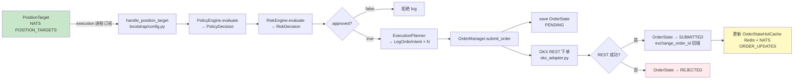
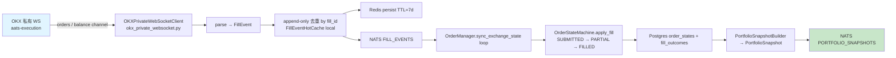
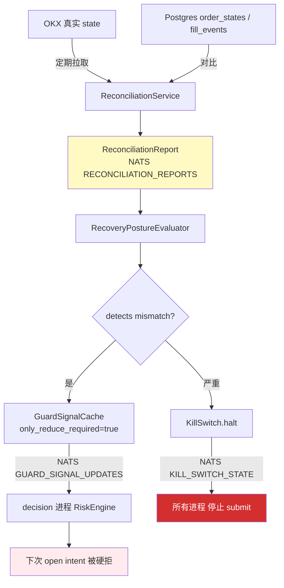

# 02 · 核心数据流

> **生成于 HEAD=0ef6f1c** · 2026-04-21
> **范围**：market tick → FeatureSnapshot → Decision → PositionTarget → OrderIntent → OKX → FillEvent → OrderState 更新 → Portfolio → Reconciliation

---

## TL;DR

```
OKX WS → Market tick → FeatureSnapshot → Trigger → Orchestrator
  → Baseline Assessment → (AI skipped in baseline_only) → Target Engine
  → Strategy Coordinator → PositionTarget → [NATS POSITION_TARGETS]
  → Execution Planner → LegOrderIntent → OrderManager.submit
  → OKX REST → OrderState=SUBMITTED → [Redis + NATS ORDER_UPDATES]
  → OKX Private WS → FillEvent → OrderState=FILLED → PortfolioSnapshot
```

每条链路中间都有 ReconciliationService 监听、KillSwitch 可中断、RecoveryPostureEvaluator 可阻塞。

---

## Pipeline 1 · 决策链路（market → PositionTarget）

```mermaid
graph LR
    A[OKX 公开 WS<br/>aats-market 进程] -->|raw ohlcv/orderbook| B[MarketSnapshot<br/>NATS MARKET_SNAPSHOTS]
    B -->|订阅| C[FeatureEngine<br/>volatility / regime / long-short ratio]
    C --> D[FeatureSnapshot<br/>NATS FEATURE_SNAPSHOTS]
    D -->|快路径 _handle_feature_snapshot_via_queue| E[DecisionCycleTrigger<br/>_trigger_queue maxsize=1]
    E -->|latest-wins dedup| F[_dispatcher_loop]
    F --> G[DecisionOrchestrator.run_cycle]
    G --> G1[context_builder.build]
    G1 --> G2[baseline_strategy.evaluate<br/>→ BaselineAssessment]
    G2 --> G3{ai_operating_mode<br/>== baseline_only?}
    G3 -->|是 当前| G4[跳过 AI]
    G3 -->|否| G5[ai_service.assess<br/>→ AIAssessment]
    G4 --> G6
    G5 --> G6
    G6[target_engine.build<br/>→ PositionTarget] --> G7[strategy_coordinator<br/>apply_selected_target]
    G7 --> H[PositionTarget<br/>NATS POSITION_TARGETS]
    
    style A fill:#e1f5ff
    style G3 fill:#fff9c4
    style G4 fill:#c8e6c9
    style H fill:#c8e6c9
```



**关键触发频率**（实测 2026-04-21）：
- 每 ~ 24.4 秒一次决策（3538/24h ≈ 2.46/min）
- 触发由 MarketSnapshot 驱动（不是定时器）

**重要设计约束**：
- `_trigger_queue` maxsize=1 是**故意的**（latest-wins，见 SOW §7）
- `_dispatcher_loop` 是**单线程**（确保 run_cycle 不并行，避免状态机竞争）
- FeatureSnapshot envelope 的 `event_id` 作为 `feature_snapshot_hint` 传进 run_cycle，保证 ref 一致性

---

## Pipeline 2 · 执行链路（PositionTarget → OrderState）



**key transitions**：`PENDING → SUBMITTED → (PARTIAL_FILLED) → FILLED`，也可能
`PENDING → REJECTED` 或 `SUBMITTED → CANCELED`（见 [04_state_machines.md](04_state_machines.md)）。

---

## Pipeline 3 · Fill 摄入链路



**keepalive 保护**（A1 修复 `7660646`）：`OKXPrivateWebSocketClient` 的主循环
每条消息后调 `_assert_keepalive_alive(task)` 检测 keepalive task 静默死，
30s 之内重连 vs 旧版的隐藏失活。

---

## Pipeline 4 · 反馈循环（Reconciliation / Recovery）



这就是 [03_safety_layers.md](03_safety_layers.md) 的详细来源。

---

## Topic 汇总表

| Topic | Producer | Consumer | 持久化 | 关键？ |
|-------|----------|----------|--------|--------|
| MARKET_SNAPSHOTS | market | decision, gateway | event_store | - |
| FEATURE_SNAPSHOTS | market | decision | event_store | - |
| DECISION_CONTEXTS | decision | audit, reconciliation | event_store | - |
| BASELINE_ASSESSMENTS | decision | audit | event_store | - |
| AI_ASSESSMENTS | decision | audit | event_store | 仅 AI 模式 |
| **DECISION_OUTCOMES** | **execution** (via `_publish_finalized_decision_outcome`) | **audit** | **event_store** | - |
| POSITION_TARGETS | decision | execution | event_store | ✅ |
| POLICY_DECISIONS | decision | execution | event_store | ✅ |
| RISK_DECISIONS | decision | execution | event_store | ✅ |
| ORDER_INTENTS | decision / execution | execution | event_store | ✅ |
| ORDER_UPDATES | execution | gateway, execution | Redis + event_store | ✅ |
| OBLIGATION_UPDATES | execution | all | Redis + event_store | ✅ |
| FILL_EVENTS | execution | decision, portfolio | Redis (7d) + event_store | ✅ |
| PORTFOLIO_SNAPSHOTS | execution | decision, gateway | event_store | - |
| RECONCILIATION_REPORTS | execution | audit, recovery | event_store | ✅ |
| GUARD_SIGNAL_UPDATES | execution | decision (RiskEngine) | Redis + event_store | ✅ |
| KILL_SWITCH_STATE | execution (governance) | all | Redis + event_store | 🔴 critical |
| PROCESSING_FAILURES | all | reconciliation | event_store | - |
| OPERATOR_COMMAND_REQUESTS | gateway | execution | event_store | ✅ |
| OPERATOR_COMMAND_RESPONSES | execution | gateway | event_store | ✅ |

---

## 重要决策速率与时序

| 指标 | 值 | 来源 |
|------|-----|------|
| 决策周期 | ~2.46/min (24.4s 间隔) | `SELECT COUNT(*) FROM event_store WHERE event_type='DecisionContext' AND event_timestamp > NOW() - '24h'` |
| 实际成交数 | 25 笔 / 4 天 | order_states 表 |
| 策略成交率 | 4 天 1 交易日 | 当前市场信号 < 成本阈值 → 3 天 hold |
| OKX WS 消息 | ~30/sec（粗估） | Pipeline 1 的隐式上限 |
| Reconciliation 循环 | 30s 左右间隔 | `reconciliation_stale_after_seconds / 2` |
| 持仓快照 | 60s+jitter | `_refresh_account_loop` |
| event_store 写速 | ~0.5 GB/day（dedup 后） | Phase 1 数据 |

---

## 发现的 latent 模式

（已抄进 [10_latent_findings.md](10_latent_findings.md)）：

- ~~`DECISION_OUTCOMES` topic 被 declared 但 never published~~ — **已纠正**: 其实是 `_publish_finalized_decision_outcome` 在 `config.py:1868` 发布，我的 audit agent 漏搜了 bootstrap 目录
- OrderState 更新存在 WS vs REST 竞争窗口 — **HIGH**
- `run_cycle` 无全局 timeout，NATS 背压时可能卡死整个 decision 进程 — **HIGH**
- Reconciliation 发报告到 KillSwitch halt 之间有 10-50ms 缝 — **HIGH**（安全敏感）
- Feature snapshot 无 TTL，market 重启后 decision 可能用旧数据
- 心跳文件 health check 看不到 GIL 卡死

**这些都不是今天的紧急问题**，但用户做 code review 时可以挨个看。
