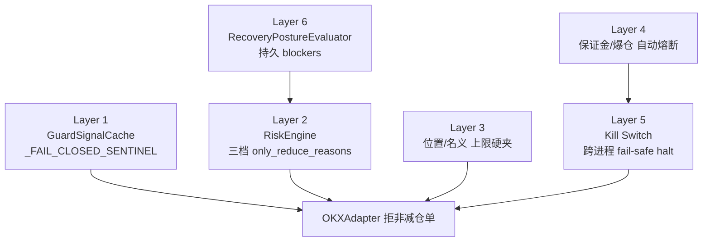

# 03 · 安全层（Fail-Closed 架构）

> **生成于 HEAD=待更新** · 2026-04-21
> **基础**：本次 session C2 审计报告 `docs/autonomous_sessions/2026_04_21_safety_audit_report.md` 的知识图谱版本
> **目标读者**：任何即将动 risk / recovery / kill switch 相关代码的人

---

## TL;DR

AATS 的 "fail-closed" 有 **6 层防御**，任何一层独立工作就能保住资本。每层都有
明确的触发条件、执行点、和 fail-closed 的兜底行为。



---

## Layer 1 · GuardSignalCache `_FAIL_CLOSED_SENTINEL`

**位置**: `aats/services/governance_engine/guard_signal_cache.py:75-83, 352-374`

**什么时候 fail**: Redis 断连 / NATS 断连 / bootstrap 失败 / snapshot age > 120s

**做了什么**: `snapshot()` 返回
```python
{
    "only_reduce_required": True,
    "only_reduce_reasons": ["guard_signal_missing_or_stale"],
    "safe_to_trade": False,
    "status": "stale",
    "_stale": True,
}
```

**下游谁看**: RiskEngine 通过 `live_runtime_guard_provider.snapshot()` / `recovery_status_provider()`

**测试锚点**: `tests/unit/test_guard_signal_cache_bootstrap_failure.py` (6b0cbaf, 8 tests)

---

## Layer 2 · RiskEngine 三档 `only_reduce_reasons`

**位置**: `aats/services/governance_engine/risk.py:1487-1543`

**三个 provider 路径**：
1. `reconciliation_only_reduce_reasons` — 对账发现异常
2. `runtime_guard_only_reduce_reasons` — guard 信号（Layer 1 的下游）
3. `recovery_status_only_reduce_reasons` — recovery posture 评估

**决策逻辑**:
```
IF any 路径 的 only_reduce_reasons 非空:
    only_reduce_required = True
    flattened_target_qty = reduce_only_target_qty(current)
    IF target ≈ current:
        approved = False  # 硬拒
        rejection_reasons += provider reasons
```

**测试锚点**: `tests/unit/test_risk_engine_provider_none_behavior.py` (d477bf4, 10 tests)

---

## Layer 3 · 位置/名义上限硬夹

**位置**: `aats/services/governance_engine/risk.py:102-117` + `1450-1467`

**硬夹字段**:
| 字段 | 默认值 | 0 语义 | 测试 |
|------|--------|--------|------|
| `max_abs_position_qty` | 0.01 | 硬拒 open（夹 qty=0） | ✅ d6e6694 |
| `max_notional_per_symbol` | 1,000 | 硬拒 open（scale notional=0） | ✅ d6e6694 |
| `max_gross_notional_per_symbol` | 2,500 | ⚠️ 禁用检查 | ✅ d6e6694 |
| `max_pending_notional_per_symbol` | 1,250 | ⚠️ 禁用检查 | ✅ d6e6694 |
| `max_total_open_notional` | 5,000 | ⚠️ 禁用检查 | ✅ d6e6694 |
| `max_target_leverage` | 1（spot+cash）/ 20 | hard cap | - |
| `max_open_orders` | 5 | block on exceed | - |

**生产实盘值**（来自 `.env.derivatives.live`）：
- `MAX_ABS_POSITION_QTY=0.1` BTC
- `MAX_NOTIONAL_PER_SYMBOL=10_000` USDT
- `MAX_TOTAL_OPEN_NOTIONAL=10_000` USDT

---

## Layer 4 · 保证金 / 爆仓自动熔断

**位置**: `aats/services/governance_engine/derivatives_live_guard.py:78-215`

**触发条件**（任一满足）：

| 触发 | 阈值（实盘 env） | 动作 |
|------|------------------|------|
| 保证金使用率高 | ≥ 75% (`AUTO_HALT_MARGIN_USAGE_FRACTION`) | `auto_halt_required=True` |
| 爆仓距离近 | ≤ 10% (`AUTO_HALT_LIQUIDATION_GAP_FRACTION`) | 同上 |
| 保证金中等 | ≥ 65% (`ONLY_REDUCE_TRIGGER_MARGIN_FRACTION`) | `only_reduce_required=True`（不熔断，只减仓） |
| 风险快照缺失 | > 240s | `auto_halt_required=True` |

**熔断路径**:
```python
if auto_halt_required:
    self.kill_switch.halt(reason="derivatives_live_risk_auto_halt")
```
→ Layer 5 接管。

---

## Layer 5 · Kill Switch 跨进程 Fail-Safe

**位置**: `aats/services/governance_engine/kill_switch.py`

**核心不变性 I1-I7**（见代码注释）：
- **I1**: 任何 `halt()` 的本地状态**立即**生效（sync read 不会晚于 write）
- **I2**: 跨进程通过 NATS KILL_SWITCH_STATE 广播，≤1s 内所有进程本地状态一致
- **I3**: Redis 持久化（TTL=30d），进程重启也能恢复 halted 状态
- **I5**: `OKXAdapter.submit_order()` 前同步读 `kill_switch.halted`，halted 且非减仓 → `kill_switch_active`
- **I6**: NATS 乱序事件用 `set_at_ts` 排序，防止旧事件回退状态
- **I7**: 多进程模式下 Redis bootstrap 失败 → **默认 halt**（fail-safe，line 245）

**halt 触发源**:
- 手动 operator action
- Layer 4 auto-halt
- trial_guard breached
- reconciliation halt_required

---

## Layer 6 · RecoveryPostureEvaluator 持久 Blockers

**位置**: `aats/services/governance_engine/recovery_posture.py:58-66`

**持久 blockers 集合**（即使 reconciliation 清掉也不自动解除，必须人工
或特定信号恢复）：

```python
_PERSISTENT_STATUS_BLOCKERS = {
    "pending_execution_commands",
    "stuck_sent_submit_commands",
    "account_snapshot_refresh_failed",
    "strategy_bundle_recovery_in_progress",
    "strategy_bundle_recovery_requires_review",
    "derivatives_exchange_position_without_local_execution_chain",
    *EXIT_EXECUTION_BLOCKER_KINDS,
}
```

**为什么要持久**：防止"reconciliation 短暂好转 → recovery 解除阻塞 →
RiskEngine 放行开仓 → 下一次 reconciliation 又发现 mismatch"的抖动。

**最重要的一条**：`derivatives_exchange_position_without_local_execution_chain`
—— 交易所有仓位但本地没有对应的执行 intent。生产真实场景（手动从交易所
app 下的单、OKX 推的强平）。Layer 6 检测并阻止直到人工介入。

---

## 端到端链路

一次 `PositionTarget` 的安全评估会依次经过：

```
PositionTarget 进入 handle_position_target
  │
  ▼
Layer 3（位置/名义硬夹）    ← target_qty 被 cap
  │
  ▼
Layer 2（三档 only_reduce 聚合） ← 任何一条非空 → approved=False
  │     依赖：
  │       ├── Layer 1（guard signal 是否 stale）
  │       ├── Layer 4（auto_halt 状态是否在）
  │       └── Layer 6（recovery 是否有持久 blocker）
  │
  ▼
RiskDecision（approved/rejected）
  │
  ▼ 如 approved
OrderManager.submit_order
  │
  ▼
Layer 5（Kill Switch）      ← OKXAdapter 前最后一道 synchronous 检查
  │
  ▼ 如 not halted
OKX REST submit
```

---

## 测试覆盖度速查

| Layer | Happy path | Error branch | 新增 anchor |
|-------|-----------|--------------|-------------|
| 1 | ✅ test_guard_signal_cache | ✅ stale / missing / bootstrap failure | ✅ 6b0cbaf (8 tests) |
| 2 | ✅ test_guarded_live | ✅ sentinel 传导 | ✅ d477bf4 (10 tests) |
| 3 | ✅ 隐含于 test_guarded_live | ⚠️ zero semantics (仅 2/5 字段安全) | ✅ d6e6694 (6 tests) |
| 4 | ✅ test_task72_derivatives_live_guard | ⚠️ NaN / Infinity 无显式测 | 部分 |
| 5 | ✅ test_kill_switch_cross_process | ✅ fail-safe halt on Redis down | 部分 |
| 6 | ✅ test_recovery_posture | ✅ derivatives_exchange_position | 充分 |

**本次 session 新增的 3 份 anchor test（总 24 项）补齐了之前的**显式证明缺口**。

---

## 有什么可能破

详见 [10_latent_findings.md](10_latent_findings.md)，关键是：
- **LF-20260421-004**：Reconciliation → Kill Switch 有 10-50ms 竞争窗口
- **LF-20260421-005**：Kill Switch 不验证所有进程收到事件（NATS 丢包漏洞）
- **LF-20260421-011**：max_gross/pending/total_open_notional=0 禁用检查（UX 陷阱）

这些都不紧急但值得未来 fix。

---

## 参考

- C2 审计报告：`docs/autonomous_sessions/2026_04_21_safety_audit_report.md`
- 状态机详情：[04_state_machines.md](04_state_machines.md)
