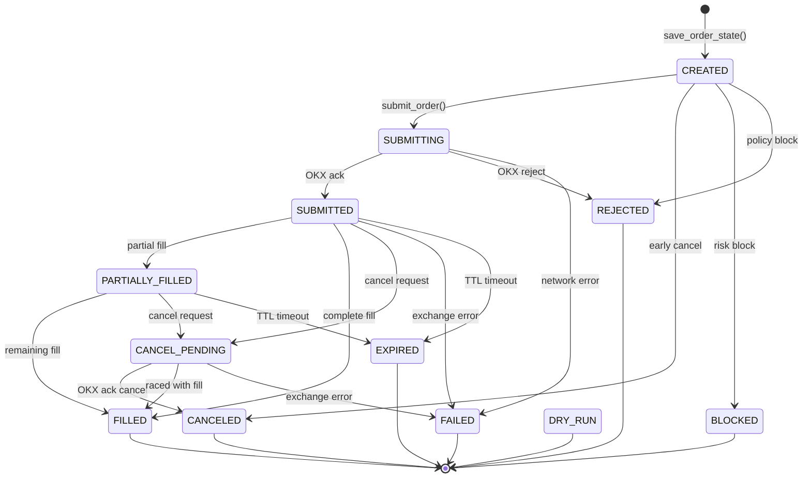
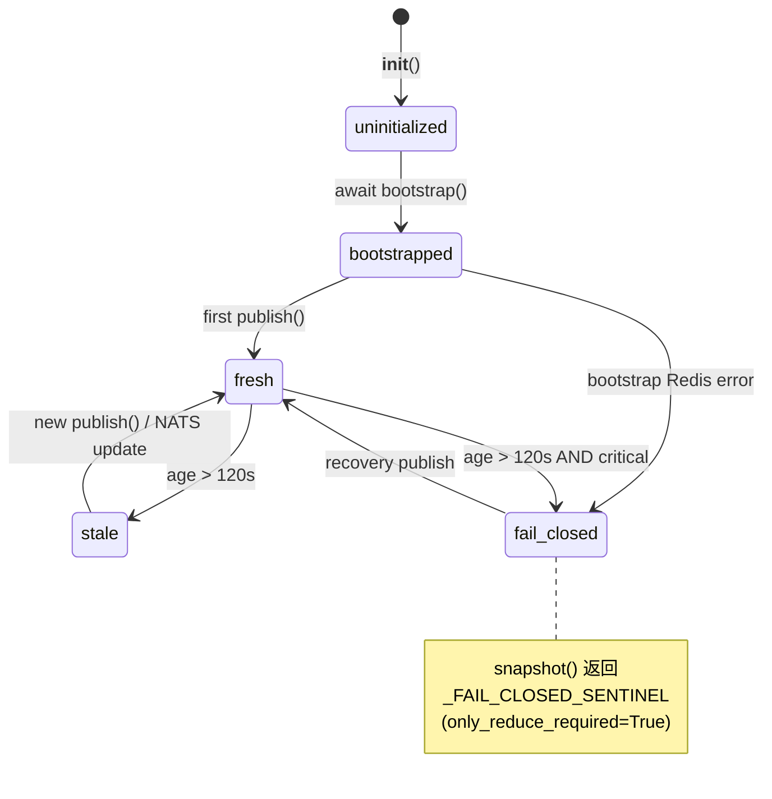
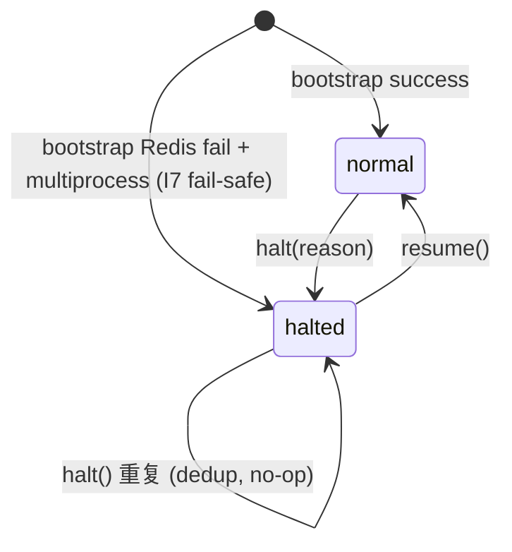

# 04 · 状态机

> **历史快照**：2026-04-21 版本；当前状态枚举、转换和恢复语义以 schema、service 和测试为准。

> **生成于 HEAD=待更新** · 2026-04-21
> **范围**：OrderState / Reconciliation / GuardSignal / KillSwitch / RecoveryPosture

---

## TL;DR

AATS 里有 **5 个核心状态机**。每个都有明确的 terminal 集合、乐观锁 / 幂等性、和
fail-closed 默认行为。

| 状态机 | 正常路径 | 紧急 exit | 持久化 |
|--------|---------|-----------|--------|
| OrderState | CREATED→SUBMITTING→SUBMITTED→FILLED | REJECTED / FAILED / BLOCKED / DRY_RUN | PG + Redis |
| Reconciliation Severity | CLEAN→INFO→SOFT_MISMATCH | REVIEW_REQUIRED / HARD_MISMATCH | PG |
| Guard Signal | uninitialized→bootstrapped→fresh→stale | `_FAIL_CLOSED_SENTINEL` | Redis |
| Kill Switch | normal→halted→normal | 多进程 fail-safe halt | Redis |
| Recovery Posture | normal→only_reduce→review_required→resume_blocked | any persistent blocker | 推导 |

---

## 1 · OrderState 状态机

**位置**: `aats/services/execution_engine/state_machine.py`

**所有状态**:
- **transient**: CREATED / SUBMITTING / SUBMITTED / PARTIALLY_FILLED / CANCEL_PENDING
- **terminal** (不可再转): FILLED / CANCELED / REJECTED / FAILED / BLOCKED / DRY_RUN / EXPIRED



**关键不变性**:
- **No backward transitions** — `STATE_PRIORITY` (line 79) 硬拦
- `filled_qty ≤ requested_qty`（line 211 归一化）
- `remaining_qty = max(0, requested_qty - filled_qty)`
- 同 status 允许幂等重复（line 76）

**⚠️ 边缘情况**:
- 如果 exchange 推回一个 status regression（旧数据），merge 逻辑保留新 fill 但不回退 status（line 160-187）—— 这 **掩盖了 exchange 端的数据异常**，见 [LF-20260421-002](10_latent_findings.md#LF-20260421-002)

---

## 2 · Reconciliation Severity 状态机

**位置**: `aats/services/reconciliation_service/comparator.py:1138-1154`

**Severity 从低到高**:

| Severity | 触发 | 动作 | 能 resume 吗 |
|----------|------|------|------------|
| **CLEAN** | 无 findings | 正常 | ✅ |
| **INFO** | 只有 historical | 仅记录 | ✅ |
| **SOFT_MISMATCH** | `only_reduce_required` 或 soft | 只减仓模式 | 待评估 |
| **REVIEW_REQUIRED** | ≥ 1 finding.review_required=True | 暂停新单，等人审 | ❌ |
| **HARD_MISMATCH** | ≥ 1 finding.halt_required=True | 全停 | ❌ |

**一个 finding 的字段**:
- `severity`: info / soft / review / halt
- `review_required`: bool
- `halt_required`: bool
- `only_reduce_required`: bool
- `blocks_resume`: bool

**聚合**: multiple findings → `max(severity)` 胜出。

---

## 3 · Guard Signal 生命周期

**位置**: `aats/services/governance_engine/guard_signal_cache.py`



**Stale 阈值**：`_DEFAULT_STALE_THRESHOLD_SECONDS = 120`

**跨进程同步**:
- **Writer (execution)**: local dict → Redis (TTL=360s) → NATS broadcast
- **Reader (decision)**: Redis bootstrap → NATS subscribe → local cache 同步
- **幂等**: NATS receive 比 `set_at_ts`，旧消息 drop (line 399)

**Dedup**（本次 session T+5 引入）:
- 同 payload hash → skip event_store.append（省 3.3 GB 历史）
- 仍 NATS broadcast → reader `_last_updated_at` 不停 → 120s 不触发 fail-closed

---

## 4 · Kill Switch 状态机

**位置**: `aats/services/governance_engine/kill_switch.py`



**halt 触发源**（4 个）:
1. Manual: `ks.halt(reason="manual_halt")` via API
2. Auto (margin): DerivativesLiveGuardService → auto_halt_required
3. Auto (trial): TrialGuardService breached
4. Auto (reconciliation): HARD_MISMATCH severity

**不变性 I1-I7**（见 [03_safety_layers.md#Layer-5](03_safety_layers.md#layer-5-kill-switch-跨进程-fail-safe)）。

---

## 5 · RecoveryPosture 状态

**位置**: `aats/services/governance_engine/recovery_posture.py`

**Recovery state 集合**:
- `normal_operation`
- `degraded_continue`（soft mismatch 但无需人审）
- `only_reduce`（衍生品必须减仓）
- `review_required`
- `resume_blocked`（halt_required 或 kill_switch.halted 或持久 blocker）
- `bundle_recovery`（策略 bundle 还在恢复中）
- `manually_halted`
- `rebaseline_pending` / `rebaseline_completed`
- `multi_process_role_skip`

**决策逻辑简化**:

```python
if report.halt_required:
    state = "resume_blocked"
elif review_required_blocks_resume:
    state = "review_required"
elif only_reduce_required:
    state = "only_reduce"
elif bundle_recovery_required:
    state = "bundle_recovery"
else:
    state = "normal_operation"

# 最终覆盖：
if kill_switch.halted:
    state = "resume_blocked"
```

**Resume action 推导** (`resume_check()`):
- `runnable`: bool（所有 blockers 清掉）
- `blockers`: tuple[str, ...]

**持久 blockers**（不自动清）：见 [03_safety_layers.md#Layer-6](03_safety_layers.md#layer-6-recoverypostureevaluator-持久-blockers)。

---

## 状态机之间的依赖

```mermaid
graph TD
    OSM[OrderState machine] -.|fills| RS[Reconciliation severity]
    RS -.|severity>=HARD| KS[Kill Switch]
    RS -.|findings| RP[Recovery posture]
    GSC[Guard signal] -.|only_reduce| RE[RiskEngine]
    KS -.|halted| RP
    RP -.|only_reduce 或 resume_blocked| RE
    RE -.|approved?| OSM
    
    style RE fill:#fff9c4
    style OSM fill:#c8e6c9
```

---

## 测试覆盖

每个状态机都有单独的 unit test 文件：
- `test_order_state_machine.py`
- `test_reconciliation_*.py`（多个）
- `test_guard_signal_cache.py` + `test_guard_signal_cache_bootstrap_failure.py`（本 session 新增）
- `test_kill_switch_*.py` + `test_kill_switch_cross_process.py`
- `test_recovery_posture.py` + 集成 `test_recovery.py`

本次 session C2 新增的 3 个 anchor test 文件（24 tests）覆盖了之前的证明缺口。

---

## 值得担心的地方

- **OrderState regression silently merged** → [LF-20260421-002](10_latent_findings.md#LF-20260421-002)
- **Kill Switch 不 ack** → [LF-20260421-005](10_latent_findings.md)
- **Recovery blockers 用 dict.fromkeys dedup 但不 content-hash** → 同名不同语义 blockers 会合并
