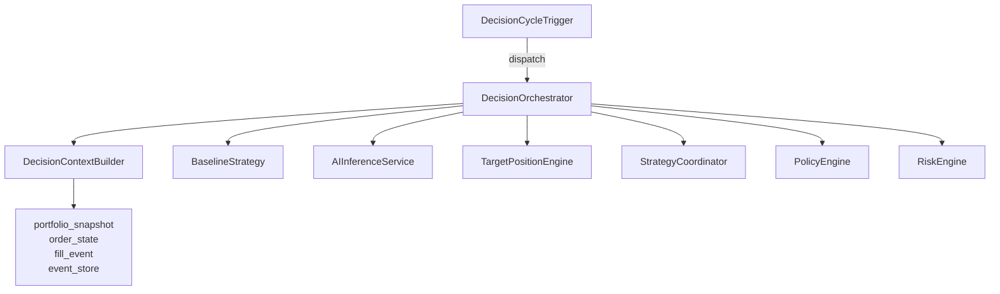

# 06 · Service 目录（系统的"动词"）

> **生成于 HEAD=待更新** · 2026-04-21
> **内容**：`aats/services/` 下的核心 service 类，按进程归类

---

## TL;DR

AATS 共约 11 个 service 目录，~100 个 service 类。按**哪个进程运行**归类能
快速定位。每个 service 都在 `aats/bootstrap/config.py` 的 `_slice_active(role)`
里决定是否实例化。

---

## `decision` 进程

| Service | 职责 | 主要入口 |
|---------|------|---------|
| **DecisionOrchestrator** | 编排每次 decision cycle | `run_cycle(symbol, timeframe, feature_snapshot_hint)` |
| **DecisionContextBuilder** | 组装 DecisionContext | `build(...)` |
| **BaselineStrategy** | 规则引擎的评估 | `evaluate(context) -> BaselineAssessment` |
| **AIInferenceService** | 调 OpenAI 的 AI 评估（当前 short-circuit） | `assess(context, baseline)` / `should_attempt_assessment()` |
| **PromptBuilder**, **AssessmentValidator** | AI prompt + 结果验证 | - |
| **TargetPositionEngine** | baseline + AI → PositionTarget | `build(...)` / `build_ai_decision_intent(...)` |
| **StrategyCoordinatorService** | 多 sleeve 资金分配 + 冲突解决 | `evaluate(context)` / `apply_selected_target(...)` |
| **DecisionCycleTrigger** | 触发 run_cycle 的调度器 | `apply_message(feature_snapshot)` |
| **DecisionTriggerPolicy** | 何时 trigger（频率 / cooldown） | `should_trigger(symbol, timeframe, context)` |
| **PolicyEngine** | 运行时策略过滤（symbol 白名单等） | `evaluate(target) -> PolicyDecision` |
| **RiskEngine** | 风险约束评估 | `evaluate(target) -> RiskDecision` |

### `decision` 进程的依赖图（简化）

---

## `execution` 进程

| Service | 职责 | 主要入口 |
|---------|------|---------|
| **OrderManager** | 订单生命周期管理 | `accept_order_intent(intent)` / `apply_fill_event(fill)` / `sync_exchange_state()` |
| **ExecutionPlanner** | target → ExecutionPlan（legs / slices / urgency） | `build_plan(...)` |
| **OKXExecutionAdapter** | ExecutionPlan → OKX REST | `submit_order(intent)` / `cancel_order(...)` |
| **OKXPrivateWebSocketClient** | 私有 WS 接 fills / balances | `run_forever()`（含 keepalive watchdog） |
| **exit_intent_aggregator** (module) | 多腿 exit 订单的协调 | `create_exit_execution_intent_from_order_intent(...)` |
| **OKXAccountService** | 账户 / 仓位读取 | `refresh()` / `latest_snapshot()` |
| **AccountSnapshotCache** | 跨进程账户缓存 | `publish(snapshot)` / `snapshot()` |
| **ReconciliationService** | 对账（交易所 vs 本地） | `validate_now(...)` / `repair_missing_portfolio_snapshot(...)` |
| **StateComparator** | 具体的状态对比 | `compare(...) -> ReconciliationReport` |
| **PortfolioService** | 组合 + PnL 聚合 | `refresh()` / `bootstrap_snapshot(...)` |
| **PortfolioSnapshotBuilder** | 构建 PortfolioSnapshot | `build(state, price, ...)` |
| **DerivativesLiveGuardService** | 保证金/爆仓 auto-halt 计算 | `evaluate_now()` |
| **ForwardTrialGuardService** | trial 模式下的 breach 检测 | `evaluate_now()` |
| **RecoveryPostureEvaluator** | 系统恢复状态评估 | `assess()` / `resume_check()` |
| **ExecutionLedgerRecoveryService** | 启动 recovery | `execute_startup_recovery_sequence()`（只跑一次） |

---

## `market` 进程

| Service | 职责 |
|---------|------|
| **MarketDataGateway** | 市场数据入口 |
| **OKXPublicWebSocketClient** | 公开 WS 订阅 |
| **MarketSnapshotNormalizer** | 归一化为 MarketSnapshot |
| **MarketSnapshotPublisher** | 发 NATS |
| **FeatureEngine** | 消费 MarketSnapshot → FeatureSnapshot |
| **FeatureCalculator** | 算 EMA / RSI / regime / volatility |
| **RegimeClassifier** | bull / bear / range 判别 |
| **LongShortRatioPoller** | 长短比例（perpetual） |

---

## `gateway` 进程

| Service | 职责 |
|---------|------|
| **FastAPI app** (`apps/api_gateway/main.py`) | HTTP 入口 + UI |
| **OperatorQueryService** | 所有 dashboard 查询的 facade（**368 方法**，见 LF） |
| **CommandBridge** | operator 命令（halt / resume / rebaseline） |
| **StrategyProfileControlService** | sleeve 配置管理 |

---

## 跨所有进程（`shared` slice）

| Service | 职责 |
|---------|------|
| **EventBus** (`aats/bus/`) | NATS JetStream 抽象 |
| **DatabaseRuntime** | PG 连接池（SQLAlchemy 2.0 sync） |
| **HotStateStore** | Redis 抽象 |
| **MetricsRegistry** | Prometheus counter / histogram |
| **TelemetryConfig** | OTLP trace 到 Jaeger |
| **SchemaBase** 验证 | pydantic 2 |
| **GuardSignalHotStateCache** (读 side) | 订阅 guard signal |
| **KillSwitch** (读 side) | 订阅 halt 事件 |

---

## 可疑模式（已抄到 [10_latent_findings.md](10_latent_findings.md)）

1. **OperatorQueryService 368 方法** — facade 过大，应按领域拆
2. **TargetPositionEngine 69 方法** — position sizing / AI intent 翻译 / operating mode / fee 逻辑混在一起
3. **RiskEngine 58 方法** — 衍生品 guard / 现货 guard / margin / funding / obligation check 应该用 strategy pattern 拆
4. **DecisionContextBuilder 横向依赖爆炸** — 从 9+ 个 services 吸数据
5. **exit_intent_aggregator 是 module 而不是 class** — 风格不一致
6. **projections/ 目录孤儿** — 只有 2 处 import，可能死代码

---

## 怎么用

- 查 "某个动作发生在哪里"：找 service → `accept_order_intent` / `evaluate` / `assess` 等主入口
- 看 "某进程在启动时起了什么" ：`aats/bootstrap/config.py` 的 `_slice_active("<role>")` 条件分支
- Debug 一个流：按 [02_data_flow.md](02_data_flow.md) 的 pipeline 图顺藤摸瓜
