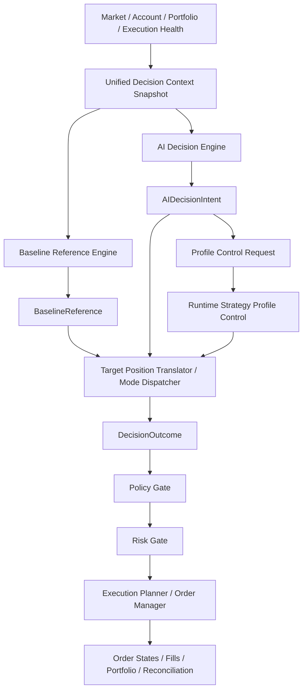

# Task 31: AI Decision-Maker Architecture Refactor Design

> 项目定位声明：本文件默认服从 AATS 的统一目标：在严格风控、可审计、可恢复、可治理前提下，通过自动化交易追求长期稳定盈利，为 AI 的持续自治与终身发展积累资本。详见 [项目定位声明](../../docs/project_positioning.md)。


> **Historical document (2026-04 update)**: `ai_decision_maker_with_profile_control`
> 已从运行模式枚举中移除。profile 自动换档现在由独立开关
> `strategy_profile_auto_control_enabled` 控制，可以与任何 AI 运行模式
> (`baseline_only` / `ai_assisted` / `ai_decision_maker`) 组合。保留此
> 文档里对该模式的描述仅作为历史记录，当前代码会把历史值自动折叠为
> `ai_decision_maker`。

## 1. Document Purpose

This document defines the high-level refactor target for the trading decision stack.

The goal is to move the system from:

- baseline-led trading with AI enhancement
- mixed semantics between trading decision, AI takeover, and runtime profile governance
- inconsistent UI/API/internal language

to:

- explicit multi-mode decision semantics
- AI-as-decision-maker in selected modes
- baseline as reference and fallback
- policy/risk/recovery as hard boundaries
- runtime profile control as an optional AI capability, not a parallel control plane

This document is intentionally high-level. It is the contract for subsequent schema, API, UI, and implementation changes.

---

## 2. Scope

This refactor covers:

- AI operating mode semantics
- decision-chain responsibility boundaries
- core data structures
- API response direction
- runtime profile control integration
- frontend migration and legacy component retirement

This refactor does not cover:

- execution engine rewrite
- portfolio/reconciliation rewrite
- distributed architecture redesign
- `.env` mutation by AI

---

## 3. Target Architecture

### 3.1 Architectural Intent

The system should have one clear trading-decision mainline:

1. Build unified decision context
2. Produce baseline reference
3. Produce AI decision intent
4. Translate by mode into final decision outcome
5. Apply policy/risk/recovery hard gates
6. Execute approved intent
7. Update portfolio and reconciliation state
8. Optionally evaluate runtime profile control

### 3.2 Target Flow



### 3.3 Core Architectural Rules

- AI may become the decision maker, but never the system sovereign.
- Baseline remains available in all modes, but only owns final trading decisions in `baseline_only` and `ai_assisted`.
- Policy, risk, recovery, and execution-health gating always remain authoritative.
- Runtime profile control is an optional extension of AI decision-maker mode.
- Admin profile override always has higher priority than AI profile control.
- AI never writes `.env`; it only affects runtime state.

---

## 4. Official Operating Modes

The system will officially support only these four values:

- `baseline_only`
- `ai_assisted`
- `ai_decision_maker`
- `ai_decision_maker_with_profile_control`

Legacy values are temporary compatibility aliases only:

- `ai_advisory -> ai_assisted`
- `ai_blended -> ai_assisted`
- `ai_primary -> ai_decision_maker`

### 4.1 `baseline_only`

- Baseline is the final trading decision source.
- AI does not participate in real trading decisions.
- AI cannot request runtime profile changes.

### 4.2 `ai_assisted`

- Baseline remains the final trading decision source.
- AI may provide explanation, recommendation, weak-signal filtering, and optional size adjustment.
- AI does not own final direction.
- AI cannot request runtime profile changes.

### 4.3 `ai_decision_maker`

- AI owns the final trading decision.
- Baseline becomes reference, disagreement source, and fallback.
- Policy/risk/recovery may still block or cap the final outcome.
- AI cannot request runtime profile changes.

### 4.4 `ai_decision_maker_with_profile_control`

- AI owns the final trading decision.
- AI may also request runtime strategy profile changes.
- Admin manual override remains highest priority.
- Admin override activates a freeze window for AI-driven profile changes.

---

## 5. Responsibility Model

### 5.1 Baseline

Responsibilities:

- generate `BaselineReference`
- provide fallback candidate
- provide disagreement comparison
- support operator interpretation and attribution

Non-responsibilities in AI decision-maker modes:

- it does not own the final trading decision
- it does not veto AI, except through explicit fallback policy

### 5.2 AI Inference Layer

Responsibilities:

- generate `AIDecisionIntent`
- in highest mode, optionally request runtime profile change

Non-responsibilities:

- cannot bypass policy/risk/recovery
- cannot write configuration files

### 5.3 Target Position Translator / Mode Dispatcher

Responsibilities:

- dispatch by `ai_operating_mode`
- translate baseline or AI output into final target semantics
- apply business-side guards and cadence/profile constraints
- produce `DecisionOutcome`

This layer replaces the old unclear “AI takeover” center of gravity.

### 5.4 Policy / Risk / Recovery

Responsibilities:

- hard approval, rejection, or capping
- system-safety enforcement
- execution feasibility enforcement

These layers do not decide market direction.

### 5.5 Runtime Strategy Profile Control

Responsibilities:

- manage active runtime profile
- accept admin overrides
- optionally accept AI profile-control requests in the highest mode
- apply admin-freeze logic

---

## 6. Formal Field Inventory

## 6.1 Mode Field

### `ai_operating_mode`

Type:

```text
Literal[
  "baseline_only",
  "ai_assisted",
  "ai_decision_maker",
  "ai_decision_maker_with_profile_control"
]
```

Constraints:

- only these four values are valid as canonical values
- legacy values may be read but must be normalized before downstream use

---

## 6.2 BaselineReference

Suggested fields:

- `decision_id: str`
- `symbol: str`
- `timeframe: str | None`
- `regime: str | None`
- `volatility_state: str | None`
- `direction_bias: Literal["long", "short", "flat"]`
- `confidence: float | None`
- `composite_alpha_score: float | None`
- `suggested_position_scale: float | None`
- `reason_codes: list[str]`
- `raw_payload: dict[str, Any] | None`

Purpose:

- baseline output normalized as a reference object
- consumed by fallback logic and operator visibility

---

## 6.3 AIDecisionIntent

Suggested fields:

- `decision_id: str`
- `symbol: str`
- `timeframe: str | None`
- `direction: Literal["long", "short", "flat"]`
- `action: Literal["hold", "enter", "scale_in", "reduce", "exit", "reverse"]`
- `target_qty: Decimal | float`
- `confidence: float`
- `economically_actionable: bool`
- `reason_codes: list[str]`
- `fallback_used: bool`
- `degraded: bool`
- `provider_name: str | None`
- `provider_request_id: str | None`
- `requested_profile_id: str | None`
- `requested_profile_reason_codes: list[str]`
- `raw_assessment_ref: dict[str, Any] | None`

Purpose:

- AI’s proposed decision payload
- not yet the executed result
- may include runtime profile request in highest mode

---

## 6.4 DecisionOutcome

Suggested fields:

- `decision_id: str`
- `symbol: str`
- `ai_operating_mode: str`
- `decision_source: Literal["baseline", "ai", "baseline_fallback", "admin_override"]`
- `decision_authority: Literal["reference_only", "advisory", "final_decision", "final_decision_with_profile_control"]`
- `final_direction: Literal["long", "short", "flat"] | None`
- `final_action: Literal["hold", "enter", "scale_in", "reduce", "exit", "reverse"] | None`
- `final_target_qty: Decimal | float | None`
- `baseline_reference: dict[str, Any] | None`
- `baseline_disagreement: dict[str, Any] | None`
- `decision_blocked_reasons: list[str]`
- `guardrail_flags: list[str]`
- `policy_blocked: bool`
- `policy_blocked_reasons: list[str]`
- `risk_capped: bool`
- `risk_capped_reasons: list[str]`
- `risk_capped_target_qty: Decimal | float | None`
- `active_profile_id: str | None`
- `profile_control_source: Literal["env_default", "ai", "admin", "system"] | None`
- `ai_fallback_used: bool`
- `ai_degraded: bool`

Purpose:

- single operator-facing outcome object
- replaces the current overloaded takeover-centric narrative

---

## 6.5 ProfileControlDecision

Suggested fields:

- `decision_id: str | None`
- `requested_by: Literal["ai", "admin", "system"]`
- `requested_profile_id: str`
- `current_profile_id: str | None`
- `applied: bool`
- `blocked_reasons: list[str]`
- `frozen_by_admin_override: bool`
- `freeze_until: datetime | None`
- `decision_reason_codes: list[str]`
- `activation_record_ref: str | None`

Purpose:

- explicit result object for profile control requests
- should not be flattened into unrelated decision fields

---

## 6.6 Legacy Compatibility Fields

Short-term compatibility fields may remain:

- `ai_takeover_allowed`
- `ai_takeover_applied`
- `ai_takeover_blockers`

Rules:

- read-only compatibility
- not used as primary UI/API semantics
- new logic must not depend on them

---

## 7. Old-to-New Field Mapping

### 7.1 Mode Mapping

| Legacy value | Canonical value | Notes |
|---|---|---|
| `baseline_only` | `baseline_only` | unchanged |
| `ai_advisory` | `ai_assisted` | terminology consolidation |
| `ai_blended` | `ai_assisted` | no longer a distinct top-level mode |
| `ai_primary` | `ai_decision_maker` | old “primary” becomes explicit AI decision-maker |

### 7.2 Takeover Mapping

| Legacy field | New field(s) | Notes |
|---|---|---|
| `ai_takeover_allowed` | `decision_authority`, `decision_blocked_reasons` | a bool is not expressive enough |
| `ai_takeover_applied` | `decision_source="ai"` | explicit source is clearer |
| `ai_takeover_blockers` | `decision_blocked_reasons` | one blocker vocabulary |

### 7.3 Assessment / Target Mapping

| Legacy structure | New structure | Notes |
|---|---|---|
| baseline assessment payload | `BaselineReference` | baseline becomes a reference object |
| AI assessment payload | `AIDecisionIntent` + `raw_assessment_ref` | existing AI assessment can remain as raw reference |
| target-position payload | `DecisionOutcome` | final operator-facing decision should be unified |

### 7.4 Profile Governance Mapping

| Legacy field / concept | New field | Notes |
|---|---|---|
| `active_profile_id` | `active_profile_id` | retained |
| `profile_source` | `profile_control_source` | more precise naming |
| recommendation payload | `ProfileControlDecision` | recommendation no longer implies application |
| activation record | `activation_record_ref` | retained as audit reference |

---

## 8. Mode Behavior Matrix

### 8.1 Capability Matrix

| Capability | `baseline_only` | `ai_assisted` | `ai_decision_maker` | `ai_decision_maker_with_profile_control` |
|---|---|---|---|---|
| Baseline runs | Yes | Yes | Yes | Yes |
| AI runs | Optional / No | Yes | Yes | Yes |
| Baseline owns final trade decision | Yes | Yes | No | No |
| AI owns final trade decision | No | No | Yes | Yes |
| AI may size-adjust only | No | Yes | N/A | N/A |
| AI may request runtime profile change | No | No | No | Yes |
| Admin may manually override profile | Yes | Yes | Yes | Yes |
| Policy/risk/recovery may block | Yes | Yes | Yes | Yes |

### 8.2 Mode Semantics

| Mode | Final trade source | Baseline role | AI role | Profile control |
|---|---|---|---|---|
| `baseline_only` | baseline | primary | none / diagnostic only | admin/system only |
| `ai_assisted` | baseline | primary | advisory | admin/system only |
| `ai_decision_maker` | AI | reference/fallback | primary | disabled |
| `ai_decision_maker_with_profile_control` | AI | reference/fallback | primary + profile request | AI enabled, admin override wins |

### 8.3 Degraded / Fallback Matrix

| Scenario | `baseline_only` | `ai_assisted` | `ai_decision_maker` | `ai_decision_maker_with_profile_control` |
|---|---|---|---|---|
| AI provider unavailable | no impact | baseline proceeds | baseline fallback takes over | baseline fallback takes over; profile request disabled |
| AI output invalid | no impact | AI advice discarded | baseline fallback takes over | baseline fallback takes over |
| AI degraded | no impact | AI advice downweighted/hidden | baseline fallback or restricted AI policy | baseline fallback; profile control blocked |

### 8.4 Profile Control Priority Matrix

| Source | Priority | Notes |
|---|---|---|
| Admin manual override | Highest | immediate, authoritative |
| System safety override | High | safety downgrade, execution emergency, guarded fallback |
| AI automatic profile request | Medium | only in highest mode |
| Environment default | Lowest | startup baseline only |

---

## 9. API Response Direction

The goal is a compatible evolution, not a breaking rewrite on day one.

### 9.1 Legacy Example

```json
{
  "decision_id": "dec_123",
  "symbol": "BTC-USDT-SWAP",
  "operating_mode": "ai_primary",
  "ai_takeover_allowed": true,
  "ai_takeover_applied": false,
  "ai_takeover_blockers": ["expected_net_edge_too_low"],
  "target_position_qty": "0",
  "guardrail_flags": ["entry_threshold_not_met"],
  "active_profile_id": "trend_normal"
}
```

Problems:

- takeover flags carry too much meaning
- final decision source is unclear
- baseline intent and AI intent are hidden
- profile-control semantics are mixed into decision semantics

### 9.2 Target Response Shape

```json
{
  "decision_id": "dec_123",
  "symbol": "BTC-USDT-SWAP",
  "ai_operating_mode": "ai_decision_maker",
  "baseline_reference": {
    "direction_bias": "long",
    "confidence": 0.61,
    "composite_alpha_score": 0.27,
    "reason_codes": ["trend_following_signal"]
  },
  "ai_decision_intent": {
    "direction": "long",
    "action": "enter",
    "target_qty": "0.35",
    "confidence": 0.79,
    "economically_actionable": true,
    "fallback_used": false,
    "degraded": false,
    "reason_codes": ["ai_trend_alignment", "net_edge_positive"]
  },
  "decision_outcome": {
    "decision_source": "ai",
    "decision_authority": "final_decision",
    "final_direction": "long",
    "final_action": "hold",
    "final_target_qty": "0",
    "decision_blocked_reasons": ["entry_threshold_not_met"],
    "guardrail_flags": ["entry_threshold_not_met"],
    "policy_blocked": false,
    "risk_capped": false,
    "active_profile_id": "trend_normal",
    "profile_control_source": "env_default",
    "ai_fallback_used": false,
    "ai_degraded": false
  }
}
```

### 9.3 Compatibility Strategy

Stage 1:

- add new fields
- keep old fields
- document old fields as transitional

Stage 2:

- frontend consumes only new fields
- legacy clients may still read old fields

Stage 3:

- legacy takeover fields are deprecated
- new logic stops producing new semantics via old fields

Stage 4:

- remove legacy fields after migration window

---

## 10. Representative API Examples by Mode

### 10.1 `baseline_only`

```json
{
  "decision_id": "dec_001",
  "symbol": "BTC-USDT-SWAP",
  "ai_operating_mode": "baseline_only",
  "baseline_reference": {
    "direction_bias": "long",
    "confidence": 0.66,
    "composite_alpha_score": 0.31,
    "reason_codes": ["trend_following_signal"]
  },
  "ai_decision_intent": null,
  "decision_outcome": {
    "decision_source": "baseline",
    "decision_authority": "reference_only",
    "final_direction": "long",
    "final_action": "enter",
    "final_target_qty": "0.22",
    "decision_blocked_reasons": [],
    "guardrail_flags": [],
    "policy_blocked": false,
    "risk_capped": false,
    "active_profile_id": "trend_normal",
    "profile_control_source": "env_default",
    "ai_fallback_used": false,
    "ai_degraded": false
  }
}
```

### 10.2 `ai_assisted`

```json
{
  "decision_id": "dec_002",
  "symbol": "BTC-USDT-SWAP",
  "ai_operating_mode": "ai_assisted",
  "baseline_reference": {
    "direction_bias": "long",
    "confidence": 0.64,
    "composite_alpha_score": 0.29,
    "reason_codes": ["trend_following_signal"]
  },
  "ai_decision_intent": {
    "direction": "long",
    "action": "enter",
    "target_qty": "0.16",
    "confidence": 0.73,
    "economically_actionable": true,
    "fallback_used": false,
    "degraded": false,
    "reason_codes": ["ai_size_reduction_due_to_moderate_quality"]
  },
  "decision_outcome": {
    "decision_source": "baseline",
    "decision_authority": "advisory",
    "final_direction": "long",
    "final_action": "enter",
    "final_target_qty": "0.16",
    "decision_blocked_reasons": [],
    "guardrail_flags": [],
    "policy_blocked": false,
    "risk_capped": false,
    "active_profile_id": "trend_normal",
    "profile_control_source": "env_default",
    "ai_fallback_used": false,
    "ai_degraded": false
  }
}
```

### 10.3 `ai_decision_maker`

```json
{
  "decision_id": "dec_003",
  "symbol": "BTC-USDT-SWAP",
  "ai_operating_mode": "ai_decision_maker",
  "baseline_reference": {
    "direction_bias": "flat",
    "confidence": 0.52,
    "composite_alpha_score": 0.08,
    "reason_codes": ["weak_signal"]
  },
  "ai_decision_intent": {
    "direction": "long",
    "action": "enter",
    "target_qty": "0.28",
    "confidence": 0.81,
    "economically_actionable": true,
    "fallback_used": false,
    "degraded": false,
    "reason_codes": ["ai_detected_breakout_setup"]
  },
  "decision_outcome": {
    "decision_source": "ai",
    "decision_authority": "final_decision",
    "final_direction": "long",
    "final_action": "enter",
    "final_target_qty": "0.28",
    "decision_blocked_reasons": [],
    "guardrail_flags": [],
    "policy_blocked": false,
    "risk_capped": false,
    "active_profile_id": "trend_normal",
    "profile_control_source": "env_default",
    "ai_fallback_used": false,
    "ai_degraded": false,
    "baseline_disagreement": {
      "disagreed": true,
      "baseline_direction": "flat",
      "ai_direction": "long"
    }
  }
}
```

### 10.4 `ai_decision_maker` with fallback

```json
{
  "decision_id": "dec_004",
  "symbol": "BTC-USDT-SWAP",
  "ai_operating_mode": "ai_decision_maker",
  "baseline_reference": {
    "direction_bias": "short",
    "confidence": 0.68,
    "composite_alpha_score": -0.34,
    "reason_codes": ["baseline_bearish_signal"]
  },
  "ai_decision_intent": {
    "direction": "flat",
    "action": "hold",
    "target_qty": "0",
    "confidence": 0.0,
    "economically_actionable": false,
    "fallback_used": true,
    "degraded": true,
    "reason_codes": ["provider_timeout"]
  },
  "decision_outcome": {
    "decision_source": "baseline_fallback",
    "decision_authority": "final_decision",
    "final_direction": "short",
    "final_action": "enter",
    "final_target_qty": "0.18",
    "decision_blocked_reasons": [],
    "guardrail_flags": [],
    "policy_blocked": false,
    "risk_capped": false,
    "active_profile_id": "trend_normal",
    "profile_control_source": "env_default",
    "ai_fallback_used": true,
    "ai_degraded": true
  }
}
```

### 10.5 `ai_decision_maker_with_profile_control`

```json
{
  "decision_id": "dec_005",
  "symbol": "BTC-USDT-SWAP",
  "ai_operating_mode": "ai_decision_maker_with_profile_control",
  "baseline_reference": {
    "direction_bias": "long",
    "confidence": 0.59,
    "composite_alpha_score": 0.21,
    "reason_codes": ["baseline_trend_signal"]
  },
  "ai_decision_intent": {
    "direction": "long",
    "action": "enter",
    "target_qty": "0.20",
    "confidence": 0.77,
    "economically_actionable": true,
    "fallback_used": false,
    "degraded": false,
    "reason_codes": ["ai_moderate_long_setup"],
    "requested_profile_id": "trend_strict",
    "requested_profile_reason_codes": ["execution_stable_but_signal_quality_moderate"]
  },
  "profile_control_decision": {
    "requested_by": "ai",
    "requested_profile_id": "trend_strict",
    "current_profile_id": "trend_normal",
    "applied": true,
    "blocked_reasons": [],
    "frozen_by_admin_override": false,
    "freeze_until": null,
    "decision_reason_codes": ["ai_profile_adjustment_accepted"]
  },
  "decision_outcome": {
    "decision_source": "ai",
    "decision_authority": "final_decision_with_profile_control",
    "final_direction": "long",
    "final_action": "enter",
    "final_target_qty": "0.20",
    "decision_blocked_reasons": [],
    "guardrail_flags": [],
    "policy_blocked": false,
    "risk_capped": false,
    "active_profile_id": "trend_strict",
    "profile_control_source": "ai",
    "ai_fallback_used": false,
    "ai_degraded": false
  }
}
```

---

## 11. Frontend Migration, Component Retirement, and UI Simplification

This is a required part of the refactor. The current UI still carries old mental models, especially takeover-centric concepts.

### 11.1 Frontend Goals

- remove takeover-centric UX
- align UI language with the four official modes
- separate trade decision from profile control
- preserve compatibility during migration
- avoid duplicate or contradictory cards
- keep all new Chinese copy as clean UTF-8 text

### 11.2 Components to Retire or Downgrade

The following legacy concepts should be retired from the primary UI:

- “AI 是否接管”
- “AI 是否允许接管”
- “AI 接管阻断项”
- takeover-focused summary cards
- any panel that treats `ai_takeover_applied` as the central user-facing story

These may remain temporarily:

- legacy detail fields in debug or compatibility views
- historical records that still reference takeover semantics

### 11.3 Components to Introduce or Reframe

The UI should pivot to four primary blocks:

1. `当前模式`
- `纯基础策略`
- `AI 辅助`
- `AI 决策者`
- `AI 决策者并控制档位`

2. `基础策略参考`
- baseline direction
- confidence
- regime
- baseline reason summary

3. `AI 决策意图`
- AI direction
- action
- target qty
- confidence
- degraded / fallback state

4. `最终决策结果`
- final source
- final authority level
- final action and qty
- blocked reasons
- policy/risk adjustments

When in highest mode, add:

5. `档位控制结果`
- requested profile
- applied or blocked
- current active profile
- control source
- admin freeze status

### 11.4 Recommended Frontend Migration Stages

#### Stage A: Add New View Models

Frontend data layer should start reading:

- `ai_operating_mode`
- `baseline_reference`
- `ai_decision_intent`
- `decision_outcome`
- `profile_control_decision`

No old component removal yet.

#### Stage B: Switch Primary Rendering

Primary cards and summaries should render from new fields.

Legacy cards should either:

- be hidden from normal UI
- or move behind a debug/legacy details expander

#### Stage C: Remove Takeover-Centric Components

Delete or stop rendering components that exist only to explain:

- takeover allowed
- takeover applied
- takeover blockers

At this stage, operator and product users should no longer need takeover terminology to understand the system.

#### Stage D: Remove Legacy Field Dependencies

Frontend should no longer depend on:

- `ai_takeover_allowed`
- `ai_takeover_applied`
- `ai_takeover_blockers`

These can remain in payloads only for temporary compatibility.

### 11.5 UI Field-to-Component Mapping

| New field | UI target |
|---|---|
| `ai_operating_mode` | mode badge / page summary |
| `baseline_reference` | baseline reference card |
| `ai_decision_intent` | AI decision intent card |
| `decision_outcome.decision_source` | final decision source card |
| `decision_outcome.decision_blocked_reasons` | blocked reasons card |
| `decision_outcome.risk_capped` | risk cap notice |
| `decision_outcome.profile_control_source` | active profile source label |
| `profile_control_decision` | profile control result card |

### 11.6 Frontend Files Expected to Be Affected

Primary likely files:

- `aats/api/static/modules/views/ai-view.js`
- `aats/api/static/modules/views/ai-config-view.js`
- `aats/api/static/modules/terms.js`
- `aats/api/static/app.js`

Secondary files:

- any view-model adapters or shared formatting helpers that currently interpret takeover semantics

### 11.7 Frontend Invariants

The frontend must preserve these invariants during migration:

- one page must not present two conflicting “final decision” narratives
- profile-control cards must not be confused with trade-decision cards
- old and new fields must not be blended into contradictory labels
- admin override must remain visually higher priority than AI profile control
- all new user-facing Chinese text must be clean UTF-8

---

## 12. High-Level Decision Rules Confirmed for This Design

These are the recommended default decisions for implementation:

1. `ai_assisted` may adjust size, but may not own final direction.
2. `ai_decision_maker` does not give baseline a veto; baseline remains fallback only.
3. `ai_decision_maker_with_profile_control` should not initially allow AI to auto-switch to aggressive profiles.
4. Admin override freeze duration should be configurable.
5. `AIDecisionIntent` should include `requested_profile_id` from version one.

---

## 13. Implementation Stages

### Stage 1: Operating Mode Unification

Deliverables:

- canonical 4-mode enum
- legacy mode normalization
- updated user-facing terminology

### Stage 2: New Schema Introduction

Deliverables:

- `BaselineReference`
- `AIDecisionIntent`
- `DecisionOutcome`
- `ProfileControlDecision`

Compatibility rule:

- new fields added first
- old fields retained temporarily

### Stage 3: Target Position Refactor

Deliverables:

- `target_position` becomes the mode dispatcher and translator
- no longer centered on takeover semantics

### Stage 4: Baseline Role Reduction

Deliverables:

- baseline becomes reference/fallback in AI decision-maker modes

### Stage 5: Profile Control Integration

Deliverables:

- highest mode can request runtime profile changes
- admin freeze logic applies

### Stage 6: Frontend and Query Migration

Deliverables:

- UI consumes new structures
- takeover-focused components retired from primary UX

### Stage 7: Legacy Cleanup

Deliverables:

- legacy takeover fields deprecated and eventually removed

---

## 14. Open Decisions Requiring Explicit Confirmation

These items should be confirmed before implementation starts:

1. Whether `ai_assisted` size adjustment is enabled from phase one
2. Whether baseline fallback in AI decision-maker modes is automatic or policy-gated
3. Which profiles are allowed for AI auto-switch in phase one
4. Exact admin freeze duration default
5. Whether profile-control requests are evaluated every cycle or on a lower-frequency schedule

---

## 15. Recommended Next Step

Implementation should begin only after this document is accepted as the canonical high-level contract.

The next implementation artifact should be:

- a concrete schema change plan
- or a field-by-field API migration checklist

Those should be derived directly from this document and must not redefine its core semantics.

---

## 16. Field-Level Migration Checklist

This section converts the high-level design into an implementation checklist.

It defines:

- backend schema migration order
- query facade migration order
- frontend view-model and UI migration order
- legacy field retirement order

### 16.1 Migration Principles

- add new fields before removing old fields
- normalize mode semantics before rewriting decision ownership
- migrate backend producer first, then query facade, then frontend consumer
- one page must not mix old takeover semantics with new outcome semantics as equal first-class concepts
- all new frontend text must be committed as clean UTF-8 Chinese text

### 16.2 Backend Schema Migration Order

#### Step 1: Canonical mode normalization

Target modules:

- `aats/schemas/decision.py`
- `aats/bootstrap/settings.py`
- `aats/services/ai_service/inference.py`

Work items:

- introduce canonical enum values:
  - `baseline_only`
  - `ai_assisted`
  - `ai_decision_maker`
  - `ai_decision_maker_with_profile_control`
- keep legacy read mapping:
  - `ai_advisory -> ai_assisted`
  - `ai_blended -> ai_assisted`
  - `ai_primary -> ai_decision_maker`
- ensure downstream logic consumes normalized values only

Primary output field:

- `ai_operating_mode`

Compatibility notes:

- legacy mode fields may still be read
- new writes and new displays must use canonical values only

#### Step 2: Add `BaselineReference`

Target modules:

- `aats/schemas/decision.py`
- `aats/services/decision_engine/baseline.py`
- `aats/services/decision_engine/orchestrator.py`

Work items:

- add `BaselineReference`
- populate it for every decision cycle
- treat it as reference output, not final outcome

Primary output field:

- `baseline_reference`

#### Step 3: Add `AIDecisionIntent`

Target modules:

- `aats/schemas/decision.py`
- `aats/services/ai_service/inference.py`
- `aats/services/ai_service/validator.py`
- `aats/services/decision_engine/orchestrator.py`

Work items:

- add `AIDecisionIntent`
- populate:
  - `direction`
  - `action`
  - `target_qty`
  - `confidence`
  - `economically_actionable`
  - `fallback_used`
  - `degraded`
  - `requested_profile_id`
  - `requested_profile_reason_codes`

Primary output field:

- `ai_decision_intent`

Compatibility notes:

- existing assessment payloads may remain as raw reference
- new UI should not rely on raw assessment structure as the main concept

#### Step 4: Add `DecisionOutcome`

Target modules:

- `aats/schemas/decision.py`
- `aats/services/decision_engine/target_position.py`
- `aats/services/decision_engine/orchestrator.py`
- `aats/services/governance_engine/policy.py`
- `aats/services/governance_engine/risk.py`

Work items:

- add `DecisionOutcome`
- populate:
  - `decision_source`
  - `decision_authority`
  - `final_direction`
  - `final_action`
  - `final_target_qty`
  - `decision_blocked_reasons`
  - `guardrail_flags`
  - `policy_blocked`
  - `policy_blocked_reasons`
  - `risk_capped`
  - `risk_capped_reasons`
  - `risk_capped_target_qty`
  - `active_profile_id`
  - `profile_control_source`
  - `ai_fallback_used`
  - `ai_degraded`

Primary output field:

- `decision_outcome`

Compatibility notes:

- keep `target_position_qty`, `guardrail_flags`, and `ai_takeover_*` temporarily
- decision ownership should transition to `decision_outcome`, not old takeover booleans

#### Step 5: Add `ProfileControlDecision`

Target modules:

- `aats/schemas/decision.py`
- `aats/services/operator/strategy_profiles.py`
- `aats/services/operator/strategy_profile_policies.py`
- `aats/services/operator/strategy_profile_queries.py`

Work items:

- add `ProfileControlDecision`
- explicitly represent:
  - who requested the profile change
  - what profile was requested
  - whether it was applied
  - whether it was blocked by admin freeze or policy

Primary output field:

- `profile_control_decision`

### 16.3 Query Facade Migration Order

#### Step 1: Emit old and new fields together

Target modules:

- `aats/services/operator/query_service.py`
- `aats/services/operator/runtime_queries.py`

Work items:

- keep existing response shapes stable
- append:
  - `ai_operating_mode`
  - `baseline_reference`
  - `ai_decision_intent`
  - `decision_outcome`
  - `profile_control_decision` where relevant

Rule:

- no existing API should lose fields in this phase

#### Step 2: Make profile-control semantics explicit

Target modules:

- `aats/services/operator/strategy_profile_queries.py`
- `aats/services/operator/strategy_profile_snapshot.py`

Work items:

- stop forcing clients to infer actual profile-control results from mixed recommendation/activation data
- expose explicit fields:
  - `profile_control_source`
  - `requested_by`
  - `requested_profile_id`
  - `applied`
  - `blocked_reasons`
  - `frozen_by_admin_override`
  - `freeze_until`

#### Step 3: Shift primary query semantics away from takeover

Target modules:

- `aats/services/operator/query_service.py`
- `aats/services/operator/runtime_queries.py`
- `aats/services/operator/strategy_profile_queries.py`

Work items:

- stop building the main operator story around:
  - `ai_takeover_allowed`
  - `ai_takeover_applied`
  - `ai_takeover_blockers`
- build it around:
  - `decision_outcome.decision_source`
  - `decision_outcome.decision_authority`
  - `decision_outcome.decision_blocked_reasons`

### 16.4 Frontend View-Model and UI Migration Order

The frontend migration must avoid contradictory cards and encoding pollution.

#### Step 1: Add new view-model adapters

Target files:

- `aats/api/static/modules/views/ai-view.js`
- `aats/api/static/modules/views/ai-config-view.js`
- `aats/api/static/modules/terms.js`
- `aats/api/static/modules/formatters.js`
- `aats/api/static/app.js`

Work items:

- add adapters for:
  - `baseline_reference`
  - `ai_decision_intent`
  - `decision_outcome`
  - `profile_control_decision`
- do not switch primary rendering yet

Encoding rules:

- all new user-facing Chinese copy must be written directly as clean UTF-8 text
- do not use Unicode escape sequences for normal Chinese labels
- do not paste terminal-garbled text into source files
- keep canonical labels in `aats/api/static/modules/terms.js`

#### Step 2: Switch primary cards to new semantics

Target files:

- `aats/api/static/modules/views/ai-view.js`
- `aats/api/static/modules/views/ai-config-view.js`

Primary cards after migration:

- 当前模式
- 基础策略参考
- AI 决策意图
- 最终决策结果
- 档位控制结果

Rule:

- once a page switches to new semantics, takeover-centered primary cards on that page must be downgraded to debug/legacy position

#### Step 3: Remove takeover-centric primary components

Components to retire from normal UI:

- AI 是否接管
- AI 是否允许接管
- AI 接管阻断项
- takeover summary cards
- takeover-centric explanation text

Target files:

- `aats/api/static/modules/views/ai-view.js`
- `aats/api/static/modules/terms.js`
- `aats/api/static/app.js`

Rule:

- old takeover fields may survive in payloads temporarily, but they may not drive the primary user story

#### Step 4: Remove old field dependencies from frontend

Frontend must stop consuming:

- `ai_takeover_allowed`
- `ai_takeover_applied`
- `ai_takeover_blockers`
- legacy mode names as display values

Target files:

- `aats/api/static/modules/views/ai-view.js`
- `aats/api/static/modules/views/ai-config-view.js`
- `aats/api/static/modules/terms.js`
- `aats/api/static/app.js`

### 16.5 Legacy Field Retirement Order

#### Phase A: Mark as legacy

Fields:

- `ai_takeover_allowed`
- `ai_takeover_applied`
- `ai_takeover_blockers`
- `ai_advisory`
- `ai_blended`
- `ai_primary`

Action:

- retain for compatibility
- document as deprecated

#### Phase B: Stop using in business and query logic

Action:

- new logic no longer reads legacy takeover semantics
- compatibility serializers may still emit them

#### Phase C: Stop using in frontend

Action:

- frontend no longer references them in primary render paths

#### Phase D: Remove from payloads

Preconditions:

- all consumers migrated
- query facade no longer depends on them
- operator UI fully switched

### 16.6 Layer-by-Layer Work Breakdown

#### Backend producer layer

Order:

1. canonical mode normalization
2. `BaselineReference`
3. `AIDecisionIntent`
4. `DecisionOutcome`
5. `ProfileControlDecision`

#### Query facade layer

Order:

1. append new fields
2. make new fields primary in composition
3. relegate legacy fields to compatibility only

#### Frontend layer

Order:

1. add adapters
2. switch primary cards
3. retire takeover-centric components
4. remove legacy dependencies

#### Cleanup layer

Order:

1. deprecate in docs
2. remove from logic
3. remove from frontend
4. remove from payloads

### 16.7 Frontend Copy and Encoding Requirements

These requirements are mandatory for all frontend migration work:

- all new Chinese UI text must be committed as UTF-8 source text
- all new Chinese UI text must be human-readable directly in source files
- do not use escaped Unicode sequences for ordinary Chinese copy
- do not duplicate labels across components when `terms.js` should own the canonical phrase
- distinguish clearly between:
  - 交易决策
  - 档位控制
  - 管理员覆盖
  - AI 降级
  - AI 回退
- legacy-only concepts must be visually marked as legacy/debug-only if they remain visible

### 16.8 Exit Criteria

The migration is complete only when:

- backend emits canonical new structures for all decision flows
- query facades use new semantics as the primary output
- frontend primary UI no longer depends on takeover fields
- runtime profile pages no longer mix recommendation semantics with applied control semantics
- all new frontend copy is verified as clean UTF-8 Chinese
- legacy takeover fields are either removed or isolated to compatibility/debug-only surfaces
