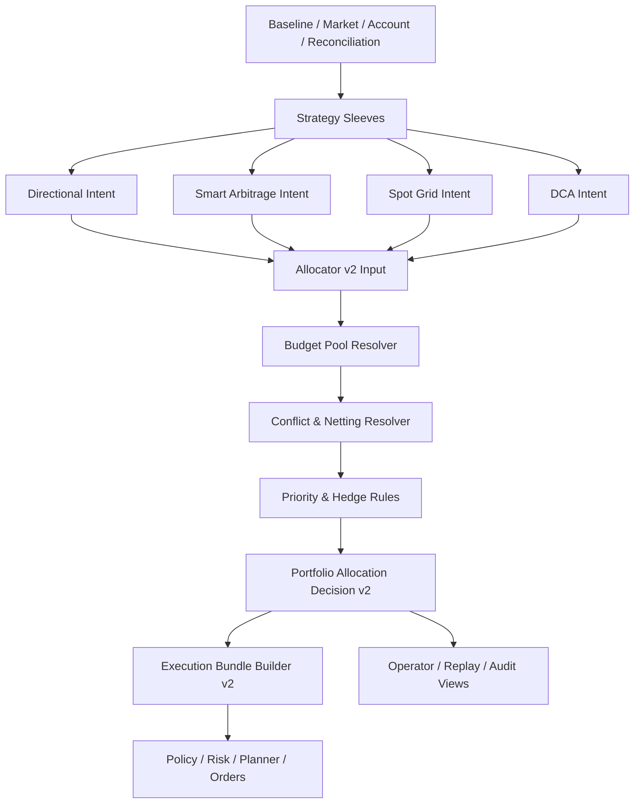

# Task74 Allocator v2 架构升级任务书

## 1. 文档定位

这份文档定义 `Task73` 之后的下一阶段工作：把当前的 `PortfolioAllocatorV1` 升级为真正的组合层 `allocator v2`。

当前系统已经具备：

- `baseline -> strategy_coordinator -> sleeve intents -> allocator v1 -> execution bundle -> replay / recovery / attribution`
- `directional / smart_arbitrage / spot_grid / dca` 四类策略接入
- `strategy_sleeve_id / allocation_id / strategy_bundle_id` 真相链
- `sleeve inventory`、`sleeve_pnl_records`、`bundle recovery`、`auto parallel`

但当前的 `allocator v1` 本质上仍然是：

- 安全优先的规则选择器
- 简单的账户级净额器
- 以 family 优先级和若干硬规则决定“谁上谁下”

它还不是一个完整的多策略组合层优化器。

`task74` 的目标就是把这部分升级成：

- 真正的策略级资金分仓器
- 同标的冲突净额器
- 组合级预算再分配器
- 可重放、可审计、可解释的组合决策器

## 2. 当前 allocator v1 的边界

当前 `allocator v1` 的主要行为见 [allocator.py](/D:/文件/project/AIParticipatingAutonomousTradingSystem/aats/services/strategy_engines/allocator.py)。

它目前的特点是：

- 合约侧：
  - `smart_arbitrage` 活跃时，优先保留套利腿
  - `directional` 与其冲突时会被压制
- 现货侧：
  - `spot_grid + dca` 可以并行
  - 若库存型 sleeve 不活跃，回退到 `directional`
- 同 symbol 的多 sleeve 冲突，目前主要靠：
  - family 优先级
  - `execution_compatible`
  - `include_active_inventory`
  - 简单的预算和权重

当前还缺的能力包括：

- 每个 sleeve 独立资金池
- 更细的同标的净额规则
- hedge sleeve 与 directional sleeve 的部分让渡
- 组合级风险不足时的统一预算削减
- allocator 决策可复现与可解释

## 3. allocator v2 的目标架构

### 3.1 目标

allocator v2 要从“批准/压制策略”升级为“对多策略意图进行预算、冲突、净额、执行优先级的统一编排”。

### 3.2 设计原则

- allocator 是唯一能把多个 sleeve 转成账户级执行目标的层。
- sleeve 只表达自己的愿望，不直接拥有执行权。
- allocator v2 的每一步都必须能落审计证据。
- 同一 symbol 的多个策略可以并行，但必须通过净额规则和预算规则受控。
- `hedge` 不应再只是“要么全保留、要么全压制”，而要支持部分让渡。

## 4. 任务拆分

### Task74-A1 策略级资金分仓

目标：

- 给每个 sleeve 建立独立预算池，而不是只靠 `budget_multiplier`

需要做的事：

- 新增 `SleeveBudgetProfile`
- 新增 `sleeve_budget_assignments`
- 在 runtime 中引入：
  - `cash_budget`
  - `margin_budget`
  - `notional_cap`
  - `drawdown_cap`
- allocator 输入里显式带上预算快照，而不是运行时临时猜

建议数据字段：

- `budget_profile_id`
- `strategy_sleeve_id`
- `quote_budget_limit`
- `margin_budget_limit`
- `notional_cap`
- `max_symbol_notional`
- `max_drawdown_usdt`
- `allocator_override_weight`
- `effective_from`
- `effective_to`

验收：

- 任意一个 sleeve 都能明确回答“它这轮最多能动多少钱”
- runtime/operator 能看到每个 sleeve 当前实际预算

### Task74-A2 同标的冲突净额规则

目标：

- 把同一 symbol 上不同 sleeve 的冲突，从“家族优先级”升级成显式净额规则

需要做的事：

- 引入 `ConflictResolutionPolicy`
- 支持以下冲突类型：
  - `directional vs smart_arbitrage`
  - `spot_grid vs dca`
  - `directional vs spot inventory sleeves`
  - `same-direction additive`
  - `opposite-direction offset`
- 为每类冲突生成明确的 `netting_reason_codes`

建议数据字段：

- `conflict_type`
- `symbol`
- `product_type`
- `input_sleeves`
- `gross_requested_qty`
- `net_approved_qty`
- `blocked_qty`
- `netting_policy`
- `reason_codes`

验收：

- 同 symbol 的多 sleeve 冲突时，可以明确回答“为什么最后只执行了这个净额结果”

### Task74-A3 Hedge 特权与方向腿让渡

目标：

- 把当前 `smart_arbitrage` 对 `directional` 的硬压制，升级成可配置的 hedge 优先级与部分让渡

需要做的事：

- 定义 hedge 特权规则：
  - 绝对保留
  - 风险不足时部分保留
  - 可与 directional 进行风险加权共存
- directional sleeve 在风险不足时，不是只有 `blocked`，而是允许：
  - `reduced`
  - `partially approved`
  - `protective only`

建议数据字段：

- `hedge_priority_class`
- `hedge_protected_notional`
- `directional_reduced_notional`
- `risk_weighted_net_exposure`

验收：

- `smart_arbitrage` 活跃时，directional 可以按规则被部分压缩，而不是简单消失

### Task74-A4 组合级风险预算再分配

目标：

- 当账户整体风险不足时，由组合层统一削减各 sleeve 预算

需要做的事：

- 引入组合层预算再分配器
- 统一考虑：
  - 账户总保证金使用率
  - 账户总 notional 上限
  - 当前 drawdown
  - `baseline.volatility_target_scale`
  - reconciliation / recovery posture
- 生成“谁被优先砍预算、为什么”的解释

建议数据字段：

- `portfolio_risk_budget_state`
- `requested_total_budget`
- `approved_total_budget`
- `sleeve_budget_cuts`
- `cut_reason_codes`

验收：

- 当风险不足时，allocator 能统一收缩多个 sleeve，而不是只依赖各 sleeve 自己降档

### Task74-A5 组合执行 bundle v2

目标：

- 把 bundle 从“执行容器”升级成“组合决策与执行之间的可审计桥梁”

需要做的事：

- bundle 中显式带上：
  - 预算来源
  - 净额前后 exposure
  - gross vs net qty
  - 组合层预期收益/成本
  - bundle 优先级
- 区分：
  - single-sleeve bundle
  - multi-sleeve bundle
  - hedge-protected bundle

建议数据字段：

- `bundle_type`
- `bundle_priority`
- `gross_requested_exposure`
- `net_approved_exposure`
- `expected_cost_bps`
- `expected_edge_bps`
- `budget_snapshot_ref`
- `allocation_snapshot_ref`

验收：

- 任意 bundle 都能回答“它为什么产生、由哪些 sleeve 共同组成、净额前后发生了什么”

### Task74-A6 allocator 决策可复现

目标：

- 保证 allocator v2 的决策在 replay 中可重放、可解释

需要做的事：

- 为 allocator 输入快照建版本引用
- 为预算、冲突、净额、优先级决策建完整事件
- replay 增加 `allocator decision reconstruction`

建议新增事件话题：

- `strategy.allocator_budget_snapshots`
- `strategy.allocator_conflict_resolutions`
- `strategy.allocator_netting_decisions`
- `strategy.portfolio_allocation_decisions.v2`

验收：

- 给定同一批输入，能重构同一 allocator 输出
- replay 能指出 allocator 结果与历史真相哪里不一致

### Task74-A7 operator 组合视图与调试面板

目标：

- 让 operator 看懂 allocator v2 的决策，不只是看最终订单

需要做的事：

- 新增面板：
  - `sleeve budgets`
  - `conflict netting`
  - `hedge protection`
  - `portfolio risk budget`
  - `allocator decision trace`
- 补中文解释：
  - 哪些 sleeve 被批准
  - 哪些被部分削减
  - 哪些被拦住
  - 为什么

验收：

- 不看代码，也能在控制面理解本轮 allocator 为什么这样分配

### Task74-A8 allocator v2 全链路测试

目标：

- 为 allocator v2 建立完整持久化与 replay 级测试闭环

需要做的事：

- 单测：
  - conflict resolution
  - hedge priority
  - budget redistribution
- 集成测试：
  - `directional + smart_arbitrage`
  - `spot_grid + dca`
  - `live futures + postgres + replay`
  - `bundle recovery + allocator replay`
- 长周期测试：
  - 多轮预算收缩
  - 多轮净额化
  - 多轮 attribution 后是否仍一致

验收：

- allocator v2 在 PostgreSQL、replay、recovery、operator 视图中保持一致

## 5. 数据结构与 schema 建议

### 5.1 新增表

建议新增以下表：

- `sleeve_budget_profiles`
- `sleeve_budget_assignments`
- `allocator_budget_snapshots`
- `allocator_conflict_resolutions`
- `allocator_netting_decisions`

### 5.2 需要扩展的现有表

建议扩展：

- `portfolio_allocation_decisions`
  - 增加预算、冲突、净额、优先级字段
- `strategy_execution_bundles`
  - 增加 `bundle_type / bundle_priority / gross_requested_exposure / net_approved_exposure`
- `decision_audit_records`
  - 增加 allocator v2 的事件引用
- `sleeve_pnl_records`
  - 增加 `allocator_version / budget_profile_id / attribution_confidence`

## 6. 分阶段实施计划

### 阶段 1：资金分仓地基

- 完成 `Task74-A1`
- 先把预算池做成真相

### 阶段 2：冲突与净额规则

- 完成 `Task74-A2`
- 完成 `Task74-A3`

### 阶段 3：组合层预算再分配

- 完成 `Task74-A4`
- 让 allocator 真正掌握组合级风险削减

### 阶段 4：bundle v2 与 replay 可复现

- 完成 `Task74-A5`
- 完成 `Task74-A6`

### 阶段 5：operator 可视化与全链路验证

- 完成 `Task74-A7`
- 完成 `Task74-A8`

## 7. 与现有系统的兼容策略

### 7.1 可以兼容保留的部分

- 当前 `baseline -> strategy_coordinator -> risk -> planner -> execution` 主框架
- 当前 `strategy_sleeve_id / allocation_id / bundle_id` 真相链
- 当前 `sleeve inventory / sleeve_pnl_records / bundle recovery`
- 当前 operator API 与 dashboard 基础结构

### 7.2 必须迁移或弱化的部分

- 当前以 family 优先级为核心的 allocator 规则
- 当前“预算主要由 sleeve 自己收缩”的模式
- 当前“smart_arbitrage 活跃就直接压制 directional”的硬规则
- 当前“bundle 只是执行容器”的语义

## 8. 验收红线

以下任一项未满足，就不能宣称 allocator v2 完成：

- 无法回答每个 sleeve 这一轮的预算上限
- 无法回答同一 symbol 的净额结果是如何算出来的
- 无法解释 directional 为什么被 hedge 压缩
- 无法重放 allocator 决策
- operator 看不到预算、净额、冲突与削减证据
- replay 无法验证 allocator 输出与持久化真相一致

## 9. 当前建议

下一步最合理的起点是：

1. 先做 `Task74-A1 策略级资金分仓`
2. 再做 `Task74-A2/A3 冲突净额 + hedge 特权`
3. 再做 `Task74-A4 组合层预算再分配`

也就是说，allocator v2 的第一批真正编码任务，不应该先从 UI 开始，而应该先把预算池和冲突规则做成系统真相。
