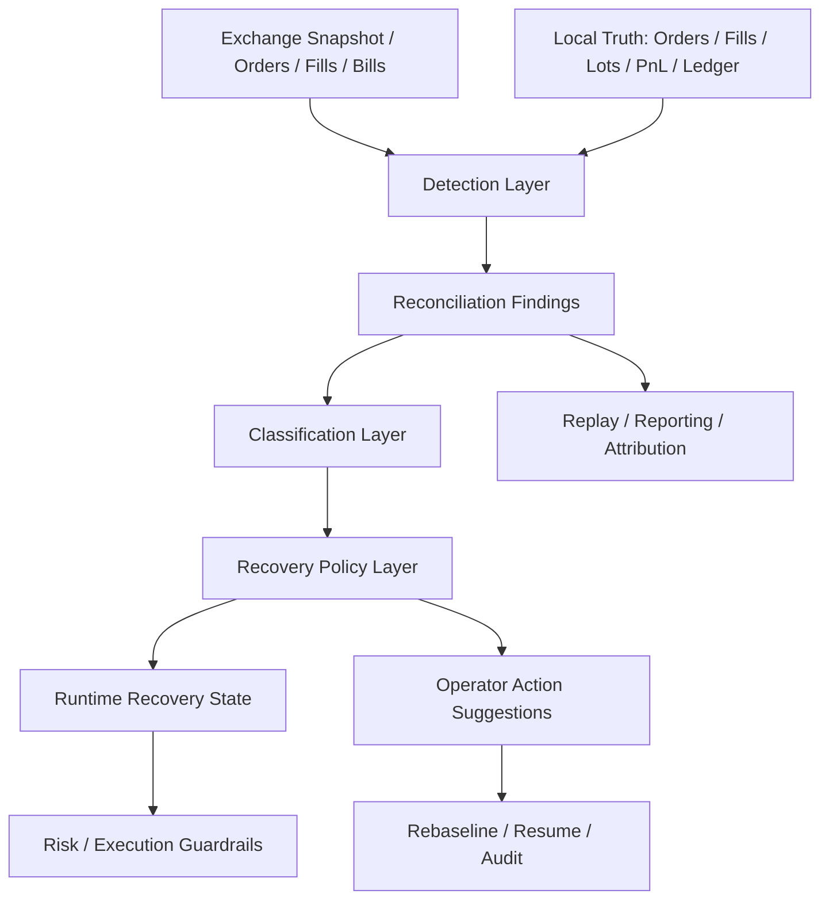

# Task75 对账与恢复系统重构任务书

> 项目定位声明：本文件默认服从 AATS 的统一目标：在严格风控、可审计、可恢复、可治理前提下，通过自动化交易追求长期稳定盈利，为 AI 的持续自治与终身发展积累资本。详见 [项目定位声明](../../../docs/project_positioning.md)。

## 1. 任务定位

本任务用于重构当前系统中的“对账 / 恢复 / rebaseline / resume”子系统。

当前系统已经具备真实交易能力，但对账模块长期承担了过多职责：

- 发现本地真相与交易所真相的差异
- 判断当前是否还能继续自动交易
- 驱动 `rebaseline`、`resume`、`only_reduce`、`bundle_recovery`
- 给 operator 页面提供“为什么现在不能交易”的解释

这些职责本身都合理，但当前实现把：

- 差异发现
- 差异分类
- 恢复策略
- 人工操作语义

耦合在了一起，导致系统不断依赖条件分支补丁来收敛边界情况。

本任务的目标不是继续补局部判断，而是把这套系统拆成可审计、可回放、可扩展的分层结构。

## 2. 当前问题

### 2.1 差异类型混在一起

当前 `ReconciliationReport` 同时承载：

- 订单、成交、持仓数量这类结构性差异
- 余额、费用、资金费这类财务差异
- 保证金率、仓位保证金、浮盈浮亏这类动态观测漂移

结果是：

- operator 很难判断差异是否真的严重
- 轻微动态漂移经常被抬高成“待人工确认”

### 2.2 对账与恢复策略耦合过深

当前：

- `comparator` 负责比对差异
- `repair` 负责生成报告和辅助修复
- `recovery_posture` 负责映射运行态

但这三层之间缺少稳定边界，导致：

- 同一个问题在多个模块重复解释
- 旧的 `review_required`、`resume_blocked`、`only_reduce` 状态容易粘住

### 2.3 rebaseline 只是在接受一个快照

现有 `rebaseline` 更像：

- “接受当前账户快照”

但真实生产系统需要的是：

- “接受截至某个时间水位的交易所历史”

否则同一批历史 `fills / bills / open orders` 会在后续对账中反复出现。

### 2.4 恢复状态机不够证据驱动

理想状态下：

- 恢复状态应由“当前对账证据”推导

当前现实是：

- 恢复状态会被历史状态拖住
- 最新对账已经干净，UI 仍可能显示“待人工确认”

### 2.5 多策略并行后粒度不够

Task73 之后，系统已经引入：

- `strategy_sleeve`
- `allocation`
- `bundle`
- `sleeve_pnl`

因此对账系统也必须升级为能下钻到：

- 账户级
- sleeve 级
- allocation 级
- bundle 级

否则无法回答：

- 哪个 sleeve 真正出现了差异
- 哪个 bundle 需要恢复
- 哪类收益归因是否被恢复链路污染

## 3. 重构目标

### 3.1 目标分层

对账与恢复系统重构后，应拆成四层：

1. `Detection Layer`
   - 只负责发现差异
2. `Classification Layer`
   - 只负责给差异分层和分级
3. `Recovery Policy Layer`
   - 只负责把差异映射成运行时恢复状态
4. `Operator Action Layer`
   - 只负责人工动作、审计与解释

### 3.2 设计原则

- 对账必须保留，不能删除
- 轻度观测漂移不能单独触发人工复核
- `review_required` 只能由高风险证据触发
- `rebaseline` 必须带“已确认水位”
- 恢复状态应尽量由当前证据重算，而不是依赖旧字符串状态
- 多策略运行下，对账结果必须能追到 sleeve / allocation / bundle

## 4. 目标架构

## 5. 差异类型重分层

### 5.1 Structural Reconciliation

用于表示硬真相差异：

- open orders
- order state
- fill truth
- position quantity
- bundle completeness
- sleeve inventory completeness

这类差异如果无法解释，应优先进入：

- `review_required`
- `resume_blocked`
- `bundle_recovery`

### 5.2 Financial Reconciliation

用于表示财务真相差异：

- balance
- realized pnl
- fee
- funding fee
- reservation / obligation / ledger truth

这类差异通常进入：

- `SOFT_MISMATCH`
- 或在严重时进入 `REVIEW_REQUIRED`

### 5.3 Observational Drift

用于表示动态观测漂移：

- margin_allocated
- maintenance_margin
- margin_ratio
- liquidation gap
- unrealized pnl
- mark-price-driven exposure drift

这类差异通常：

- 保持为 `SOFT_MISMATCH`
- 不触发 `review_required`
- 不单独阻断 `resume`

## 6. Schema 与数据库表设计

### 6.1 新增表

#### `reconciliation_findings`

作用：

- 保存标准化差异条目，而不是只保存一份总报告

关键字段：

- `finding_id`
- `reconciliation_id`
- `scope_kind`
- `scope_ref`
- `finding_type`
- `severity_class`
- `structural`
- `financial`
- `observational`
- `review_required`
- `only_reduce_required`
- `halt_required`
- `blocks_resume`
- `reason_code`
- `details_json`
- `strategy_sleeve_id`
- `allocation_id`
- `strategy_bundle_id`

#### `baseline_generations`

作用：

- 把 baseline 从“一个快照”升级为“一个可追踪代次”

关键字段：

- `generation_id`
- `baseline_event_ref`
- `baseline_kind`
- `account_source`
- `product_type`
- `margin_mode`
- `allowed_symbols`
- `safe_for_automatic_continuation`
- `requires_operator_review`
- `exchange_ack_watermark_id`
- `previous_generation_id`
- `previous_baseline_ref`
- `trigger_reason`
- `reason_codes`

#### `exchange_ack_watermarks`

作用：

- 保存“操作员已接受到哪里”的交易所历史水位

关键字段：

- `watermark_id`
- `account_source`
- `product_type`
- `margin_mode`
- `latest_bill_id`
- `latest_bill_ts`
- `latest_fill_id`
- `latest_fill_ts`
- `latest_order_snapshot_ts`
- `latest_reconciliation_id`
- `baseline_event_ref`

#### `reconciliation_state_snapshots`

作用：

- 持久化每轮恢复状态机的最终输出

关键字段：

- `snapshot_id`
- `reconciliation_id`
- `recovery_state`
- `resume_eligible`
- `safe_to_trade`
- `review_required`
- `only_reduce_required`
- `halt_required`
- `bundle_recovery_required`
- `resume_blocked_reasons_json`
- `derived_from_generation_id`
- `exchange_ack_watermark_id`
- `details_json`

### 6.2 现有结构扩展

建议扩展：

- `reconciliation_reports`
  - `findings`
  - `finding_summary`
  - `baseline_generation_id`
  - `exchange_ack_watermark_id`
  - `structural_review_required`
  - `financial_review_required`
  - `observational_only`

- `AccountBaselineSnapshot`
  - `baseline_generation_id`
  - `exchange_ack_watermark_id`

- `decision_audit_records`
  - 继续串接 `reconciliation_refs`
  - 后续再扩 `recovery_snapshot_ref`

## 7. 数据流

### 7.1 目标数据流

1. 采集交易所：
   - snapshot
   - open orders
   - fills
   - bills
2. 采集本地真相：
   - execution truth
   - sleeve inventory
   - fill outcomes
   - funding fee truth
   - ledger truth
3. `Detection Layer` 产出标准化 findings
4. `Classification Layer` 产出：
   - `CLEAN`
   - `SOFT_MISMATCH`
   - `REVIEW_REQUIRED`
   - `HARD_MISMATCH`
5. `Recovery Policy Layer` 产出：
   - `normal_operation`
   - `degraded_continue`
   - `only_reduce`
   - `bundle_recovery`
   - `review_required`
   - `resume_blocked`
6. `Operator Action Layer` 基于 baseline generation 与 watermark 做人工确认与恢复

### 7.2 恢复状态目标规则

- `CLEAN` -> `normal_operation`
- `SOFT_MISMATCH` 且仅观测漂移 -> `degraded_continue`
- `SOFT_MISMATCH` 且只需要减仓保护 -> `only_reduce`
- bundle 未恢复完成 -> `bundle_recovery`
- 结构性或财务高风险差异 -> `review_required`
- 明确 halt 条件 -> `resume_blocked`

## 8. 风控边界

重构后需保证：

- 轻度观测漂移不会单独阻断交易
- 结构性错账不会被误降级
- `only_reduce` 只在确有必要时触发
- `resume_eligible` 只由当前证据决定
- rebaseline 之后不会因为同一批已确认历史再次重复拦截
- 多策略并行时不会把别的 sleeve 差异误归到当前 sleeve

## 9. 分阶段实施计划

### Task75-A1/A2 差异类型重分层

目标：

- 引入 findings 模型
- 把差异拆成 structural / financial / observational
- 让 `SOFT_MISMATCH` 不再天然等于人工复核

交付：

- `reconciliation_findings`
- `finding_summary`
- comparator findings 化

### Task75-A3/A4/A5 baseline generation 与 watermark

目标：

- 把 rebaseline 变成“接受一代基线”
- 给基线附带交易所历史确认水位

交付：

- `baseline_generations`
- `exchange_ack_watermarks`
- baseline import / rebaseline 接入

### Task75-A6/A7 恢复状态机重构

目标：

- 把恢复状态机改成证据驱动
- 引入 `degraded_continue`
- 自动清理粘住的 `review_required`

交付：

- `reconciliation_state_snapshots`
- recovery posture 重构
- classifier 重构

### Task75-A8/A9 operator 行为与 UI 收口

目标：

- operator 页面显示 findings 分层、水位、基线代次
- UI 不再把轻度差异渲染成“待人工确认”

交付：

- operator query 扩展
- 风险与恢复页面文案收口

### Task75-A10/A11 多策略对账升级

目标：

- findings、replay、reporting 都能下钻到 sleeve / allocation / bundle

交付：

- findings 策略级归属
- replay 校验 bundle / sleeve / allocation
- 归因链路补齐

## 10. 兼容与迁移

### 10.1 可以兼容旧系统的部分

- `ReconciliationReport` 主体结构保留
- 现有 repair / recovery / operator API 路径继续保留
- 历史 reconciliation report 不需要删表重建

### 10.2 必须迁移的部分

- 增加 findings 表
- 增加 baseline generation / watermark 表
- 增加 recovery state snapshot 表
- 旧的软差异阻断语义需要整体调整

## 11. 验收红线

这轮重构完成后，至少要满足：

- 轻度保证金漂移不会继续卡在“待人工确认”
- `rebaseline` 后不会反复被同一批历史 bills 再次拦住
- `review_required` 只能由高风险证据触发
- `resume_eligible` 与 UI 展示一致
- replay 可以校验 sleeve / allocation / bundle 级对账归属
- PostgreSQL 迁移、legacy upgrade、恢复、operator、UI、replay 回归全部通过

## 12. 当前实现进度

截至当前基线，Task75-A1 到 Task75-A11 已完成首版实现，已经落到：

- findings 分层
- baseline generation / watermark
- 恢复状态机重构
- operator / UI 收口
- 多策略对账归属与 replay 升级

后续如继续扩展，可在此基础上继续做：

- allocator v2 级别的组合对账策略
- 更细粒度的 sleeve / bundle 风险恢复策略
- 更长周期的对账稳定性与 soak test
