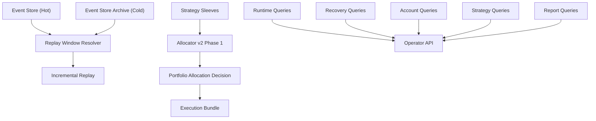

# Task76 Query Service 拆分、Allocator v2 第一阶段与 Event Store 归档任务书

> 项目定位声明：本文件默认服从 AATS 的统一目标：在严格风控、可审计、可恢复、可治理前提下，通过自动化交易追求长期稳定盈利，为 AI 的持续自治与终身发展积累资本。详见 [项目定位声明](../../../docs/project_positioning.md)。

## 1. 任务定位

`Task76` 用于承接上一阶段已经完成的：

- `Task73` 单账户并行多策略 `sleeve / allocation / bundle / auto parallel`
- `Task74` allocator v2 架构设计
- `Task75` 对账与恢复系统重构

当前系统已经具备：

- `baseline -> strategy_coordinator -> allocator v1 -> execution bundle -> recovery / replay / attribution`
- `directional / smart_arbitrage / spot_grid / dca` 四类策略接入
- `strategy_sleeve_id / allocation_id / strategy_bundle_id / sleeve_pnl_records`
- `reconciliation findings / baseline generation / exchange watermark`

但当前还存在三个明显的下一阶段工作面：

1. operator 查询与控制面逻辑仍然过度集中在 `query_service.py`
2. `allocator v1` 仍然偏规则压制，不是真正的组合层预算与净额分配器
3. `event_store` 与 replay 仍然偏“全量历史回放”，缺少冷热分层、归档和增量 replay

`task76` 的目标是把这三块一起推进到下一基线：

- 把控制面查询层拆成清晰的领域边界
- 正式启动 `allocator v2` 第一阶段
- 把 `event_store` 升级成支持归档与增量 replay 的生产级结构

## 2. 当前问题

### 2.1 `query_service.py` 过大，控制面 blast radius 过高

当前 [query_service.py](/D:/文件/project/AIParticipatingAutonomousTradingSystem/aats/services/operator/query_service.py) 既负责：

- runtime 状态
- recovery / reconciliation
- strategy runtime
- reports / attribution
- account visibility
- blocker control
- auth 相关只读摘要

这会带来几个问题：

- 一个小查询改动容易影响不相关 API
- 很难建立清晰的模块级测试边界
- operator 页面在演进时容易继续往一个文件里堆逻辑

### 2.2 `allocator v1` 仍是安全优先的规则合成器

当前 [allocator.py](/D:/文件/project/AIParticipatingAutonomousTradingSystem/aats/services/strategy_engines/allocator.py) 已经能做：

- `spot_grid + dca` 并行
- `smart_arbitrage` 对冲优先
- 冲突时简单压制与净额

但它还缺：

- 真正的 `sleeve budget`
- 同标的冲突的显式净额规则
- `hedge` 与 `directional` 的部分让渡
- 组合层统一预算收缩
- allocator 决策真相与可重放性

### 2.3 `event_store` 缺少冷热分层与增量 replay

当前 `event_store` 仍是系统中最重要的历史真相来源，但随着数据量增长，会出现：

- replay 与 reconciliation 越来越重
- operator 查询默认扫太多历史
- recovery 与 attribution 越来越依赖全量历史
- 历史数据和活跃数据混放，运行成本上升

`Task75` 已经引入了：

- `baseline_generation`
- `exchange_ack_watermarks`
- `reconciliation_findings`

这为“增量 replay”打下了基础。现在需要把 event store 结构正式升级。

## 3. 目标架构

设计原则：

- 查询层拆域后，每个域只负责自己的读取与解释
- `allocator v2 phase 1` 先解决预算与净额，不一次性追求最终形态
- replay 优先改成“从基线和水位出发的增量重放”，不是默认全量扫描
- 归档不得破坏：
  - auditability
  - recovery
  - reconciliation
  - attribution

## 4. 任务拆分

### 第一组：`query_service` 拆分

#### Task76-A1 Runtime / Recovery / Account 查询拆分

目标：

- 把 `runtime`、`recovery`、`account` 三个只读域从大 QueryService 中拆开

建议拆成：

- `runtime_queries.py`
- `recovery_queries.py`
- `account_queries.py`

要求：

- API 不变或仅最小兼容调整
- 原有 `OperatorQueryService` 退化成 façade，不再承载具体业务逻辑

验收：

- runtime/recovery/account 相关 endpoint 仍然全部可用
- 新文件边界清晰，单测可以直接按域编写

#### Task76-A2 Strategy / Report / Blocker 查询拆分

目标：

- 把 `strategy runtime`、`strategy attribution`、`reporting`、`blocker control` 查询域拆开

建议拆成：

- `strategy_queries.py`
- `report_queries.py`
- `blocker_queries.py`

要求：

- strategy/runtime/report 页不再直接依赖一个超大 service
- blocker 面板文案与动作映射收口到单一域

验收：

- operator UI 仍按现有页面工作
- 单独替换其中一个查询域不会影响其他域

#### Task76-A3 Query Facade、依赖注入与回归测试

目标：

- 完成 façade 装配，收敛对外引用路径

需要做的事：

- `OperatorQueryService` 只保留聚合、兼容入口与少量横切逻辑
- `config.py` 中 operator query wiring 只注入 façade
- 增加每个 query 域的单测和 operator API 集成回归

验收：

- `query_service.py` 不再继续膨胀
- 新查询域均有独立测试入口

---

### 第二组：Allocator v2 第一阶段

#### Task76-A4 Sleeve Budget Profile 与 Assignment

目标：

- 正式引入策略级预算池

新增结构建议：

- `sleeve_budget_profiles`
- `sleeve_budget_assignments`

核心字段：

- `budget_profile_id`
- `strategy_sleeve_id`
- `quote_budget_limit`
- `margin_budget_limit`
- `notional_cap`
- `max_symbol_notional`
- `max_drawdown_usdt`
- `allocator_base_weight`
- `effective_from`
- `effective_to`

第一阶段要求：

- 先支持静态预算 + runtime 自动收缩
- 不做管理员在线改预算
- 支持现货、合约分别定义预算口径

验收：

- 每个 sleeve 都能明确回答“当前这轮最多能动多少预算”

#### Task76-A5 同标的冲突净额规则 v2

目标：

- 从“family 压制”升级成显式冲突净额规则

第一阶段至少支持：

- `directional vs smart_arbitrage`
- `spot_grid vs dca`
- `same-direction additive`
- `opposite-direction offset`

新增真相建议：

- `allocator_conflict_resolutions`
- `allocator_netting_decisions`

关键字段：

- `conflict_type`
- `symbol`
- `input_sleeves`
- `gross_requested_qty`
- `net_approved_qty`
- `blocked_qty`
- `reason_codes`

验收：

- allocator 可以清楚回答“为什么最后只执行这个净额结果”

#### Task76-A6 Hedge 特权与组合层统一预算削减

目标：

- 把 `smart_arbitrage` 对方向腿的压制升级成“可解释的 hedge 保护 + 部分让渡”

第一阶段要求：

- hedge 腿优先级明确
- directional 在风险不足时允许：
  - `reduced`
  - `partially approved`
  - `protective_only`
- 组合层风险不足时，统一削减 sleeve 预算，而不是只靠 sleeve 自己降档

新增字段建议：

- `hedge_priority_class`
- `hedge_protected_notional`
- `directional_reduced_notional`
- `portfolio_risk_budget_state`
- `sleeve_budget_cuts`

验收：

- allocator 输出不再只是“准/不准”，而是能表达“保 hedge、削方向”

#### Task76-A7 Allocator Decision Truth v2

目标：

- allocator 决策必须可 replay、可审计、可解释

新增事件/表建议：

- `allocator_budget_snapshots`
- `portfolio_allocation_decisions_v2`

要求：

- 输入快照、预算快照、冲突结果、净额结果、最终批准结果必须可重建
- 为 replay / operator / attribution 提供稳定引用

验收：

- 给定相同输入，allocator 可以重放出相同输出

---

### 第三组：Event Store 归档与增量 Replay

#### Task76-A8 Event Store 热冷分层

目标：

- 把 `event_store` 拆成 hot/cold 两层语义

建议实现路线：

- `event_store` 保留热数据窗口
- `event_store_archive` 保存历史归档数据
- 归档可按：
  - topic
  - scope
  - time window
  - baseline generation

第一阶段要求：

- 不要求物理独立数据库
- 允许先用同库不同表/分区
- 归档后仍能追溯事件全文

验收：

- 热数据查询不会无限增长
- 旧事件仍可按需回放

#### Task76-A9 Baseline / Watermark 驱动的增量 Replay

目标：

- replay 默认从 `baseline_generation + exchange_ack_watermarks + latest applied offset` 出发

要做的事：

- 为 replay 增加明确的增量起点
- 为每类投影保存：
  - `last_replayed_event_id`
  - `last_replayed_event_ts`
  - `last_replayed_baseline_generation_id`

第一阶段适用对象：

- recovery
- reconciliation
- sleeve pnl projection
- allocator decision reconstruction

验收：

- 日常 replay 不再依赖全量历史扫描
- 重启后的恢复时间与历史总量解耦

#### Task76-A10 Event Store 归档运维工具与 operator 可见性

目标：

- 让归档与 replay 成为可运维、可观察的功能

需要提供：

- archive job / CLI
- replay window summary
- operator 侧最近 baseline / watermark / replay offset 展示

验收：

- operator 可以看懂：
  - 当前 replay 是从哪一代 baseline 开始
  - 当前用了哪个 watermark
  - 上次归档/回放到哪一条事件

#### Task76-A11 全链路回归测试

目标：

- 为 `query split + allocator v2 phase 1 + event store archive/replay` 建立闭环测试

至少覆盖：

- query 域拆分后 operator API/UI 不回归
- sleeve budget + netting + hedge 优先级
- allocator decision truth replay
- archive 后 replay 仍能恢复当前状态
- baseline generation / watermark / incremental replay 一致性

验收：

- 在 Postgres 集成环境下可以完整验证：
  - write truth
  - archive
  - replay
  - recovery
  - operator 解释

## 5. Schema 与数据库表设计

### 新增表

- `sleeve_budget_profiles`
- `sleeve_budget_assignments`
- `allocator_budget_snapshots`
- `allocator_conflict_resolutions`
- `allocator_netting_decisions`
- `portfolio_allocation_decisions_v2`
- `event_store_archive`
- `projection_replay_offsets`
- `archive_runs`

### 现有表扩展建议

- `strategy_sleeve_intents`
  - 增加预算 profile / approved budget snapshot 引用
- `strategy_execution_bundles`
  - 增加 `gross_requested_exposure / net_approved_exposure / bundle_priority`
- `decision_audit_records`
  - 增加 allocator v2 / replay snapshot / archive run 引用
- `reconciliation_state_snapshots`
  - 增加 replay offset / baseline generation 引用

## 6. 数据流

### 6.1 Query Split 目标数据流

1. 各 domain repo / truth table 提供数据
2. 各 query 域只做本域聚合与解释
3. `OperatorQueryService` façade 聚合多个 query 域
4. API route 只依赖 façade，不再依赖超大 service 细节

### 6.2 Allocator v2 第一阶段目标数据流

1. sleeves 产出 intents
2. budget resolver 生成 `allocator_budget_snapshots`
3. conflict resolver 生成 `allocator_conflict_resolutions`
4. netting resolver 生成 `allocator_netting_decisions`
5. allocation decision v2 生成执行 bundle
6. replay / attribution / operator 读取 allocation truth

### 6.3 Event Store 增量 Replay 数据流

1. 热事件进入 `event_store`
2. archive job 把冷数据移入 `event_store_archive`
3. replay 先读：
   - baseline generation
   - exchange watermark
   - projection replay offsets
4. 再从热层和必要的冷层窗口增量重放

## 7. 风控边界

Task76 完成后应满足：

- query 层拆分不得改变任何交易权限与风控含义
- allocator v2 第一阶段不得放宽现有 `hedge 优先、风险不足先缩减` 的保护
- 归档不得破坏：
  - recovery
  - reconciliation
  - attribution
  - auditability
- replay 增量化后，如发现 offset / watermark 不可信，必须回退到安全模式或强制全量校验

## 8. 分阶段实施计划

### 阶段 1：Query Split

- 完成 `Task76-A1`
- 完成 `Task76-A2`
- 完成 `Task76-A3`

### 阶段 2：Allocator v2 第一阶段

- 完成 `Task76-A4`
- 完成 `Task76-A5`
- 完成 `Task76-A6`
- 完成 `Task76-A7`

### 阶段 3：Archive + Incremental Replay

- 完成 `Task76-A8`
- 完成 `Task76-A9`
- 完成 `Task76-A10`
- 完成 `Task76-A11`

## 9. 兼容与迁移

### 可以兼容旧系统的部分

- 现有 API route 路径可以尽量保持不变
- `OperatorQueryService` 可以保留 façade 兼容层
- `allocator v1` 可以在阶段 2 前继续作为默认路径
- `event_store` 原始表在阶段 3 前继续作为主真相源

### 必须迁移的部分

- 新 query 不应再继续回写到超大 `query_service.py`
- allocator 决策必须逐步迁移到 v2 truth
- replay 必须从“默认全量扫描”迁移到“基于 baseline/watermark 的增量 replay”

## 10. 当前建议

当前推荐顺序就是你指定的顺序：

1. 先做 `query_service` 拆分
2. 再做 `allocator v2` 第一阶段
3. 最后做 `event_store` 归档与增量 replay

原因是：

- query 层边界不先立住，后面 allocator/operator 改动会继续堆进一个大 service
- allocator v2 phase 1 需要清晰的 query / truth / operator 展示边界
- event store 归档与 replay 增量化，应该在新的 allocator truth 已经存在后再一起接入

## 11. 验收红线

以下任一项未满足，都不应宣称 `Task76` 已完成：

- operator 查询仍高度耦合在单一超大 service 中
- sleeve 没有明确预算与组合层净额解释
- allocator v2 输出不能重放
- archive 后 recovery / replay / attribution 出现信息断层
- replay 仍默认依赖全量 event store 扫描
- operator 无法从控制面看懂 budget / netting / replay 起点 / archive 状态
