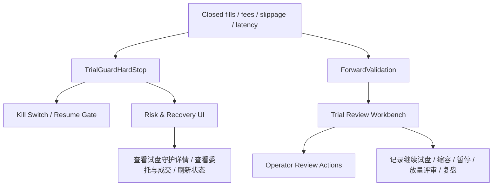

# Task77 小资金试盘守护重构与试盘工作台收口

> 项目定位声明：本文件默认服从 AATS 的统一目标：在严格风控、可审计、可恢复、可治理前提下，通过自动化交易追求长期稳定盈利，为 AI 的持续自治与终身发展积累资本。详见 [项目定位声明](../../../docs/project_positioning.md)。

## 1. 任务定位

`Task77` 用于重构当前的“小资金试盘守护（trial_guard）”链路。

当前系统里已经存在一条真正会影响自动交易资格的试盘守护链：

- 后台轮询周期性评估最近成交、费用、滑点、慢成交比
- 达到最少样本后，若触发阈值会直接 `kill_switch.halt(...)`
- 恢复链会把它视为 `resume_blocked`
- 风险页也会把它作为主阻断展示

也就是说，它不是“纯展示功能”。

但当前实现把三类不同职责混在了一起：

1. `TrialGuard` 的硬停机判断
2. `Forward Validation` 的观察/缩容/暂停/放量建议
3. operator 侧的“试盘审查 / 复盘 / 处理动作”

这导致：

- 页面上看到的是一坨原因，不知道哪条是真正的硬阻断
- `试盘审查` 卡片更多是说明，不是工作台
- risk/recovery 与 strategy/trial-review 之间没有清晰分工
- 用户会误以为“只是给建议”，但实际上后台已经硬停机

`Task77` 的目标是把这条链拆清楚：

- **TrialGuardHardStop**：只负责“是否必须硬停机”
- **ForwardValidation**：只负责“建议继续 / 缩容 / 暂停 / 放量”
- **TrialReviewWorkbench**：只负责“operator 要看什么、点什么、记录什么”

## 2. 当前问题

### 2.1 硬停机与建议混在一起

当前 [trial_guard.py](/D:/文件/project/AIParticipatingAutonomousTradingSystem/aats/services/governance_engine/trial_guard.py) 会直接：

- 评估最近成交样本
- 判断是否 breach
- 触发 `kill_switch.halt(reason="trial_guard_threshold_breached")`

这是一条真正的风控链。

但 [query_service.py](/D:/文件/project/AIParticipatingAutonomousTradingSystem/aats/services/operator/query_service.py) 又把：

- `trial_guard.status`
- `recovery.safe_to_trade`
- `review_required`
- `active blockers`
- `forward_validation verdict`

一起揉进 `scaling_readiness_report()` 和 `trial_review_packet()`。

结果就是：

- `pause_trial` 既可能是“建议暂停”，也可能是“系统已经硬停机”
- 同一个 reasons 列表里混入 hard stop、恢复条件和 advisory 理由

### 2.2 风险页与策略页职责边界不清晰

当前：

- 风险页能看到 `trial_guard` 状态，也能看到 blocker
- 策略页能看到“系统自动试盘结论”

但两边的动作入口并没有收口：

- 风险页偏恢复，但缺试盘专属跳转
- 策略页偏总结，但缺专属操作按钮

### 2.3 试盘守护配置与 profile 语义耦合过重

当前 `trial_guard` 的 `profile_active` 仍然直接和：

- `config_profile == "forward_test_small_capital"`

强绑定。

这意味着：

- “当前不在试盘档位”
- “当前是否应该硬停机”

很容易在 operator 视角被误看成一回事。

实际上这两者应该拆开：

- `trial_guard_enabled_for_runtime`
- `trial_profile_label`
- `trial_guard_hard_stop_active`
- `forward_validation_active`

## 3. 目标架构

设计原则：

- **硬停机** 和 **建议** 必须分层
- `resume` 只能被 `TrialGuardHardStop` 阻断，不能被 advisory recommendation 直接阻断
- 风险页负责“为什么现在不能继续交易”
- 策略页负责“试盘阶段表现如何、现在建议怎么做”
- operator 的处理动作必须能被审计和回放

## 4. 子系统拆分

### 4.1 TrialGuardHardStop

职责：

- 只负责判断是否触发试盘守护硬停机
- 只基于硬阈值做判断
- 输出明确 breach code 和恢复条件

输入：

- 最近 closed fills
- realized pnl / funding fee
- fee_to_notional_ratio
- high_slippage_ratio
- slow_submit_to_fill_ratio

输出：

- `status`
  - `disabled`
  - `warming_up`
  - `monitoring`
  - `breached`
  - `recovered`
- `breaches`
- `halt_required`
- `resume_blocked`
- `recovery_requirements`

必须保证：

- `breached` 时，恢复链一定明确阻断 `resume`
- 页面必须能看到“具体是哪条阈值命中”

### 4.2 ForwardValidation

职责：

- 只做试盘表现评估与放量建议
- 永远不直接触发 kill switch

输出：

- `continue_small_capital`
- `shrink_trial`
- `pause_trial`
- `approve_scale_up`

规则：

- 它的结论只能进入 strategy/trial-review 页面
- 不能作为 `resume_blocked_reason`

### 4.3 TrialReviewWorkbench

职责：

- 提供给 operator 的统一处理入口
- 汇总：
  - hard stop
  - advisory recommendation
  - 最近观察周期
  - 可执行动作

要点：

- reasons 要按类别分组，不再混成一个平铺列表
- 动作必须按状态出现，不再固定一套按钮

## 5. 数据模型与 API

### 5.1 新增/重构的数据结构

建议新增：

- `trial_guard_evaluations`
  - 每次守护评估一条
  - 保存 threshold、value、breaches、summary

- `trial_guard_recovery_requirements`
  - 当前恢复条件
  - 例如需要连续多少个健康轮次、当前剩余哪些 breach

- `trial_review_actions`
  - operator 在试盘工作台上做过的动作
  - 例如：
    - `continue_small_capital`
    - `shrink_trial`
    - `pause_trial`
    - `approve_scale_up`
    - `review_snapshot`

### 5.2 推荐 API

保留：

- `GET /system/trial-guard`
- `GET /reports/forward-validation`
- `GET /reports/scaling-readiness`
- `GET /reports/trial-review-*`
- `POST /system/trial-review/record`

新增或重构：

- `GET /system/trial-guard`
  - 明确返回 breach 明细、恢复条件、当前 hard-stop 状态

- `POST /system/trial-guard/refresh`
  - 手动刷新试盘守护评估

- `POST /system/trial-review/record-action`
  - 记录 operator 在试盘工作台上的明确动作

- `GET /reports/trial-review-workbench`
  - 一个聚合型接口，供策略页直接消费

## 6. UI 重构要求

### 6.1 风险与恢复页

当 blocker 为 `trial_guard_threshold_breached` 时：

应该显示：

- 具体硬停机标题
- breach 明细
- 最近触发时间
- 当前是否仍在 breach
- 恢复前需要满足的条件

按钮：

- `查看试盘审查`
- `查看委托与成交`
- `刷新当前状态`

不应再出现：

- 与 trial_guard 无关的“查看最新对账”
- 误导性的“继续保持暂停”
- 假装可以直接恢复的按钮

### 6.2 策略判断页的“系统自动试盘结论”

必须拆成三块：

1. `硬停机状态`
2. `试盘建议`
3. `可执行动作`

建议按钮：

当 `trial_guard.status == breached`

- `查看试盘守护详情`
- `查看委托与成交`
- `记录本次复盘`
- `刷新当前状态`

当 `ForwardValidation == continue_small_capital`

- `记为继续小资金试盘`

当 `ForwardValidation == shrink_trial`

- `记为缩小试盘规模`

当 `ForwardValidation == pause_trial` 且没有 hard stop

- `记为暂停试盘并复盘`

当 `ForwardValidation == approve_scale_up`

- `提交放量评审`

## 7. 实施任务拆分

### Task77-A1 拆分 hard stop 与 advisory 语义

目标：

- `trial_guard.py` 只负责 hard stop
- `forward_validation` 不再携带 halt 语义

验收：

- `trial_guard_threshold_breached` 是唯一进入 `resume_blocked_reason` 的试盘守护类原因

### Task77-A2 引入 breach 明细与恢复条件模型

目标：

- 风险页能看到具体 breach code、阈值、当前值、恢复要求

验收：

- 不再只显示“试盘守护已触发”，而是能回答“因为什么触发”

### Task77-A3 重做 risk/recovery 的 trial_guard 阻断流程

目标：

- 风险页展示清晰的 blocker copy 与专属按钮

验收：

- `trial_guard` blocker 不再误导成手动暂停或普通恢复态

### Task77-A4 重做策略页的试盘审查卡片

目标：

- “系统自动试盘结论”变成真正的试盘工作台

验收：

- 页面能区分 hard stop、advisory recommendation、action items

### Task77-A5 operator 审查动作落库

目标：

- `record_scaling_review` 与 `record_trial_review` 进入统一动作模型

验收：

- 能按时间线回看“谁在什么时候做了什么试盘决策”

### Task77-A6 调整 profile / runtime 语义

目标：

- `trial_guard` 是否启用，不再单纯绑定某个 config_profile 名字

验收：

- 页面能区分“没开试盘守护”和“没处在试盘观察流程”

### Task77-A7 测试补全

必须补：

- hard stop 触发 / 解除
- advisory pause 不应阻断 resume
- risk page 按 blocker 出现不同按钮
- strategy page trial workbench 动作可用

## 8. 验收红线

必须满足：

1. `trial_guard` 触发时，`/system/resume` 不能假恢复
2. 风险页必须明确显示 hard stop 原因和专属按钮
3. 策略页必须能明确显示：
   - 这是硬停机
   - 还是只是放量建议
4. operator 的试盘动作必须可审计
5. advisory recommendation 不能直接阻断 resume

## 9. 当前阶段建议

当前最优先顺序：

1. 先做 `Task77-A1/A2/A3`
2. 再做 `Task77-A4/A5`
3. 最后做 `Task77-A6/A7`

原因：

- 先把“系统为什么会被锁住”解释清楚
- 再把“用户能做什么”做完整
- 最后再收 profile 语义和测试矩阵
