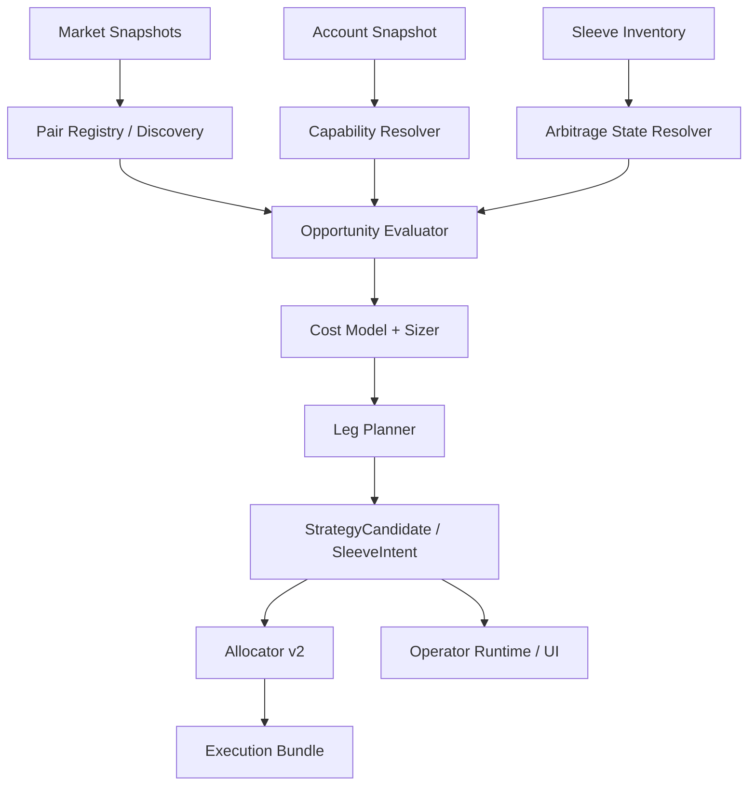

# Task78 智能套利策略重构与扩展任务书

> 项目定位声明：本文件默认服从 AATS 的统一目标：在严格风控、可审计、可恢复、可治理前提下，通过自动化交易追求长期稳定盈利，为 AI 的持续自治与终身发展积累资本。详见 [项目定位声明](../../../docs/project_positioning.md)。

## 1. 任务定位

`Task78` 用于重构当前 `smart_arbitrage` 策略，使其从“单一正基差场景引擎”升级为“可扩展的套利机会引擎”。

当前系统已经具备：

- `baseline -> strategy_coordinator -> allocator -> execution bundle -> recovery / replay`
- `directional / smart_arbitrage / spot_grid / dca` 四类策略接入
- `strategy_sleeve_id / allocation_id / strategy_bundle_id` 真相链
- `sleeve inventory / sleeve pnl / bundle recovery / operator strategy runtime`

但当时的 `smart_arbitrage.py` 仍然存在明显边界：

- 机会识别、能力判断、状态控制、仓位恢复、预算 sizing、双腿生成全部耦合在一个文件内
- 当前自动执行本质上只支持“正基差，做多现货并做空合约”
- 负基差被硬编码为 `advisory_only`
- 成本模型只有 `estimated_cost_bps` 一个粗粒度字段
- 配对关系依赖 symbol 推导，不是正式的 pair 定义
- allocator 侧只知道“smart_arbitrage 有对冲优先权”，不知道它是什么机会、为什么可执行、为什么不可执行
- operator 和前端只能看到结果，不能看到完整的能力阻断链和机会结构

`Task78` 的目标不是继续在原文件上增加更多 `if/else`，而是把智能套利升级成一套可扩展、可解释、可测试的套利框架。

## 2. 当前问题

### 2.1 策略引擎职责混杂

当前单个文件同时承担了：

- 配对 symbol 推导
- 市场快照读取
- 基差计算
- 账户仓位与 sleeve 仓位读取
- 当前套利对状态识别
- 保护性退出判断
- 正基差入场 / 退出 / 恢复
- 负基差 advisory 分支
- 执行腿构造
- 指标输出

结果是：

- 增加一个机会类型就会牵动整个文件
- 很难单独测试某个子能力
- 很难解释“为什么没执行”
- 很难扩展到库存反套、保证金融券、跨合约价差等场景

### 2.2 机会识别与执行能力耦合

当前逻辑把“负基差”直接等同于“不可自动执行”。

这会遮蔽三类本应区分的情况：

- 负基差存在，但系统完全没有可执行路径
- 负基差存在，账户有现货库存，可做库存反套
- 负基差存在，保证金借币能力可用，可做真正反向 cash-and-carry

机会本身与执行能力是两个维度，当前实现把它们混成了一个结果。

### 2.3 状态模型过于粗糙

当前只有：

- `inactive`
- `advisory_only`
- `ready`

这不足以描述实际套利生命周期：

- 候选机会已识别但被能力阻断
- 已有持仓但在等待 exit
- 双腿部分成交，需要恢复
- 只允许减仓
- 有外部污染仓位，不允许新开

### 2.4 成本模型过于简化

当前只用：

- `basis_entry_bps`
- `basis_exit_bps`
- `estimated_cost_bps`

这无法支持更真实的机会排序与执行判断。套利实际成本至少包括：

- 手续费
- 滑点
- 资金费
- 借币费
- 库存占用成本
- 持有周期相关成本

### 2.5 配对定义不正式

当前配对主要依赖：

- `BTC-USDT` 与 `BTC-USDT-SWAP` 的符号推导
- 可选 companion symbol 覆盖

这不利于扩展到：

- 多 pair 并行
- 指定现货与多个合约腿
- 永续对季度
- 同基础资产多合约择优

### 2.6 可观察性不足

当前 operator / UI 看到的是：

- 当前只给建议
- 仅参考，不直接执行
- 当前不生成执行量

但看不到：

- 识别到的是哪种机会
- 被什么能力阻断
- 如果能力具备，会生成哪种腿
- 当前处于 opening / active / unwind / recovery 的哪一阶段

## 3. 重构目标

本任务完成后，智能套利应具备以下能力：

### 3.1 架构目标

- 把 `smart_arbitrage` 从单文件逻辑重构为多模块架构
- 机会识别与执行能力分离
- 状态机显式化
- 双腿规划器独立化
- 成本模型可扩展
- operator / API / 前端可解释

### 3.2 业务目标

至少支持以下机会类型中的前两类，后两类为扩展目标：

- 正基差 cash-and-carry：`buy spot + sell derivatives`
- 负基差 reverse carry：
  - advisory only
  - inventory-backed：`sell spot inventory + buy derivatives`
  - margin-backed：`sell borrowed spot + buy derivatives`
- 合约间价差：`sell perp + buy futures` 或反向
- 资金费驱动机会：基于 funding edge 判断是否值得持有

### 3.3 运行目标

- 不破坏现有正基差自动执行路径
- 不破坏 allocator v2 现有对冲优先逻辑
- 不破坏 recovery / replay / strategy runtime 展示
- 默认通过 feature flag 逐步启用新能力，而不是一次性切换

## 4. 非目标

本任务默认不直接包含以下内容，除非后续子任务显式纳入：

- 多交易所支持
- 真正无保护的实盘借币卖空
- 完整重写 allocator
- 重写 AI 决策系统
- 修改 directional / spot_grid / dca 的核心策略逻辑
- 引入新的数据库存储系统

## 5. 目标架构

设计原则：

- `discovery` 只负责发现机会，不负责判断能不能下单
- `capability` 只负责回答当前系统能做什么
- `state_machine` 只负责回答当前套利对处于什么阶段
- `leg_planner` 只负责根据机会与能力生成可执行腿
- `engine` 只负责拼装这些结果，输出 `StrategyCandidate`

## 6. 模块拆分方案

建议将当时的 `smart_arbitrage.py` 拆成包：

- `aats/services/strategy_engines/smart_arbitrage/__init__.py`
- `aats/services/strategy_engines/smart_arbitrage/engine.py`
- `aats/services/strategy_engines/smart_arbitrage/discovery.py`
- `aats/services/strategy_engines/smart_arbitrage/pair_registry.py`
- `aats/services/strategy_engines/smart_arbitrage/capabilities.py`
- `aats/services/strategy_engines/smart_arbitrage/state_machine.py`
- `aats/services/strategy_engines/smart_arbitrage/cost_model.py`
- `aats/services/strategy_engines/smart_arbitrage/sizer.py`
- `aats/services/strategy_engines/smart_arbitrage/leg_planner.py`
- `aats/services/strategy_engines/smart_arbitrage/schemas.py`

兼容策略：

- 原 `smart_arbitrage.py` 先保留为 facade
- `coordinator.py` 继续从原入口导入，待重构稳定后再切换到新包入口

## 7. 数据模型与配置扩展

### 7.1 新增领域对象

建议新增以下 schema：

#### `ArbitragePairDefinition`

用于定义一组正式套利配对。

建议字段：

- `pair_id`
- `base_asset`
- `quote_asset`
- `primary_symbol`
- `spot_symbol`
- `hedge_symbol`
- `hedge_product_type`
- `settle_currency`
- `execution_modes`
- `enabled`
- `metadata`

#### `ArbitrageOpportunity`

用于表达一条机会，不直接等于执行计划。

建议字段：

- `pair_id`
- `opportunity_kind`
- `direction`
- `basis_bps`
- `net_edge_bps`
- `estimated_fee_bps`
- `estimated_slippage_bps`
- `estimated_funding_bps`
- `estimated_borrow_bps`
- `entry_threshold_bps`
- `exit_threshold_bps`
- `score`
- `confidence`
- `blocking_reasons`

#### `ArbitrageExecutionCapability`

用于描述当前运行时支持的执行能力。

建议字段：

- `inventory_backed_spot_sell_supported`
- `spot_margin_short_supported`
- `derivatives_short_supported`
- `funding_data_available`
- `borrow_rate_available`
- `multi_leg_recovery_supported`
- `only_reduce_required`
- `runtime_supported`

#### `ArbitragePairState`

用于表达当前套利对所处生命周期。

建议字段：

- `pair_id`
- `state`
- `current_spot_qty`
- `current_hedge_qty`
- `paired_qty`
- `unpaired_spot_qty`
- `unpaired_hedge_qty`
- `foreign_spot_qty`
- `foreign_hedge_qty`
- `recovery_required`
- `unwind_required`

### 7.2 配置扩展

建议在 [settings.py](/D:/文件/project/AIParticipatingAutonomousTradingSystem/aats/bootstrap/settings.py) 基础上增加：

- `smart_arbitrage_pair_registry_enabled`
- `smart_arbitrage_negative_basis_mode`
  - `disabled`
  - `advisory_only`
  - `inventory_backed`
  - `margin_backed`
- `smart_arbitrage_cost_model_enabled`
- `smart_arbitrage_funding_cost_enabled`
- `smart_arbitrage_borrow_cost_enabled`
- `smart_arbitrage_inventory_reservation_enabled`
- `smart_arbitrage_max_concurrent_pairs`
- `smart_arbitrage_pair_priority_mode`
- `smart_arbitrage_min_inventory_backed_ratio`

### 7.3 运行时暴露字段

建议在 [strategy_runtime.py](/D:/文件/project/AIParticipatingAutonomousTradingSystem/aats/schemas/strategy_runtime.py) 的 candidate metrics 或新增字段中暴露：

- `pair_id`
- `opportunity_kind`
- `execution_mode`
- `state_phase`
- `blocking_reasons`
- `estimated_fee_bps`
- `estimated_slippage_bps`
- `estimated_funding_bps`
- `estimated_borrow_bps`
- `inventory_backed_available_qty`

## 8. 分阶段任务拆分

## 8.1 Task78-A0 基线锁定与行为快照

目标：

- 在重构前锁定当前正基差行为
- 为后续改造提供回归基线

需要做的事：

- 梳理当前 `smart_arbitrage` 的行为矩阵
- 补齐单测覆盖：
  - 正基差开仓
  - 已有 pair 等待 exit
  - partial fill recovery
  - 负基差 advisory
  - protective directional exit
  - market pair incomplete
- 补运行时集成测试与 UI 展示快照

验收：

- 当前行为被测试完整锁定
- 后续模块拆分不改变既有业务语义

## 8.2 Task78-A1 结构拆分但不改行为

目标：

- 先把单文件拆成多模块
- 不改变对外行为

需要做的事：

- 提取 `discovery / state / sizing / leg construction` 私有函数
- 保持当前正基差逻辑与负基差 advisory 行为不变
- 保持 `coordinator`、`allocator`、`strategy runtime` 接口不变

验收：

- 行为层面与 A0 基线一致
- 所有旧测试通过

## 8.3 Task78-A2 Pair Registry 与机会模型落地

目标：

- 正式引入套利 pair 定义
- 不再只依赖 symbol 字符串推导

需要做的事：

- 新增 `ArbitragePairDefinition`
- 支持从 settings 或 profile 加载 pair 定义
- 把当前单 pair 推导兼容为 fallback，而不是唯一来源
- 引入 `ArbitrageOpportunity`

验收：

- `BTC-USDT <-> BTC-USDT-SWAP` 可以通过 pair registry 表达
- 策略运行时能输出 `pair_id`

## 8.4 Task78-A3 Capability Resolver

目标：

- 把“机会存在”和“能否执行”拆开

需要做的事：

- 新增 `capabilities.py`
- 接入账户快照、runtime posture、risk posture
- 输出标准能力描述
- 将当前“负基差不支持”硬编码改为 capability 结果

验收：

- 同一条负基差机会可以根据能力不同得到不同结论：
  - advisory
  - inventory-backed ready
  - margin-backed ready

## 8.5 Task78-A4 状态机与恢复链重构

目标：

- 明确套利机会生命周期

建议状态：

- `inactive`
- `candidate`
- `blocked`
- `opening`
- `active`
- `rebalancing`
- `unwinding`
- `recovery`
- `advisory`

需要做的事：

- 新增 `state_machine.py`
- 把当前 `current_pair_active / unwind_required / recovery_mode` 整理成显式状态机
- 将 foreign inventory / unpaired exposure 纳入状态解释

验收：

- partial fill recovery 与正常 active 持仓可区分
- operator 能看到当前处于哪一阶段

## 8.6 Task78-A5 成本模型与 sizing 重构

目标：

- 把单一 `estimated_cost_bps` 升级为可拆分成本模型

需要做的事：

- 新增 `cost_model.py`
- 成本拆分为：
  - fee
  - slippage
  - funding
  - borrow
  - inventory opportunity cost
- 新增 `sizer.py`
- sizing 支持：
  - quote budget
  - notional cap
  - available inventory cap
  - capability-specific cap

验收：

- `net_edge_bps` 由细分成本汇总得到
- inventory-backed 场景会受到库存上限约束

## 8.7 Task78-A6 库存反套支持

目标：

- 在不引入借币卖空前，先支持“账户已有现货库存”的负基差自动执行

执行模式：

- `sell spot inventory + buy derivatives`

需要做的事：

- capability resolver 暴露库存反套能力
- leg planner 支持负基差 inventory-backed 模式
- risk 只允许在现货可用余额足够时执行
- metrics 暴露 `inventory_backed_available_qty`

验收：

- 负基差场景下，若账户持有足够现货库存，候选状态可进入 `ready`
- 自动生成两条腿
- 若库存不足，则退回 advisory 或 blocked，并给出明确原因

## 8.8 Task78-A7 腿规划器与执行模式扩展

目标：

- 把双腿生成从主引擎中独立出来

建议执行模式：

- `spot_carry`
- `inventory_reverse_carry`
- `margin_reverse_carry`
- `inter_derivatives_spread`

需要做的事：

- 新增 `leg_planner.py`
- 根据 `opportunity_kind + capability + pair_state` 生成腿
- 每条腿都显式带上：
  - `role`
  - `execution_mode`
  - `reference_price`
  - `policy blockers`

验收：

- 不同执行模式的腿生成逻辑彼此独立
- candidate 输出可明确解释腿是如何构成的

## 8.9 Task78-A8 多 pair 并行与 allocator 集成

目标：

- 不再只围绕单个 pair 运行
- 支持多个 pair 候选排序与预算竞争

需要做的事：

- pair registry 支持多 pair
- engine 对多个 pair 产出机会列表并选主机会
- allocator 接收更明确的套利意图属性：
  - `pair_id`
  - `opportunity_kind`
  - `execution_mode`
  - `hedge_priority`
- 在现有 allocator v2 基础上保留对冲优先，但不再只依赖 family 名称

验收：

- 同时存在多个套利机会时，系统能解释“为什么本轮只选了某一个 pair”

## 8.10 Task78-A9 Operator / API / UI 升级

目标：

- 让 operator 和前端能够展示套利机会与阻断原因，而不是只展示结果

需要做的事：

- 扩展 operator query payload
- 扩展 runtime summary
- 前端展示以下字段：
  - `pair_id`
  - `opportunity_kind`
  - `execution_mode`
  - `state_phase`
  - `blocking_reasons`
  - `net_edge_bps`
  - `inventory_backed_available_qty`

验收：

- 前端不再只显示“当前只给建议”
- 能明确回答“识别到了什么机会、为什么没执行、还差什么能力”

## 8.11 Task78-A10 Margin-backed 反向套利扩展

目标：

- 为后续真正的负基差自动套利预留正式能力路径

需要做的事：

- 与 [risk.py](/D:/文件/project/AIParticipatingAutonomousTradingSystem/aats/services/governance_engine/risk.py) 协同
- 与 [runtime_scope.py](/D:/文件/project/AIParticipatingAutonomousTradingSystem/aats/services/runtime_scope.py) 协同
- 与执行适配层协同，明确借币、保证金、only-reduce、还币语义

验收：

- 即使该阶段最终未默认启用，也已经形成正式接口与能力模型

## 8.12 Task78-A11 回放、恢复、归因与上线切换

目标：

- 确保新套利架构不会破坏 replay / recovery / pnl attribution

需要做的事：

- 扩展 `bundle recovery`
- 扩展 `sleeve inventory` 与 lot projection 归因
- 保障 strategy runtime 历史快照兼容
- 统一新版配置面，保留能力/行为开关：
  - `smart_arbitrage_pair_definitions`
  - `smart_arbitrage_negative_basis_mode`

验收：

- 老快照能读
- 新快照能回放
- 开关关闭时回退旧行为

## 9. 建议修改文件范围

核心代码：

- [smart_arbitrage/](../../../aats/services/strategy_engines/smart_arbitrage/)（当前已完成包化；原单文件入口不再存在）
- [coordinator.py](/D:/文件/project/AIParticipatingAutonomousTradingSystem/aats/services/strategy_engines/coordinator.py)
- [allocator.py](/D:/文件/project/AIParticipatingAutonomousTradingSystem/aats/services/strategy_engines/allocator.py)
- [sleeve_inventory.py](/D:/文件/project/AIParticipatingAutonomousTradingSystem/aats/services/strategy_engines/sleeve_inventory.py)
- [settings.py](/D:/文件/project/AIParticipatingAutonomousTradingSystem/aats/bootstrap/settings.py)
- [strategy_runtime.py](/D:/文件/project/AIParticipatingAutonomousTradingSystem/aats/schemas/strategy_runtime.py)
- [risk.py](/D:/文件/project/AIParticipatingAutonomousTradingSystem/aats/services/governance_engine/risk.py)
- [runtime_scope.py](/D:/文件/project/AIParticipatingAutonomousTradingSystem/aats/services/runtime_scope.py)

operator / API / UI：

- [query_service.py](/D:/文件/project/AIParticipatingAutonomousTradingSystem/aats/services/operator/query_service.py)
- [terms.js](/D:/文件/project/AIParticipatingAutonomousTradingSystem/aats/api/static/modules/terms.js)
- [strategy-view.js](/D:/文件/project/AIParticipatingAutonomousTradingSystem/aats/api/static/modules/views/strategy-view.js)

测试：

- [test_strategy_coordinator.py](/D:/文件/project/AIParticipatingAutonomousTradingSystem/tests/unit/test_strategy_coordinator.py)
- [test_strategy_runtime_integration.py](/D:/文件/project/AIParticipatingAutonomousTradingSystem/tests/integration/test_strategy_runtime_integration.py)
- `tests/unit/` 下新增套利状态机、成本模型、能力层、腿规划器测试
- `tests/integration/` 下新增库存反套、pair registry、多 pair 排序测试

配置与文档：

- `configs/strategy_profiles/*.yaml`
- `docs/configuration/managed-config-reference.md`

## 10. 测试计划

### 10.1 单元测试

覆盖以下维度：

- pair registry 加载与 fallback 推导
- 机会识别
- capability resolver
- 状态机转换
- 成本模型拆分
- sizing 上限
- leg planner 输出
- inventory-backed 负基差路径

### 10.2 集成测试

覆盖以下路径：

- 正基差自动执行仍然可用
- 负基差 advisory
- 负基差 inventory-backed ready
- pair active 等待 exit
- partial fill recovery
- foreign inventory 污染时阻断新开
- 多 pair 排序只选主机会

### 10.3 Operator / UI 测试

覆盖以下场景：

- runtime 页面展示 `pair_id / opportunity_kind / blocking_reasons`
- advisory、blocked、recovery、ready 的文案区分
- 负基差库存不足与能力缺失的文案区分

### 10.4 回放与恢复测试

覆盖以下路径：

- bundle replay
- sleeve inventory reconstruction
- pnl attribution
- strategy runtime 历史快照兼容

## 11. 风险与应对

### 11.1 风险：重构过程中行为回归

应对：

- A0 先补行为锁定测试
- A1 只拆结构不改逻辑
- 使用 facade 保持旧入口稳定

### 11.2 风险：机会模型与 allocator 集成过深

应对：

- 先通过 candidate metrics 透传新信息
- allocator 先消费最小必要字段
- 不在第一阶段重写 allocator 主流程

### 11.3 风险：负基差能力扩展牵动执行链过大

应对：

- 优先落地 inventory-backed
- margin-backed 放到后续阶段
- 通过 capability layer 严格门控

### 11.4 风险：前端文案与后端状态不一致

应对：

- 所有 blocked / advisory reason 统一来源于 reason codes 与 capability output
- 避免在前端写新的业务判断分叉

## 12. 上线策略

采用分阶段切换：

1. 上线结构拆分与新 schema，但不开新能力
2. 开启更细的 operator / UI 展示
3. 启用 inventory-backed 负基差能力
4. 灰度启用多 pair 排序
5. 最后再评估 margin-backed 反向套利

上线原则：

- 每一步都必须可回退
- 每一步都必须有明确测试与运行时观测
- 不做一次性大爆炸切换

## 13. 最终验收标准

任务完成时，系统应满足：

- `smart_arbitrage` 已不再依赖单文件复杂分支
- 机会识别、能力判断、状态机、腿规划器、成本模型已拆层
- 正基差路径保持稳定
- 负基差能够区分：
  - advisory only
  - inventory-backed ready
  - margin-backed blocked or ready
- operator / UI 能解释“识别了什么机会、为什么没执行、下一步缺什么能力”
- replay / recovery / attribution 不回归
- 所有新能力都通过 feature flag 控制

## 14. 建议实施顺序

推荐按以下顺序执行：

1. `Task78-A0` 基线锁定
2. `Task78-A1` 结构拆分
3. `Task78-A2` pair registry 与机会模型
4. `Task78-A3` capability resolver
5. `Task78-A4` 状态机
6. `Task78-A5` 成本模型与 sizing
7. `Task78-A6` 库存反套
8. `Task78-A7` 腿规划器扩展
9. `Task78-A8` 多 pair 与 allocator 集成
10. `Task78-A9` operator / UI 升级
11. `Task78-A11` 回放恢复与切换
12. `Task78-A10` margin-backed 反向套利作为后续扩展

该顺序的核心原则是：

- 先稳定结构
- 再扩展能力
- 最后改执行边界最重的部分
