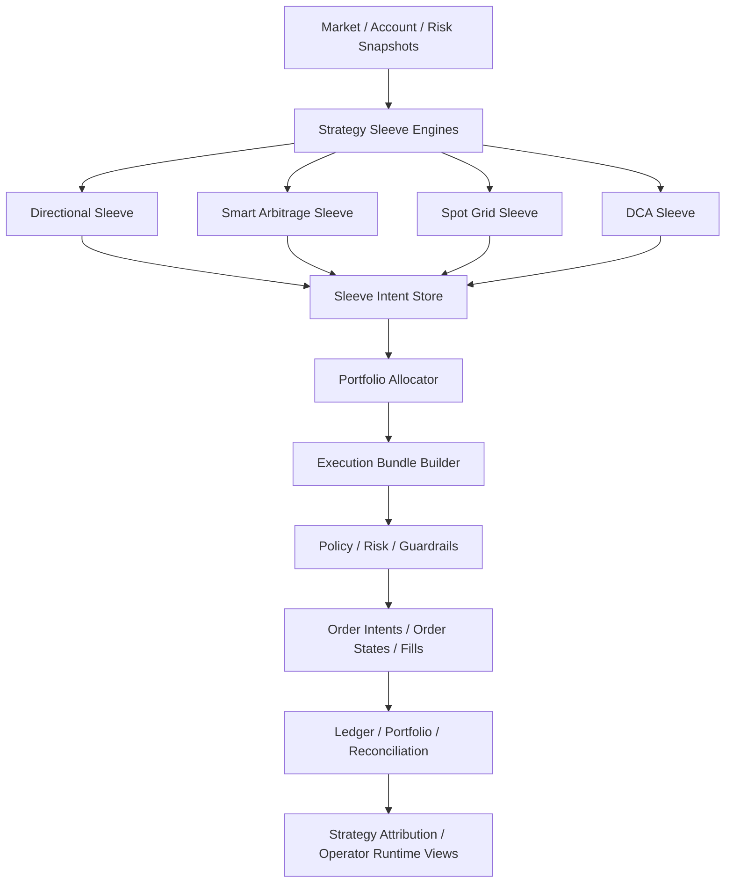

# Task73 单账户并行多策略架构升级任务书

## 1. 文档定位

这份文档定义“在同一个 OKX 子账户下并行运行多个策略”的下一阶段架构升级方案。

当前系统已经具备：

- 单账户、单 runtime 下的现货 / 合约实盘能力
- 自动策略家族选择
- `directional / smart_arbitrage / spot_grid / dca` 的策略接入能力
- 基础的执行、恢复、对账、归因与 operator 可视化

但当前系统本质上仍然是：

- 单账户视角
- 每个决策周期自动选择一个主导策略家族
- 以账户级 `PositionTarget` 作为执行入口

这还不是“单账户并行多策略组合平台”。

本任务书的目标是把系统升级为：

- 一个账户下可并行运行多个策略 sleeve
- 每个 sleeve 有独立库存归属、资金预算、收益归因和恢复状态
- 由组合层 allocator 做净额化、预算协调和账户级执行下发
- 默认全自动运行，不提供管理员在线切换主策略的 override / freeze / restore-auto

## 1.1 当前进度

截至 `2026-03-24`，当前仓库已经完成到：

- 阶段 1：策略级身份落库
- 阶段 2：sleeve 库存真相驱动策略决策
- 阶段 3：allocator v1 与 bundle recovery
- 阶段 4：`sleeve_pnl_records`、策略级归因报表、replay 归因校验
- 阶段 5：全自动并行多策略预算、启停与 allocator 自动再平衡 v1
- 策略运行时真相已落库到 `strategy_sleeve_intents / portfolio_allocation_decisions / strategy_execution_bundles / sleeve_pnl_records`
- 旧库升级路径已收敛到 `migrations/0001_postgres_latest_schema.sql + 0002_postgres_legacy_upgrade.sql`

当前尚未进入“策略级资金分仓 + 组合层 allocator v2 + 更细粒度库存隔离账务”的后续阶段。

## 2. 目标架构

### 2.1 总体目标

升级后的系统应当从“自动选择一个策略家族”演进为“多个策略 sleeve 并行产出意图，再由组合层统一协调执行”。

目标架构如下：

### 2.2 核心原则

- 同一账户可同时存在多个策略 sleeve 的库存和未完成订单。
- 每个策略 sleeve 的“目标意图”必须先落到独立的数据模型，再进入组合层。
- 组合层负责做账户级预算协调、风险净额化和执行冲突解决。
- 订单、成交、费用、资金费、保证金占用、库存变化都必须可以追溯到具体 sleeve。
- 默认是系统自动选择是否启用某个 sleeve、给它多少预算、是否进入保护态；不做管理员在线强制切换。

### 2.3 运行层级

升级后系统分成四层：

1. `Sleeve Engine Layer`
   - 每个策略只负责输出自己的 `SleeveIntent`
   - 不直接改账户级目标仓位

2. `Allocator Layer`
   - 负责把多个 sleeve 的意图汇总成账户级净目标
   - 负责预算约束、优先级排序、相互冲突解算

3. `Execution Bundle Layer`
   - 负责把 allocator 产出的组合级动作翻译成一组可审计的执行 bundle
   - 一个 bundle 可包含单腿或多腿

4. `Truth / Recovery Layer`
   - 负责按 sleeve 维度维护库存、收益、账务、恢复和归因

## 3. 目标策略范围

本期以三类新并行策略为主：

1. `smart_arbitrage`
   - 现货多头 + 合约空头的 basis / funding 套利
2. `spot_grid`
   - 现货区间库存型策略
3. `dca`
   - 现货定期买入 / 节奏型配置策略

保留现有 `directional` 作为基础方向 sleeve。

升级后的目标不是“选一个 family”，而是允许：

- `directional` 与 `smart_arbitrage` 并行
- `spot_grid` 与 `dca` 并行
- 组合层决定最终账户级净敞口

但同类库存策略是否共用同一 symbol，要由 allocator 和预算策略决定，不允许无约束叠加。

## 4. Schema 变更

### 4.1 新增核心领域对象

#### 4.1.1 StrategySleeve

表示一个可并行运行的策略实例，而不是抽象 family。

建议字段：

- `sleeve_id`
- `family`
- `name`
- `product_scope`
- `symbol_scope`
- `status`
- `automatic_enabled`
- `budget_profile_id`
- `inventory_policy`
- `created_at`
- `updated_at`

说明：

- `family` 只是模板分类，例如 `spot_grid`
- 真正运行的是具体 sleeve，例如 `spot_grid_btc_core`

#### 4.1.2 SleeveIntent

表示某个 sleeve 在某个决策窗口里想做什么。

建议字段：

- `intent_id`
- `decision_id`
- `sleeve_id`
- `family`
- `symbol`
- `product_type`
- `margin_mode`
- `intent_type`
- `current_position_qty`
- `target_position_qty`
- `delta_qty`
- `target_notional`
- `priority_score`
- `expected_edge_bps`
- `risk_budget_requested`
- `route_action`
- `reason_codes`
- `metadata`

说明：

- 这是 allocator 的输入
- 不直接等于最终执行目标

#### 4.1.3 PortfolioAllocationDecision

表示组合层对多个 sleeve intent 的统一协调结果。

建议字段：

- `allocation_id`
- `decision_window_id`
- `account_id`
- `allocator_version`
- `allocation_state`
- `input_intent_refs`
- `approved_sleeve_weights`
- `approved_sleeve_notional_limits`
- `net_exposure_targets`
- `bundle_refs`
- `blocked_reason_codes`
- `operator_summary`
- `created_at`

#### 4.1.4 SleeveInventoryLot

表示按策略 sleeve 归属的库存 lot。

建议字段：

- `lot_id`
- `sleeve_id`
- `symbol`
- `product_type`
- `margin_mode`
- `position_side`
- `open_fill_id`
- `remaining_qty`
- `avg_open_price`
- `cost_basis`
- `opened_at`
- `closed_at`
- `state`

说明：

- 这是“策略级库存归属”的核心对象
- 不能再只靠账户级 position 推导

#### 4.1.5 SleevePnLRecord

表示按 sleeve 归属的收益事件。

建议字段：

- `record_id`
- `sleeve_id`
- `family`
- `symbol`
- `event_type`
- `fill_id`
- `funding_fee_id`
- `fee_currency`
- `realized_pnl`
- `fee_amount`
- `funding_fee_amount`
- `inventory_move_qty`
- `attribution_type`
- `created_at`

### 4.2 现有 schema 需要扩展的字段

以下现有 schema 需要从“strategy_family”升级到“strategy_sleeve”级别：

- `PositionTarget`
- `ExecutionPlan`
- `OrderIntent`
- `OrderState`
- `FillEvent`
- `OrderObligation`
- `FillOutcomeRecord`
- `PortfolioSnapshot`
- `DecisionAuditRecord`
- `StrategyExecutionBundle`

建议新增统一字段：

- `strategy_sleeve_id`
- `strategy_family`
- `allocation_id`
- `allocator_version`
- `inventory_lot_id`
- `attribution_group_id`

### 4.3 需要收缩或废弃的旧语义

以下旧语义后续应弱化：

- `当前周期只选择一个 active family`
- `账户总库存直接视为策略库存`
- `一个 PositionTarget 代表本轮全部策略意图`

这些不是立刻删除，但在架构迁移完成后不能继续作为核心抽象。

## 5. 数据库表设计

### 5.1 新增表

#### 5.1.1 `strategy_sleeves`

用途：

- 存放实际运行的策略 sleeve 配置

核心列建议：

- `sleeve_id` PK
- `family`
- `name`
- `product_scope`
- `margin_scope`
- `symbol_scope_json`
- `automatic_enabled`
- `budget_profile_id`
- `inventory_policy`
- `status`
- `created_at`
- `updated_at`

索引建议：

- `(family, status)`
- `(automatic_enabled, status)`

#### 5.1.2 `sleeve_intents`

用途：

- 存放每个 sleeve 每轮的原始策略意图

核心列建议：

- `intent_id` PK
- `decision_id`
- `sleeve_id`
- `family`
- `symbol`
- `product_type`
- `margin_mode`
- `intent_type`
- `current_position_qty`
- `target_position_qty`
- `delta_qty`
- `target_notional`
- `priority_score`
- `expected_edge_bps`
- `risk_budget_requested`
- `route_action`
- `reason_codes_json`
- `metadata_json`
- `created_at`

索引建议：

- `(sleeve_id, created_at DESC)`
- `(decision_id)`
- `(symbol, product_type, created_at DESC)`

#### 5.1.3 `portfolio_allocation_decisions`

用途：

- 存放组合层对多个 sleeve intent 的统一决策

核心列建议：

- `allocation_id` PK
- `decision_window_id`
- `account_scope`
- `allocator_version`
- `allocation_state`
- `input_intent_refs_json`
- `approved_sleeve_weights_json`
- `approved_sleeve_notional_limits_json`
- `net_exposure_targets_json`
- `blocked_reason_codes_json`
- `operator_summary`
- `created_at`

索引建议：

- `(created_at DESC)`
- `(decision_window_id)`

#### 5.1.4 `strategy_execution_bundles`

用途：

- 存放 allocator 输出后的组合执行 bundle

核心列建议：

- `bundle_id` PK
- `allocation_id`
- `bundle_type`
- `bundle_state`
- `account_scope`
- `strategy_sleeve_refs_json`
- `leg_count`
- `blocked_reason_codes_json`
- `operator_summary`
- `created_at`
- `updated_at`

索引建议：

- `(allocation_id)`
- `(bundle_state, created_at DESC)`

#### 5.1.5 `sleeve_inventory_lots`

用途：

- 管理按 sleeve 归属的现货库存和合约 lot

核心列建议：

- `lot_id` PK
- `sleeve_id`
- `symbol`
- `product_type`
- `margin_mode`
- `position_side`
- `open_fill_id`
- `remaining_qty`
- `avg_open_price`
- `cost_basis`
- `state`
- `opened_at`
- `closed_at`

索引建议：

- `(sleeve_id, symbol, state)`
- `(symbol, product_type, state)`

#### 5.1.6 `sleeve_pnl_records`

用途：

- 存放按策略 sleeve 归属的收益、费用、资金费和库存调整

核心列建议：

- `record_id` PK
- `sleeve_id`
- `family`
- `symbol`
- `event_type`
- `fill_id`
- `funding_fee_id`
- `realized_pnl`
- `fee_amount`
- `funding_fee_amount`
- `inventory_move_qty`
- `attribution_type`
- `created_at`

索引建议：

- `(sleeve_id, created_at DESC)`
- `(family, created_at DESC)`
- `(symbol, created_at DESC)`

### 5.2 现有表需要增加的列

以下现有表建议扩列：

- `execution_orders`
  - `strategy_sleeve_id`
  - `allocation_id`
  - `inventory_lot_id`
- `execution_fills`
  - `strategy_sleeve_id`
  - `allocation_id`
  - `inventory_lot_id`
- `fill_outcomes`
  - `strategy_sleeve_id`
  - `allocation_id`
  - `attribution_type`
- `portfolio_snapshots`
  - `strategy_inventory_summary_json`
  - `sleeve_budget_summary_json`
- `decision_audit_records`
  - `sleeve_intent_refs_json`
  - `allocation_ref`
  - `bundle_refs_json`

### 5.3 不建议的做法

以下做法不建议采用：

- 只在 JSON payload 里塞 `sleeve_id`，不扩数据库列
- 继续用账户总 BTC 余额隐式代表某个策略的现货腿
- 在组合层不落单独 allocation record，只靠日志拼出来

## 6. 数据流

### 6.1 目标数据流

1. 市场数据、账户快照、风险快照进入 runtime
2. 各策略 sleeve 并行运行，产出 `SleeveIntent`
3. `PortfolioAllocator` 汇总所有 `SleeveIntent`
4. allocator 输出 `PortfolioAllocationDecision`
5. `ExecutionBundleBuilder` 生成一个或多个 bundle
6. bundle 进入既有 `Policy -> Risk -> Planner -> OrderIntent`
7. 订单成交后，fill 进入：
   - `execution truth`
   - `sleeve inventory`
   - `sleeve pnl attribution`
   - `portfolio snapshot`
   - `reconciliation / replay`

### 6.2 关键约束

- `SleeveIntent` 只表达该策略的愿望，不直接拥有账户执行权
- allocator 是唯一可以把多个策略净额化后转换成账户级执行目标的层
- 恢复流程必须先恢复 `bundle -> leg -> sleeve inventory`，再恢复账户级净目标

### 6.3 冲突解算示例

示例一：

- `directional` 想做多 `BTC-USDT-SWAP`
- `smart_arbitrage` 想做空 `BTC-USDT-SWAP` 作为 hedge

allocator 需要决定：

- 是否允许两者共存
- 是否以风险加权后净额执行
- 是否给 `smart_arbitrage` 保留 hedge 特权

示例二：

- `spot_grid` 想继续持有 `BTC`
- `dca` 想定期继续买入 `BTC`

allocator 需要决定：

- 两者是否共享现货库存池
- 还是按 sleeve 分 lot 归属
- 是否限制某个 sleeve 继续增持

## 7. 风控边界

### 7.1 账户级风控

账户级风控继续保留，并且优先级最高：

- 总保证金使用率
- 总名义金额上限
- 总挂单上限
- 清算缓冲
- 只减仓 / 停机规则

### 7.2 策略级风控

新增 sleeve 级风控：

- sleeve 资金预算
- sleeve 名义金额上限
- sleeve 单 symbol 上限
- sleeve 最大库存上限
- sleeve 最大回撤
- sleeve 自动降档 / 冻结

### 7.3 allocator 风控

allocator 需要新增以下边界：

- 不同 sleeve 对同一 symbol 的冲突净额规则
- hedge sleeve 与 directional sleeve 的优先级规则
- 账户级风险不足时如何削减各 sleeve 预算
- 预算削减是否允许把某个 sleeve 直接打到 `hold_current` 或 `only_reduce`

### 7.4 恢复与停机边界

以下任一情况出现，应当只允许恢复，不允许继续扩张：

- bundle 中任一腿状态未知
- sleeve inventory 与 fill truth 不一致
- sleeve PnL 无法与 fill / fee / funding fee 对上
- allocator 无法从历史意图重建当前有效预算

## 8. 分阶段实施计划

### 阶段 1：策略级身份与库存归属地基

目标：

- 给订单、成交、fill outcome、portfolio snapshot 全面加上 `strategy_sleeve_id / allocation_id`
- 引入 `strategy_sleeves`、`sleeve_intents`、`sleeve_inventory_lots`

交付：

- 新 schema
- 新表
- 现有执行链路扩列
- 单 sleeve 到 fill 的归属闭环

验收：

- 任意一笔 fill 都能回答“属于哪个 sleeve”
- 任意一个现货 lot 都能回答“属于哪个 sleeve”

### 阶段 2：多 sleeve intent 与 allocator v1

目标：

- 多个 sleeve 并行运行
- allocator 能按 symbol 和预算做净额化

交付：

- `PortfolioAllocator`
- `portfolio_allocation_decisions`
- allocator operator 视图

验收：

- 至少支持 `directional + smart_arbitrage`
- 至少支持 `spot_grid + dca`
- allocator 输出有稳定审计记录

### 阶段 3：bundle v2 与恢复链路

目标：

- bundle 从“单策略执行 bundle”升级成“组合执行 bundle”
- 恢复流程支持 bundle -> leg -> sleeve inventory 的重建

交付：

- `strategy_execution_bundles`
- recovery / replay / reconciliation 升级

验收：

- 重启后可恢复多 sleeve 未完成 bundle
- replay 能验证 bundle、leg、lot、PnL 的一致性

### 阶段 4：策略级归因与组合级报表

目标：

- 完成按 sleeve 的收益、费用、资金费、库存变化归因
- 完成组合层 allocator 的绩效追踪

交付：

- `sleeve_pnl_records`
- operator 组合页 / sleeve 页
- attribution 报表

验收：

- 可以回答：
  - 哪个 sleeve 最赚钱
  - 哪个 sleeve 占了多少库存
  - 哪类退出最伤收益
  - 哪些减仓是风险收缩而不是策略观点变化

### 阶段 5：全自动并行运行

目标：

- 系统自动决定 sleeve 是否启用、给多少预算、何时降级
- 不提供管理员在线 override 主策略

交付：

- sleeve 自动启停
- sleeve 自动预算调整
- allocator 自动再平衡

验收：

- operator 只做观察、审计、停机、恢复
- 不需要人工去切换主策略

## 9. 兼容与迁移

### 9.1 可以兼容旧系统的部分

- 现有 event bus、event store、order manager、adapter、ledger、reconciliation 主框架
- 现有 `directional` 主链
- 现有 `spot_grid / dca / smart_arbitrage` 策略评估代码中的大部分信号逻辑
- 现有 live guard、trial guard、strategy profile auto control
- 现有 operator API 和 dashboard 的基础结构

### 9.2 必须迁移的部分

- `PositionTarget` 作为唯一账户级策略入口的语义必须弱化
- `strategy_family_active / selected_family` 的单策略中心模型必须迁移为多 sleeve 模型
- 账户总库存直接推定为某个策略库存的逻辑必须迁移
- 恢复流程中“按账户净仓恢复”的假设必须升级为“先按 sleeve / bundle / lot 恢复，再汇总到账户”
- 收益归因从“按 symbol / profile / route_action”必须升级到“按 sleeve / allocation / bundle / attribution_type”

### 9.3 建议迁移策略

建议采用“双轨迁移”，不要一次性替换：

1. 保留现有单策略执行主链
2. 先给现有链路补 `strategy_sleeve_id`
3. 再引入 allocator，但先只服务两类 sleeve
4. 等 replay / reconciliation 稳定后，再切全量多 sleeve 自动运行

## 10. 当前建议

如果你的目标真的是“一个账户并行多策略”，我建议把这件事作为单独的大任务流推进，而不是继续在现有单策略模型上零散打补丁。

当前推荐顺序是：

1. 先做 `策略级库存归属`
2. 再做 `策略级资金分仓`
3. 再做 `组合层 allocator`
4. 最后做 `按策略归因的账务与恢复`

因为第一步如果不立住，后面所有“多策略并行”都会建立在脏库存和脏归因之上。

## 11. 验收红线

以下任一项未满足，都不应宣称系统已经支持“单账户并行多策略”：

- 无法说明某笔库存属于哪个 sleeve
- 无法说明某笔手续费或资金费归属于哪个 sleeve
- 无法在重启后恢复某个未完成 bundle 的腿间状态
- allocator 结果无法复现
- 同一 symbol 的多个策略冲突时，无法回答为什么最后这样净额执行
- operator 无法从控制面看懂当前各 sleeve 的预算、库存、收益和保护状态
